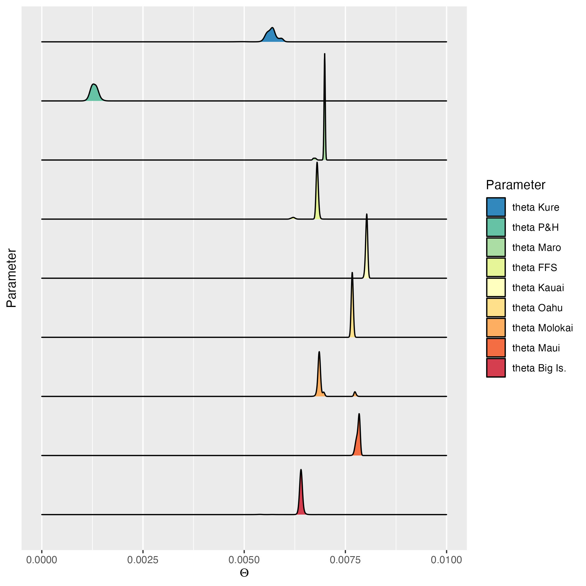
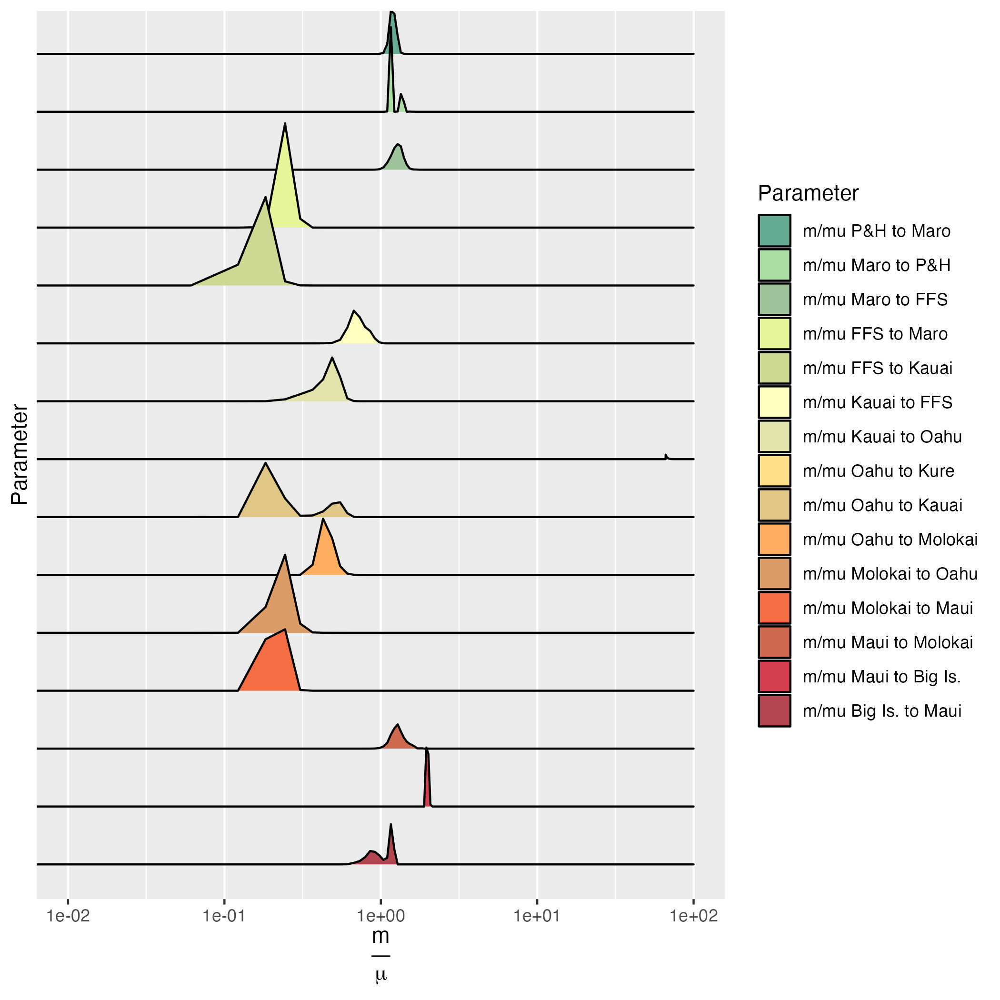
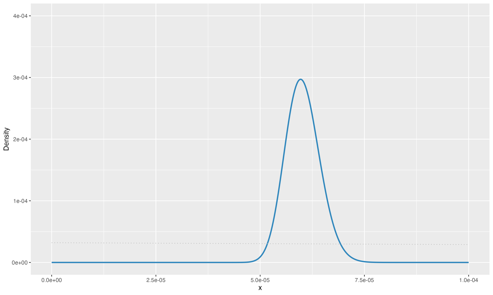
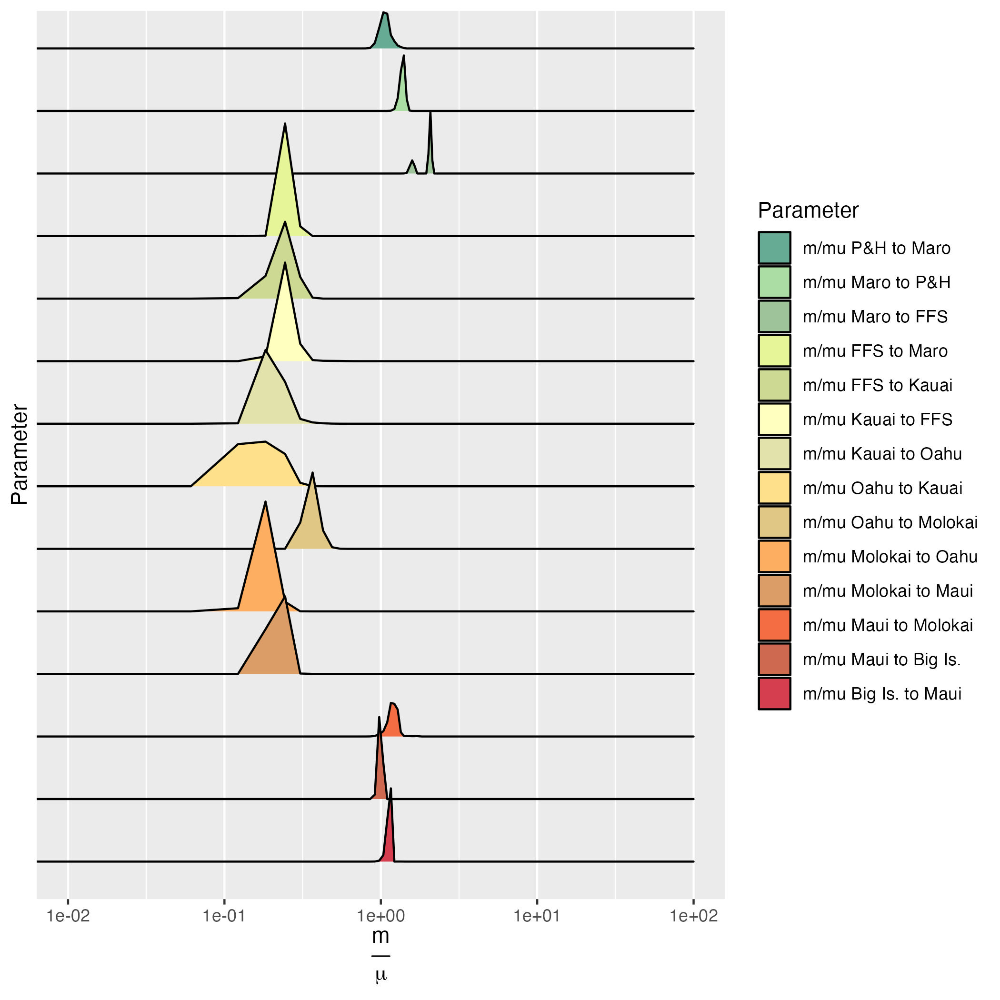
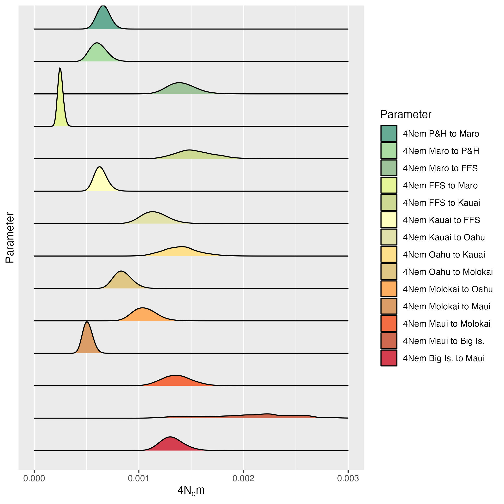
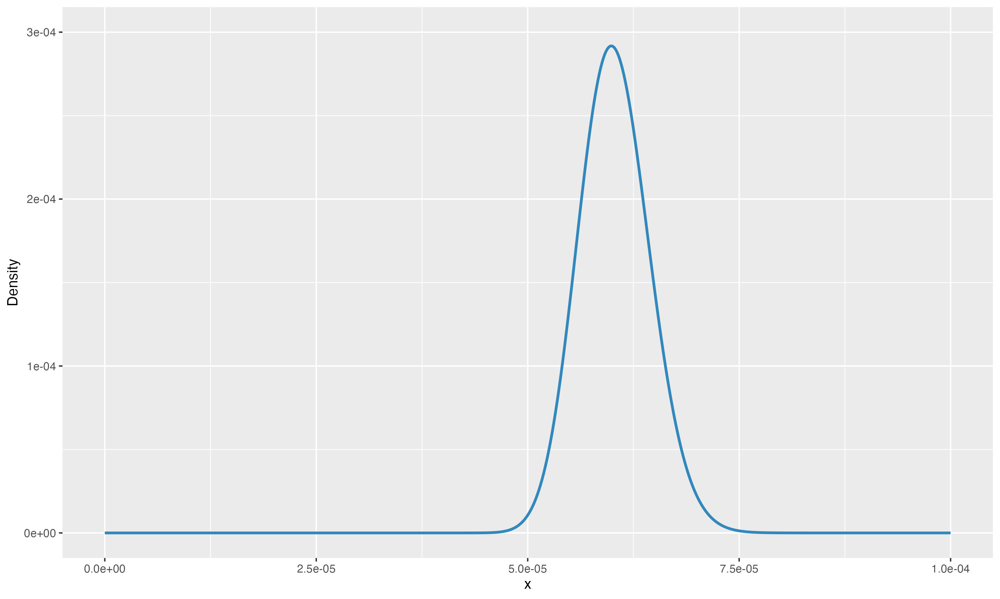

# Setup

```{r setup, warning = F, message = F}
library(tidyverse)
library(ape)
library(phangorn)
library(pegas)
library(adegenet)
#library(strataG)
library(knitr)
library(emoji)
library(coda)
library(ggmcmc)
library(perm)
library(Rmpfr)
library(spatstat.explore)
library(colorspace)
library(latex2exp)
library(ggridges)
library(raster)
library(RColorBrewer)
library(reshape2)
library(snpR)
library(graph4lg)
library(gghighlight)
library(hierfstat)
source("../IBD_Kernels/IBD_functions.R")

# Function library
harvest.model.likelihoods <- function(workingDir = workingDir,
                                      outfileName = "outfile.txt",
                                      multilocus = T){
    # this function harvests model marginal likelihoods for models calculated by
    # the program migrate-n (Beerli & Felsenstein 2001).
    # It takes as input a directory full of directories, 
    # each of which contains output from a migrate model, and is named
    # after that model. 
  
    #initialize a data frame to take the values
    modelMarglikes <- data.frame(model=character(),
                             thermodynamic=numeric(),
                             bezier.corrected=numeric(), 
                             harmonic=numeric()) 
    # loop through directories in the working directory, each of which is name
    # after a different model
  for(i in list.dirs(workingDir, full.names = F)[-1]){ #i<-"stepping.stone"
      modelDir<-file.path(workingDir,i)
      print(modelDir)
    #scan in the outfile, separating at each newline
      outfile<-scan(file=file.path(modelDir,outfileName),what="character",sep="\n") 
    #find the line with the likelihoods on it and split on runs of spaces
      marglikeline <- grep("Scaling factor",outfile,value=F)-1
      marglikeline <- strsplit(outfile[marglikeline],
                               "\\s+", perl = T)[[1]][3:5]
    #  if(length(marglikeline)==0){next}
      marglikes <- c(i,marglikeline)
     
      modelMarglikes <- rbind(modelMarglikes,marglikes, deparse.level = 2)
  }
  names(modelMarglikes) <- c("model","thermodynamic","bezier.corrected","harmonic")
  modelMarglikes[2:4] <- sapply(modelMarglikes[2:4], as.numeric)
  return(modelMarglikes)
}

bfcalcs<-function(df,ml="bezier.corrected"){
  # This calculates log bayes factors on data frames output by
  # harvest.model.likelihoods(), following Johnson and Omland (2004)
  # You may choose the likelihood flavor with
  # ml = "bezier.corrected", "thermodynamic" or "harmonic"
  #df$thermodynamic <- as.numeric(df$thermodynamic)
  #df$bezier.corrected <- as.numeric(df$bezier.corrected)
  #df$harmonic <- as.numeric(df$harmonic)
  mlcol <- df[[ml]] 
	bmvalue <- mlcol[which.max(mlcol)]
	lbf <- 2*(mlcol-bmvalue)
	choice <- rank(-mlcol)
	modelprob <- exp(lbf/2)/sum(exp(lbf/2))
	dfall <- cbind(df,lbf,choice,modelprob)
	return(dfall)
}	

migrants.per.gen<-function(x){
  #a function for creating Nm vectors out of m and Theta vectors.
  #x<-x[[1]]
  m<-names(x)[which(grepl("M_",names(x)))] #names of m columns
  #theta<-names(x)[which(grepl("Theta_",names(x)))] #names of theta columns
  for(n in m){
    t<-paste("Theta",strsplit(n,split="_")[[1]][3],sep="_")
    x[,paste("Nm",strsplit(n,split="_")[[1]][2],strsplit(n,split="_")[[1]][3],sep="_")]<- x[,which(names(x)==n)]*x[,which(names(x)==t)] 
    #this hairy little statement makes a new column named "Nm_X_Y" and then fills it by multiplying the M_X_Y column by the Theta_Y column	
  }
  return(x)
}

```

# Introduction

Rob Toonen asked me to take a look at this dataset sequenced and analyzed by 'Ale'alani Dudoit. 

From Rob:  

> It is a zoanthid - Palythoa tuberculosa - that is most common in anthropogenically disturbed habitats.  It seems like it could be a cool story, and she has plenty of SNPs or contigs to do whatever analysis you think would be most interesting to work up.

'Ale'a:

> Mahalo for checking out our data Eric, would be great to try out Migrate-n and see what results come of it. A couple other folks in the lab had similar interesting fst/structure results with their data (corals and fish) where O'ahu is more genetically similar to Kure/Midway atoll than to neighboring islands. Would be interesting to see if we get any cool results as Rob mentioned with military transport b/w O'ahu and Midway during WWII.
I can send along my TotalRawSNPs and Filtered vcf files through scp command if you have a destination path you can provide me. Please let me know what other info you need from me, happy to send along.

Eric:

>So it turns out that dDocent (or actually an associated perl script) can make haplotypes, but it will need the bam files for each individual. Supposedly we have unlimited storage on Google Drive at PSU, so I’m going to test that. I’ve shared a folder that you can use to upload the bam files.


# Transfer files

So, now I've received all .bam and .bai files for each individual, as well as locality metadata and total and filtered SNP datasets from 'Ale'a on Google Drive. I compressed these on my mac, and now need to transfer them to Argonaute. I will do this with the gdown python package (pip install gdown). This involves looking up the google id for each file in the URL of the share link and pasting that into gdown thusly

```{bash eval=F}
gdown https://drive.google.com/uc?id=19nagmzHPQgKE4PPlyHikcWc7lBZFMbXB --output ptuberculosa_metadata.csv
gdown https://drive.google.com/uc?id=19g9fMRdPH-_AG-l6kytu-lv6kd3qYpQD --output popmap
gdown https://drive.google.com/uc?id=1ASB4yOnwDzDhFPA7Pev4CyIl6M6SX8_P --output popmap.csv
gdown https://drive.google.com/uc?id=19ZsobdvBIs3bQukW0Q-ivpdlJEdGguns --output reference.fasta
gdown https://drive.google.com/uc?id=19XNrJvZKMQ3L7qTIuExajc5KY6-gj3P8 --output mm0.9minq30mac3thin500.recode.vcf
gdown https://drive.google.com/uc?id=19vth-3IMkfMfxq4cp0QLOUgC2yFqnZ3C --output TotalRawSNPs.vcf
gdown https://drive.google.com/uc?id=1I0ib-QX4eyedctD951os6gvAMUe761JU --output bam_files.zip


gdown https://drive.google.com/uc?id=1ES3yMzZS8JkWROiE1jdfTp6KBjxDdCXO --folder --remaining-ok --output firstbatch
```

# Isolation by Distance

## Load the Data

I'm going to use Will Hemstrom's new snpR package for the basic stats. It attaches sample metadata as "facets" to the datasets

```{r}
snps<-read_vcf("/Users/eric/Library/CloudStorage/GoogleDrive-edc5240@psu.edu/My Drive/ptuberculosa/Ptuberculosa_data/mm0.9minq30mac3thin500.recode.vcf")

labels <- read_tsv("/Users/eric/Library/CloudStorage/GoogleDrive-edc5240@psu.edu/My Drive/ptuberculosa/Ptuberculosa_data/labels.txt") %>% arrange(name) %>% mutate(island)

labels <- labels %>% mutate(region = case_when(island %in% c("Big Island","Maui","Molokai","Oahu","Kauai") ~ "High",
                                      .default = "Low"      ))

sample.meta(snps)$pop <- str_replace_all(labels$island," ","_")
sample.meta(snps)$region <- labels$region

```


## Calculate Distance Matrices

### Calculate Fst

Calculate Fst ($\theta_{WC}$) of Weir and Cockerham.

```{r, eval = F}
snps <- calc_pairwise_fst(snps,"pop",fst_over_one_minus_fst = F,verbose=T, 
                          boot = 1000, boot_par = 4)
fst <- get.snpR.stats(snps,facets = "pop",stats = "fst")$fst.matrix$pop$fst
fstps <- get.snpR.stats(snps,facets = "pop",stats = "fst")$fst.matrix$pop$p
#FDR correction to q-values
fstqs <- fstps[,2:10] %>% as.matrix %>% as.vector %>% p.adjust("BY") %>%
            matrix(ncol = 9) %>% bind_cols(fstps[,1]) %>% relocate(p1)
names(fstqs) <- names(fstps)

#add extra row and column to the data frame, then make it a square matrix
fst <- tibble(fst) %>% add_column(Hawaii = rep(NA,9),.before = 2) %>% add_row(.after = 9)
fst <- as.matrix(fst[,2:11])
fstqs <- tibble(fstqs) %>% add_column(Hawaii = rep(NA,9),.before = 2) %>% add_row(.after = 9)
fstqs <- as.matrix(fstqs[,2:11])
#set diagonal equal to zero
diag(fst) <- 0
diag(fstqs) <- 0
#make the matrix symmetrical
fst[lower.tri(fst)] <- t(fst)[lower.tri(fst)]
dimnames(fst)[[1]] <- dimnames(fst)[[2]]

fstqs[lower.tri(fstqs)] <- t(fstqs)[lower.tri(fstqs)]
dimnames(fstqs)[[1]] <- dimnames(fstqs)[[2]]
#reorder and also drop pioneer banks, which has n = 3
#fst <- fst[c(1,6,7,8,3,2,5,9,4),c(1,6,7,8,3,2,5,9,4)] # this is south to north
fst <- fst[c(4,9,5,2,3,8,7,6,1),c(4,9,5,2,3,8,7,6,1)] # this is north to south
fst_dist <- as.dist(t(fst), diag = T)

fstqs <- fstqs[c(4,9,5,2,3,8,7,6,1),c(4,9,5,2,3,8,7,6,1)]
fstqs_dist <- as.dist(t(fstqs), diag = T)

fst_qs <- fst
fst_qs[upper.tri(fst_qs)] <- fstqs[upper.tri(fstqs)]

#fst_pairwise <- get.snpR.stats(snps,facets = "pop",stats = "fst")$weighted.means  %>% 
#                  separate(subfacet,into=c("from","to"), sep = "~")
#fst2 <- fst_pairwise %>% spread(to,weighted_mean_fst, fill = NA)

#write.csv(fst_qs, "IBD/Ptuberculosa_Fst_SNPs_qvaluesInUpper.csv",row.names=F,quote=F)
#write.csv(fst, "IBD/Ptuberculosa_Fst_SNPs.csv",row.names=F,quote=F)


#do this for 109 migrate loci!
```

### Calculate Geographic Distance

```{r, eval = F}

localities <- read_csv("./figures/hypotheses_as_graphs/hawaii_vertices.csv") %>% 
                filter(sampled == "black") %>% map_df(rev)
gcdists <- as.dist(pointDistance(localities[,c(8,7)], lonlat=T)/1000)
attr(gcdists, "Labels") <- dimnames(fst)[[1]]

#write.csv(as.matrix(gcdists), "IBD/Ptuberculosa_pairwise_great_circle_distances_km.csv", row.names = F, quote=F)

```

### Read Matrices Back In

```{r}
#read in the two distance matrices that were created above
gen.dist.mat <- read.csv(file = "IBD/Ptuberculosa_Fst_SNPs.csv") 
#linearize
gen.dist.mat <- gen.dist.mat/(1-gen.dist.mat)                           
geo.dist.mat <- read.csv(file = "IBD/Ptuberculosa_pairwise_great_circle_distances_km.csv")

# convert to distance matrix
geo.dist <- as.dist(geo.dist.mat)
gen.dist <- as.dist(gen.dist.mat)

gen.df <- melt(as.matrix(gen.dist), varnames = c("row", "col")) %>% 
                    filter(value %in% as.matrix(gen.dist)[lower.tri(gen.dist)]) %>% 
                    distinct(value, .keep_all=T)  %>% rename(fst = value)
geo.df <- melt(as.matrix(geo.dist), varnames = c("row", "col")) %>% rename(distance = value)

dist.df <- gen.df %>% left_join(geo.df, by=c("row","col"))


```

## Calculate linear model

First to get the slope $m$ we need to make a simple linear model, calculating significance with a Mantel test. 

```{r}
mantelt_withOahu <- mantel.randtest(gen.dist,geo.dist, nrepet = 10000)
lmodel_withOahu <- lm(fst ~ distance , dist.df)
slope <- round(lmodel_withOahu$coefficients[2],7)
mantelr <- round(mantelt_withOahu$obs, 2)
pvalue <- round(mantelt_withOahu$pvalue, 5)

ibd_plot <- ggplot(dist.df,aes(x=distance,y=fst)) +
                geom_point(shape = "triangle") + 
                geom_smooth(method=lm) + xlab("Great Circle Distance (km)") + 
                ylab(expression(F["ST"]/1-F["ST"])) + 
                geom_text(label = paste("m =", slope, 
                                        "; Mantel r =", mantelr,
                                        ", p =", pvalue ), 
                          mapping = aes(x = 1000, y = 0.04))

ibd_plot

#ggsave("figures/final_figures/final_ibd_plot_allpops.pdf",ibd_plot)
```

### Remove Oahu
Because we have clear evidence of recent genetic exchange between Oahu and Kure (Midway) I'm going to take a closer look at those points with `gghighlight()`.

```{r}
ibd_plot_oahu <- ggplot(dist.df,aes(x=distance,y=fst)) +
                geom_point(fill = "grey40", color = "red",shape = "circle") + 
                geom_smooth(method=lm, color = "red") + xlab("Great Circle Distance (km)") + 
                ylab(expression(F["ST"]/1-F["ST"])) + 
              gghighlight(row == "Oahu" | col == "Oahu", keep_scales = T,
                        unhighlighted_params = (aes(color = NULL, shape = "triangle")))

#remove Oahu
gen.dist.mat <- gen.dist.mat[-4,-4]
geo.dist.mat <- geo.dist.mat[-4,-4]
geo.dist <- as.dist(geo.dist.mat)
gen.dist <- as.dist(gen.dist.mat)
dist.df_withoutOahu <- dist.df %>% filter(row != "Oahu" | col != "Oahu")
lmodel_withoutOahu <- lm(fst ~ distance , dist.df_withoutOahu)
mantelt_withoutOahu <- mantel.randtest(gen.dist,geo.dist, nrepet = 10000)
slope <- round(lmodel_withoutOahu$coefficients[2],7)
mantelr <- round(mantelt_withoutOahu$obs, 2)
pvalue <- round(mantelt_withoutOahu$pvalue, 5)

ibd_plot_oahu <- ibd_plot_oahu +  geom_text(label = paste("m =", slope, 
                                        "; Mantel r =", mantelr,
                                        ", p =", pvalue ), 
                                        mapping = aes(x = 1000, y = 0.04))

ibd_plot_oahu

#ggsave("figures/final_figures/final_ibd_plot_withoutoahu.pdf",ibd_plot_oahu)
```

### Remove Kure

```{r}

ibd_plot_kure <- ggplot(dist.df,aes(x=distance,y=fst)) +
                geom_point(fill = "grey40", color = "red",shape = "circle") + 
                geom_smooth(method=lm, color = "red") + xlab("Great Circle Distance (km)") + 
                ylab(expression(F["ST"]/1-F["ST"])) + 
              gghighlight(row == "Kure" | col == "Kure", keep_scales = T,
                        unhighlighted_params = (aes(color = NULL, shape = "triangle")))
ibd_plot_kure
#ggsave("figures/final_figures/final_ibd_plot_withoutkure.pdf",ibd_plot_kure)
```

Kure still has a positive slope

# Haplotypes from dDocent

## Filter SNPs

'Ale' already filtered the SNPs quite a bit, but I need to start that process over because coalescent programs are sensitive to ascertainment bias. Also, need to knit them back into haplotypes. As Peter Beerli says on page 15 of the migrate-n manual:

>We use a rather restrictive ascertainment models for SNPs ?. A better approach than using SNPs is the use of short reads which may or many not contain SNPs. I find that SNPs are an inferior datatype because commonly researchers are adding criteria such as a minor SNP allele must occur at a frequency higher than x, and singletons are excluded etc.

> We have found ALL variable sites and use them even if there are only a few members of another alleles present. In principal it is as you would sequence a stretch of DNA and then remove the invariant sites. Each stretch is treated as completely linked. You can combine many of such “loci” to improve your estimates.


I've installed dDocent into a dedicated environment following instructions [here](https://www.ddocent.com/bioconda/). 

```{bash, eval = F}
conda activate ddocent_env
```

Following the tutorial, but altering filtering parameters. Keeping all SNPs with even a single occurence (Minor Allele Count = 1), but they must occur in 90% of individuals (mac 1) and be of high quality (minQ 30). We are keeping genotypes with as few as 3 reads. This is because evidence to keep these SNPs is based on their existence in multiple individuals.

```{bash, eval = F}
vcftools --vcf ../TotalRawSNPs.vcf --max-missing 0.1 --mac 1 --minQ 30 --minDP 3 --recode --recode-INFO-all --out rawg.1mac1dp3

```

>After filtering, kept 93 out of 93 Individuals
Outputting VCF file...
After filtering, kept 28128 out of a possible 52804 Sites
Run Time = 9.00 seconds

Run this error checking script to see the potential impact of shallow-sequenced genotypes

```{bash, eval = F}
ErrorCount.sh rawg.1mac1dp3.recode.vcf

<!-- This script counts the number of potential genotyping errors due to low read depth -->
<!-- It report a low range, based on a 50% binomial probability of observing the second allele in a heterozygote and a high range based on a 25% probability. -->
<!-- Potential genotyping errors from genotypes from only 1 read range from 0.0 to 0.0 -->
<!-- Potential genotyping errors from genotypes from only 2 reads range from 0.0 to 0.0 -->
<!-- Potential genotyping errors from genotypes from only 3 reads range from 3808.875 to 12797.82 -->
<!-- Potential genotyping errors from genotypes from only 4 reads range from 3860.25 to 19517.424 -->
<!-- Potential genotyping errors from genotypes from only 5 reads range from 913.78125 to 6930 -->
<!-- 93 number of individuals and 28128 equals 2615904 total genotypes -->
<!-- Total genotypes not counting missing data 2508832 -->
<!-- Total potential error rate is between 0.0034210765208670807 and 0.015642834593946504 -->
<!-- SCORCHED EARTH SCENARIO -->
<!-- WHAT IF ALL LOW DEPTH HOMOZYGOTE GENOTYPES ARE ERRORS????? -->
<!-- The total SCORCHED EARTH error rate is 0.04841934414101861. -->
```


Look at missing data per individual

```{bash, eval = F}
vcftools --vcf rawg.1mac1dp3.recode.vcf --missing-indv

mawk '!/IN/' out.imiss | cut -f5 > totalmissing
gnuplot << \EOF 
set terminal dumb size 120, 30
set autoscale 
unset label
set title "Histogram of % missing data per individual"
set ylabel "Number of Occurrences"
set xlabel "% of missing data"
#set yr [0:100000]
binwidth=0.01
bin(x,width)=width*floor(x/width) + binwidth/2.0
plot 'totalmissing' using (bin($1,binwidth)):(1.0) smooth freq with boxes
pause -1

```

```{bash, eval = F}
                                                                                                                        
                                         Histogram of % missing data per individual                                     
     20 +-----------------------------------------------------------------------------------------------------------+   
        |    * *      +            +             +            +             +            +             +            |   
        |    * **                                             'totalmissing' using (bin($1,binwidth)):(1.0) ******* |   
        |    * **                                                                                                   |   
        |    * **                                                                                                   |   
        |    * **                                                                                                   |   
     15 |-+  * **                                                                                                 +-|   
        |    * **                                                                                                   |   
        |   ** **                                                                                                   |   
        |   ** **                                                                                                   |   
        |   ** **                                                                                                   |   
     10 |-+ ** **                                                                                                 +-|   
        |   ** **                                                                                                   |   
        |   ** ***                                                                                                  |   
        |   ** ***                                                                                                  |   
        |   ** ***                                                                                                  |   
        |   ** *****                                                                                                |   
      5 |-+ ** *** *                                                                                              +-|   
        |  *** *** ****                                                                                             |   
        |  *** *** ** *                                                                                             |   
        |  *** *** ** *                                                                                             |   
        |  *** *** ** *******                                                                                       |   
        |***** *** ** *** * *******************************************************************************         |   
      0 +-----------------------------------------------------------------------------------------------------------+   
        0            0.1          0.2           0.3          0.4           0.5          0.6           0.7          0.8  
                                                      % of missing data                                                 
```

'Ale' has probably removed any really bad individuals already. I'll keep all of these for now.

Now filter based on missingness within populations. Puritz wrote a script for this that creates lots of output, so I created ./filterpop directory to run it in. I am removing loci that are missing 10% of data in any of 10 populations. I altered popmap to remove spaces from pop names too.

```{bash, eval=F}
pop_missing_filter.sh ../rawg.1mac1dp3.recode.vcf ../../popmap 0.1 10 rawg1mac1dp3allpops.1.vcf
```

This filter keeps loci with Allele Balance  between 0.25 and 0.75. From Jon:

>Allele balance is: a number between 0 and 1 representing the ratio of reads showing the reference allele to all reads, considering only reads from individuals called as heterozygous Because RADseq targets specific locations of the genome, we expect that the allele balance in our data (for real loci) should be close to 0.5

So this will keep only really high quality SNPs

```{bash, eval=F}
 vcffilter -s -f "AB > 0.25 & AB < 0.75 | AB < 0.01" ./filterpops/rawg1mac1dp3allpops.1.vcf.recode.vcf > rawg.1mac1dp3allpop.1.ABfil.vcf
 
 mawk '!/#/' *ABfil.vcf | wc -l
2756
```

Now remove SNPs that occur on both strands of a read. Jon: 

> Unless you are using super small genomic fragment or really long reads (MiSeq). A SNP should be covered only by forward or only reverse reads. The filter is based on proportions, so that a few extraneous reads won’t remove an entire locus.... In plain english, it’s keeping loci that have over 100 times more forward alternate reads than reverse alternate reads and 100 times more forward reference reads than reverse reference reads along with the reciprocal....That only removes a small proportion of loci, but these loci are likely to be paralogs, microbe contamination, or weird PCR chimeras.

```{bash. eval = F}
vcffilter -f "SAF / SAR > 100 & SRF / SRR > 100 | SAR / SAF > 100 & SRR / SRF > 100" -s rawg.1mac1dp3allpop.1.ABfil.vcf > rawg.1mac1dp3allpop.1.ABfil.FRfil.vcf

mawk '!/#/' rawg.1mac1dp3allpop.1.ABfil.FRfil.vcf | wc -l
7
```

Hmmm... that's a bit too stringent... maybe these were done on a MiSeq?


> The next filter looks at the ratio of mapping qualities between reference and alternate alleles...The rationale here is that, again, because RADseq loci and alleles all should start from the same genomic location there should not be large discrepancy between the mapping qualities of two alleles.

```{bash eval =F}
vcffilter -f "MQM / MQMR > 0.9 & MQM / MQMR < 1.05" rawg.1mac1dp3allpop.1.ABfil.vcf > rawg.1mac1dp3allpop.1.ABfil.MQfil.vcf
mawk '!/#/' rawg.1mac1dp3allpop.1.ABfil.MQfil.vcf | wc -l
2512
```

>Yet another filter that can be applied is whether or not their is a discrepancy in the properly paired status of for reads supporting reference or alternate alleles....Since de novo assembly is not perfect, some loci will only have unpaired reads mapping to them. This is not a problem. The problem occurs when all the reads supporting the reference allele are paired but not supporting the alternate allele. That is indicative of a problem.

```{bash eval = F}
vcffilter -f "PAIRED > 0.05 & PAIREDR > 0.05 & PAIREDR / PAIRED < 1.75 & PAIREDR / PAIRED > 0.25 | PAIRED < 0.05 & PAIREDR < 0.05" -s rawg.1mac1dp3allpop.1.ABfil.MQfil.vcf > rawg.1mac1dp3allpop.1.ABfil.MQfil.MapFil.vcf

mawk '!/#/' rawg.1mac1dp3allpop.1.ABfil.MQfil.MapFil.vcf| wc -l
2141
```


```{bash eval = F}
dDocent_filters rawg.1mac1dp3allpop.1.ABfil.MQfil.MapFil.vcf rawg.1mac1dp3allpop.1.ABfil.MQfil.MapFil.dDFil.vcf 
This script will automatically filter a FreeBayes generated VCF file using criteria related to site depth,
quality versus depth, strand representation, allelic balance at heterzygous individuals, and paired read representation.
The script assumes that loci and individuals with low call rates (or depth) have already been removed. 

Contact Jon Puritz (jpuritz@gmail.com) for questions and see script comments for more details on particular filters 

Number of sites filtered based on allele balance at heterozygous loci, locus quality, and mapping quality / Depth
 1192 of 2141 

Are reads expected to overlap?  In other words, is fragment size less than 2X the read length?  Enter yes or no.
yes
Is this from a mixture of SE and PE libraries? Enter yes or no.
no
Number of additional sites filtered based on properly paired status
 0 of 949 

Number of sites filtered based on high depth and lower than 2*DEPTH quality score
 78 of 949 


                                                                                                                        
                                                                                                                        
                                               Histogram of mean depth per site                                         
       30 +---------------------------------------------------------------------------------------------------------+   
          |    +    +   **+    +    +    +     +    +    +    +     +    +    +    +     +    +    +    +     +    +|   
          |             **                                'meandepthpersite' using (bin($1,binwidth)):(1.0) ******* |   
          |         *** **                                                                                          |   
       25 |-+       * * **                                                                                        +-|   
          |        ** ****    **                                                                                    |   
          |        ** ****    **                                                                                    |   
          |        ** ****    **                                                                                    |   
       20 |-+   ** ** ****    **                                                                                  +-|   
          | **  ** ** ****    **                                                                                    |   
          | **  ** ** *****   ** **                                                                                 |   
       15 |***  ** ** *****   ** **                                                                               +-|   
          |**** ** ** *****   ** **                                                                                 |   
          |**** ** ** ******* ** **                                                                                 |   
          |**** ***** ******* ** **              **                                                                 |   
       10 |********** *************   ***        **                                                               +-|   
          |********** ************** ****     ** **                                                                 |   
          |********** ************** ****     ** **                                                                 |   
          |********** ********************** *** ***          *****                                                 |   
        5 |********** ******************** * ************     * ***                                               +-|   
          |********** ******************** **************  ** * *******  **                                         |   
          |********** ******************** ******************** ****************** ************ *** ***  ***       *|   
          |********** ******************** ******************** ************ *** *** ****** * *** *** **** *********|   
        0 +---------------------------------------------------------------------------------------------------------+   
          10   15   20    25   30   35   40    45   50   55   60    65   70   75   80    85   90   95  100   105  110   
                                                          Mean Depth                                                    
                                                                                                                        
If distrubtion looks normal, a 1.645 sigma cutoff (~90% of the data) would be 10141.7555
The 95% cutoff would be 101
Would you like to use a different maximum mean depth cutoff than 101, yes or no
no
Number of sites filtered based on maximum mean depth
 81 of 949 

Number of sites filtered based on within locus depth mismatch
 36 of 868 

Total number of sites filtered
 1309 of 2141 

Remaining sites
 832 

Filtered VCF file is called rawg.1mac1dp3allpop.1.ABfil.MQfil.MapFil.dDFil.vcf.FIL.recode.vcf

Filter stats stored in rawg.1mac1dp3allpop.1.ABfil.MQfil.MapFil.dDFil.vcf.filterstats
(ddocent_env) ecrandall@Argonaute:~/eric_data/ptuberculosa/filtering$ 
```

This script apparently does many of the other steps that I did above manually, so I started from an earlier checkpoint

```{bash, eval = F}
dDocent_filters  rawg1mac1dp3allpops.1.vcf.recode.vcf  rawg.1mac1dp3allpop.1.dDfil.vcf 
This script will automatically filter a FreeBayes generated VCF file using criteria related to site depth,
quality versus depth, strand representation, allelic balance at heterzygous individuals, and paired read representation.
The script assumes that loci and individuals with low call rates (or depth) have already been removed. 

Contact Jon Puritz (jpuritz@gmail.com) for questions and see script comments for more details on particular filters 

Number of sites filtered based on allele balance at heterozygous loci, locus quality, and mapping quality / Depth
 23877 of 25261 

Are reads expected to overlap?  In other words, is fragment size less than 2X the read length?  Enter yes or no.
yes
Is this from a mixture of SE and PE libraries? Enter yes or no.
no
Number of additional sites filtered based on properly paired status
 197 of 1384 

Number of sites filtered based on high depth and lower than 2*DEPTH quality score
 1673 of 1187 


                                                                                                                        
                                                                                                                        
                                               Histogram of mean depth per site                                         
       60 +---------------------------------------------------------------------------------------------------------+   
          | +    +     +    +     +    +    +     +    +     +    +     +    +    +     +    +     +    +     +    +|   
          |                                               'meandepthpersite' using (bin($1,binwidth)):(1.0) ******* |   
          |           **                                                                                            |   
       50 |-+         **                                                                                          +-|   
          |           **                                                                                            |   
          |        ** **                                                                                            |   
          |        ** **   **                                                                                       |   
       40 |-+      ** **   **                                                                                     +-|   
          |    **  ** **   **                                                                                       |   
          |    ** *** ***  ** **                                                                                    |   
       30 |-+  *********** *****                                                                                  +-|   
          | ** *********** *****                                                                                    |   
          | ** *****************                                                                                    |   
          | ********************                                                                                    |   
       20 |-********************  **                                                                              +-|   
          |********************** ***                                                                               |   
          |********************** ***                                                                               |   
          |****************************     *                                                                       |   
       10 |**************************** *** *                                                                     +-|   
          |******************************** **   **    ***** **                                                     |   
          |**************************************************** **       **         ***                             |   
          |************************************************************************** ****  **  ** +  *** **  +*****|   
        0 +---------------------------------------------------------------------------------------------------------+   
            12   18    24   30    36   42   48    54   60    66   72    78   84   90    96  102   108  114   120  126   
                                                          Mean Depth                                                    
                                                                                                                        
If distrubtion looks normal, a 1.645 sigma cutoff (~90% of the data) would be 11589.30825
The 95% cutoff would be 116
Would you like to use a different maximum mean depth cutoff than 116, yes or no
no
Number of sites filtered based on maximum mean depth
 109 of 1187 

Number of sites filtered based on within locus depth mismatch
 21 of 1072 

Total number of sites filtered
 24210 of 25261 

Remaining sites
 1051 

Filtered VCF file is called rawg.1mac1dp3allpop.1.dDfil.vcf.FIL.recode.vcf

Filter stats stored in rawg.1mac1dp3allpop.1.dDfil.vcf.filterstats

mv rawg.1mac1dp3allpop.1.dDfil.vcf.FIL.recode.vcf rawg.1mac1dp3allpop.1.dDfil.vcf
```

Now to filter by HWE

>The next filter to apply is HWE. Heng Li also found that HWE is another excellent filter to remove erroneous variant calls. We don’t want to apply it across the board, since population structure will create departures from HWE as well. We need to apply this by population. I’ve included a perl script written by Chris Hollenbeck, one of the PhD student’s in my current lab that will do this for us.

>Let’s filter our SNPs by population specific HWE First, we need to convert our variant calls to SNPs To do this we will use another command from vcflib called vcfallelicprimatives

```{bash, eval =F}
vcfallelicprimitives rawg.1mac1dp3allpop.1.dDfil.vcf --keep-info --keep-geno > rawg.1mac1dp3allpop.1.dDfil.prim.vcf
```

> This will decompose complex variant calls into phased SNP and INDEL genotypes and keep the INFO flags for loci and genotypes. Next, we can feed this VCF file into VCFtools to remove indels.

```{bash, eval =F}
vcftools --vcf rawg.1mac1dp3allpop.1.dDfil.prim.vcf --remove-indels --recode --recode-INFO-all --out SNP.rawg.1mac1dp3allpop.1.dDfil
```

>Outputting VCF file...
After filtering, kept 1096 out of a possible 1126 Sites
Run Time = 0.00 seconds

Now apply the HWE filter, in filterhwe folder

```{bash, eval = F}
filter_hwe_by_pop.pl -v ../SNP.rawg.1mac1dp3allpop.1.dDfil.recode.vcf -p ../../popmap -o SNP.rawg.1mac1dp3allpop.1.dDfil.HWE -h 0.01 -c 0.1

<!-- Processing population: BigIsland (17 inds) -->
<!-- Processing population: FrenchFrigateShoals (9 inds) -->
<!-- Processing population: Kauai (15 inds) -->
<!-- Processing population: Kure (10 inds) -->
<!-- Processing population: MaroReef (5 inds) -->
<!-- Processing population: Maui (10 inds) -->
<!-- Processing population: Molokai (10 inds) -->
<!-- Processing population: Oahu (10 inds) -->
<!-- Processing population: Pearl_Hermes (4 inds) -->
<!-- Processing population: PioneerBanks (3 inds) -->
<!-- Outputting results of HWE test for filtered loci to 'filtered.hwe' -->
<!-- Kept 997 of a possible 1096 loci (filtered 99 loci) -->
```


Hmm... the HWE filter is not working great, likely because of low sample sizes. It's leaving me with mostly loci without individuals with alternate homozygotes 

```{bash, eval = F}
conda deactivate
```

## Haplotyping

### rad_haplotyper.pl

Chris Hollenbeck has created a script that can get haplotypes from dDocent output. First, gotta remove the -RG from the .bam and .bai files.

```{bash, eval = F}
for f in *.bam; do mv "$f" "${f%-RG.bam}.bam" ; done
for f in *.bam.bai; do  mv "$f" "${f%-RG.bam.bai}.bam.bai" ; done
```

Now, to install the rad_haplotyper environment following [these](https://github.com/chollenbeck/rad_haplotyper) instructions

hmmm ... rad_haplotyper isn't working because the Vcf Perl module changed its name to VCF... breaking the script. I tried a few minor modifications but couldn't fix it. Created an issue in the github site.

Remember to remove the environment: $ conda remove rad_haplotyper_env


### Microhaplot

I am now going to try [microhaplot](https://ngthomas.github.io/microhaplot/index.html) by Thomas Ng and Eric Anderson!!

Now, have to convert the bam files to sam files.

```{bash eval = F}
for bam in *.bam                                                                                                      
do
echo $bam
samtools view -h -o ../sam_files/${bam%.bam}.sam $bam
done

for bam in *.bam                                                                                                      
do
echo $bam
mv $bam ${bam%-RG.bam}.bam
done

for bam in *.bai                                                                                                      
do
echo $bam
mv $bam ${bam%-RG.bam.bai}.bam.bai
done

for bam in *.bam                                                                                                      
do
echo $bam
samtools idxstats $bam > ./idxstats/${bam%.bam}_idxstats.txt
done


for bam in *.bam                                                                                                      
do
echo $bam
samtools view -h -o /Users/edc5240/Datasets/Ptuberculosa/sam_files/${bam%.bam}.sam $bam
done
```

#### Tutorial

Do the [tutorial](https://ngthomas.github.io/microhaplot/articles/microhaplot-walkthrough.html)

```{r, eval = F}
library(microhaplot)
shiny_dir <- "/Volumes/GoogleDrive-103325533945714033178/My Drive/Ptuberculosa/Ptuberculosa_data/shiny_dir"
microhaplot::mvShinyHaplot(shiny_dir)

app.path <- file.path(shiny_dir, "microhaplot")
microhaplot::runShinyHaplot(app.path)
```


#### Load Data
Then follow along [here](https://ngthomas.github.io/microhaplot/articles/microhaplot-data-prep.html) to get data into microhaplot. 

```{r, eval = F}
library(microhaplot)

run.label <- "Ptuberculosa"

path <- "/Users/edc5240/Datasets/Ptuberculosa"
sam.path <- "/Users/edc5240/Datasets/Ptuberculosa/sam_files"
# untar(system.file("extdata",
#                   "sebastes_sam.tar.gz",
#                   package="microhaplot"),
#       exdir = sam.path)


label.path <- file.path(path, "labels.txt")
vcf.path <- file.path(path, "mm0.9minq30mac3thin500.recode.vcf")

mvShinyHaplot(file.path(path,"shiny_dir"))
app.path <- file.path(path,"shiny_dir", "microhaplot")

haplo.read.tbl <- prepHaplotFiles(run.label = run.label,
                            sam.path = sam.path,
                            out.path = path,
                            label.path = label.path,
                            vcf.path = vcf.path,
                            app.path = app.path)

runShinyHaplot(path = "/Users/edc5240/Datasets/Ptuberculosa/shiny_dir/microhaplot")
```

Working with the data in microhaplot was OK, but I kept getting unexplained N's in the output, and it was going to take some coding effort to translate the output into migrate format. Moreover, microhaplot only kept the variable sites, which isn't ideal for migrate's mutation model. So I am giving up on this front, and am going to try to generate haplotypes with Stacks.

# Haplotypes from Stacks

## Setup

Need first to copy all the fastq files over from Google Drive, where 'Ale'a put them. I split them into 4 tranches to keep the number of files under 50 as required by gdown. Note that the folder protocol won't take urls, but just the ID.

```{bash eval = F}
gdown --id 1ES3yMzZS8JkWROiE1jdfTp6KBjxDdCXO --folder --remaining-ok --output firstbatch
gdown --id 1Ofta4RLcf6vddIiAA6dLCkdrYngADW1d --folder --remaining-ok --output secondbatch
gdown --id 1Og6JQNlhgprYvLTxJtMBlCCj72qRxLOw --folder --remaining-ok --output thirdbatch
gdown --id 1Ojnlj3L_8UFoPUVxaqvLKTLs8qq_S9ml --folder --remaining-ok --output fourthbatch

```


Need to rename the files into Illumina format in order for Stacks to recognize the paired reads

```{bash eval = F}
cd raw

for f in *.F.fq.gz
do
mv $f ${f/_1.F.fq.gz/_R1_001.fastq.gz}
done

for f in *.R.fq.gz
do
mv $f ${f/_1.R.fq.gz/_R2_001.fastq.gz}
done

cd ..
```

## Process RadTags

'Ale'a said:

>It was an ezRAD protocol developed by the Tobo lab. The restriction enzymes used were both MboI and Sau3AI. The sequences have indexes removed but still need to be trimmed/ends cleaned.

So I will process the radtags to remove adapters and the sau3AI cut site (GATC, which is the same as MboI).
This command cleans data removing reads with uncalled bases, low phred scores, rescue barcodes and rad-tags.

```{bash eval = F}

process_radtags -p ./raw/ -o ./cleaned/ --rescue --clean --quality --paired --filter_illumina --renz-1 sau3AI \
--adapter-1 AGATCGGAAGAGCACACGTCTGAACTCCAGTCA \
--adapter-2 AGATCGGAAGAGCGTCGTGTAGGGAAAGAGTGT

```

> 724964572 total sequences
        0 failed Illumina filtered reads (0.0%)
227835784 reads contained adapter sequence (31.4%)
        0 barcode not found drops (0.0%)
 28941251 low quality read drops (4.0%)
 63374437 RAD cutsite not found drops (8.7%)
404813100 retained reads (55.8%)

## Pipeline


Hmm... gotta rename the cleaned files too

```{bash eval = F}
cd cleaned
for f in *001.1.fq.gz
do
mv $f ${f/_R[12]_001.1.fq.gz/.1.fq.gz}
done

for f in *001.2.fq.gz
do
mv $f ${f/_R[12]_001.2.fq.gz/.2.fq.gz}
done
```


I'm going to use the denovo_map.pl pipeline. This command will take data from `./cleaned` and the popmap I created for dDocent and -m 3 reads per stack, -n 4 distance between stacks, -M 4 distance between catalog loci. Running on 12 -T threads and only keeping loci that appear in 75% of individuals in all 10 populations

```{bash eval = F}
denovo_map.pl --samples ./cleaned/ --popmap ../popmap --out-path ./pipeline --paired \
-m 3 -n 4 -M 4 -T 12 -r 75 -p 10 -X "populations: --fasta-samples" -X "populations: --filter-haplotype-wise"
```

Copy it down

```{bash eval = F}
scp -r  ecrandall@128.118.123.64:eric_data/ptuberculosa/stacks/pipeline/output1 ./stacks_output              
```

## Populations

Now I need to re-run `populations` to get more statistics. Original populations output is in output1, this will be in output2.

```{bash eval = F}
populations -P ../ -O ./ -M ../../../popmap -t 12 -p 10 -r 75 -H --hwe --fstats --p-value-cutoff 0.99 --fasta-loci --fasta-samples --vcf --genepop --structure --treemix --fasta-samples-raw 
```

## Fasta2Genotype

Paul Maier created [this script](http://www.mountainmanmaier.com/software/) to convert Stacks haplotypes to migrate format. I had to remove all the [individualName] tokens from the populations.samples.fa to get it to work.

```{bash eval = F}
python2 /Applications/migrate/migrate-4.4.4/fasta2genotype/fasta2genotype.py populations.samples2.fa NA ../popmap.tsv  populations.snps.vcf ptuberculosa.mig

```

```{bash, eval = F}
###################################################################
###                                                             ###
###       Fasta2Genotype | Data Conversion | Version 1.10       ###
###                                                             ###
###                        Cite as follows:                     ###
###                                                             ###
###   Maier P.A., Vandergast A.G., Ostoja S.M., Aguilar A.,     ###
###   Bohonak A.J. (2019). Pleistocene glacial cycles drove     ###
###   lineage diversification and fusion in the Yosemite toad   ###
###   (Anaxyrus canorus). Evolution, in press.                  ###
###   https://www.doi.org/10.1111/evo.13868                     ###
###                                                             ###
###################################################################

Output type? [1] Migrate [2] Arlequin [3] DIYABC [4] LFMM [5] Phylip [6] G-Phocs [7] Treemix [8] Haplotype: 1
Remove restriction enzyme or adapter sequences? These may bias data. [1] Yes [2] No: 2
Coverage Cutoff (number reads for locus)? Use '0' to ignore coverage: 0
Remove monomorphic loci? [1] Yes [2] No: 2
Remove loci with excess heterozygosity? This can remove paralogs. [1] Yes [2] No: 1
Maximum heterozygosity cutoff for removing loci out of Hardy-Weinberg? 0.5
Filter for allele frequency? False alleles might bias data. [1] Yes [2] No: 2
Filter for missing genotypes? These might bias data. [1] Yes [2] No: 2
 
**************************************************************************************************************
***                                       ... BEGINNING CONVERSION ...                                     ***
**************************************************************************************************************
 
Cataloging loci...
Counting locus lengths...
Cataloging populations...
Counting gene copies...
Counting alleles for each locus...
Identifying loci with excess heterozygosity...
     Calculating observed heterozygosity and homozygosity...
     Calculating expected heterozygosity and homozygosity...
     Flagging loci with excess heterozygosity for removal...
     Removing loci...
     Removed 2 overly heterozygous loci.
Outputting migrate-n file...
*** DONE! ***
```

Then I manually re-ordered the populations to run from north to south in the output file, and moved it into the migrate folder.

# Migrate

## Install Migrate

Install the parallel version of Migrate on Nautilus server. I hade to remove `-fvectorize` from line 100 of the makefile to get this to work.

```{bash eval = F}
curl https://peterbeerli.com/migrate-html5/download_version4/migrate-newest-src.tar.gz > migrate.tar.gz
tar -xvf migrate.tar.gz
cd migrate-4.4.4/
cd src
./configure
make mpis (for parallel running)
sudo cp migrate-n-mpi /usr/local/bin/migrate-n-mpi
```

##  Locus Statistics & Mutation Model

These RAD loci are much less variable than COI that I'm used to using. I need to figure out an overall mutation model to use with RAD loci. I can't find any [discussion of this issue on the Migrate Google Group](https://groups.google.com/g/migrate-support/search?q=%22mutation%20model%22), so [I created one](https://groups.google.com/g/migrate-support/c/XjV_4jZW4RI/m/HbRWoGY6AwAJ). I guess I'll use `modelTest` in the phangorn package to see where that gets me.

I renamed the FASTA headers in `populations.samples.fa` with BBEdit:

```{bash eval = F}
Find: >CLocus_\d+_Sample_\d+_Locus_(\d+)_Allele_([01]) \[(.+)\]
Replace: >\3_L\1_A\2

```

Lets load in the data and calculate some statistics for each locus. Previously Migrate-n only implemented the F84 (=HKY) model, with two rates (Transistions and Transversions) and gamma distributed rate variability. The new v4 has a `datamodel` parameter that suggests it might take other models of molecular evolution, but the possible models are not listed in the documentation! So I will just fit an HKY model. 

note the interface lists these possible models: 
 1  Jukes-Cantor model
 2  Kimura 2-parameter model
 3  Felsenstein 1981 (F81) model
 4  Felsenstein 1984 (F84) model
 5  Hasegawa-Kishino-Yano model
 6  Tamura-Nei model


```{r stats, warning = F, eval=F}

fastadata <- read.FASTA("/Volumes/GoogleDrive-103325533945714033178/My Drive/Ptuberculosa/stacks_output/allpops75_hwe/populations.samples_rename.fasta")

# have to read in the locus lengths, because this is the only way to make sure the stats
# and the migrate infile are ordered the same
migrate_lengths <- read_lines("/Volumes/GoogleDrive-103325533945714033178/My Drive/Ptuberculosa/stacks_output/ptuberculosa.mig", skip = 1, n_max=1) %>% 
  str_split("\\t", simplify = T) %>%  t(.) %>% tibble(length=.)

# Get locus names. fasta2genotype orders them alphabetically, so do this here too
locus_names <- str_extract(names(fastadata),"L\\d+") %>% unique() %>% sort()

stats <- tibble(locus = character(), 
                length = numeric(),
                segSites = numeric(),
                nHaps = numeric(),
                nucDiv = numeric(),
                ttRatio = numeric(),
                model = character(),
                gammaShape = numeric(),
                rate1 = numeric(), 
                rate2 = numeric(), 
                rate3 = numeric(),
                rate4 = numeric(),
                Q1= numeric(),
                Q2 = numeric(),
                Q3 = numeric(),
                )
                
for(l in locus_names){
  print(paste("Now Doing Locus", l, match(l, locus_names), "out of", length(locus_names)))
  locus_dnabin <- fastadata[str_which(names(fastadata),pattern = l)]
  # convert to package formats
  locus_dnabin <- as.matrix(locus_dnabin)
  locus_gtypes <- sequence2gtypes(locus_dnabin)
  locus_phy <- phyDat(locus_dnabin)
  #create a haplotype network .. to be continued
  haps <- haplotype(locus_dnabin)
  nhaps <- length(dimnames(haps)[[1]])
  #tcs <- haploNet(haps)
  #find parameters of HKY (F84) model
  modeltest <- modelTest(locus_phy, model = c("JC","K80", "F81", "HKY","TrN"), 
                         G = T, I = F, k = 4, mc.cores = 4)
  # pick out the best model. If multiple models are tied for best, pick the simplest one
  bestmodel <- modeltest$Model[which(modeltest$BIC == min(modeltest$BIC))][1]
  #open the object environment
  env <- attr(modeltest,"env")
  bestparams <- get(bestmodel, env)
  bestparams <- eval(bestparams, env=env)
  # use this code for v3, which only has F84 (HKY)
  #HKY <- modelTest(locus_phy, model = c("HKY"), 
  #                       G = T, I = F, k = 4)
  #env <- attr(HKY, "env")
  #HKYG <- get("HKY+G", env)
  #model <- eval(HKYG, env=env)
  # calculate TiTv Ratio
  ttratio <- TiTvRatio(locus_gtypes)
  
  stats <- bind_rows(stats, tibble(locus=l, 
                          length = length(locus_dnabin[1,]),
                          segSites = length(seg.sites(locus_dnabin)),
                          nHaps = length(dimnames(haps)[[1]]),
                          nucDiv = nuc.div(locus_dnabin),
                          ttRatio =  ttratio[3],
                          model = bestmodel,
                          gammaShape = bestparams$shape,
                          rate1 = bestparams$g[1],
                          rate2 = bestparams$g[2],
                          rate3 = bestparams$g[3],
                          rate4 = bestparams$g[4],
                          Q1 = sort(unique(bestparams$Q))[1],
                          Q2 = sort(unique(bestparams$Q))[2],
                          Q3 = sort(unique(bestparams$Q))[3]
                          ))
                         
                        
}

stats <- stats[which(stats$length %in% migrate_lengths$length),]
#setdiff(stats$length, as.numeric(migrate_lengths$length))
# write_csv(stats, "./migrate/run4_locus_statistics.csv")
```

## Write a model block

Write a space delimited textfile that can be added to the migrate data file in the format that Peter suggested.

```{r}
stats <- read_csv("./migrate/run4/run4_locus_statistics.csv")

# write a space delimited textfile that can be added to the migrate data file
# following Peter's suggestion here:
#https://groups.google.com/g/migrate-support/c/XjV_4jZW4RI/m/HbRWoGY6AwAJ
migrate_mutation_models <- tibble(prefix = "#$",
                                 locus=1:length(stats$locus),
                                 type = "s",
                                 model = stats$model,
                                 q1 = stats$Q2,
                                 q2 = stats$Q3)

#write_delim(migrate_mutation_models,"./migrate/run4_modelblock.txt", na="", delim = " ")
stats
```

So we have a `r length(which(stats$segSites == 0))` invariant loci, and the mean overall transition:transversion ratio is `r mean(!is.infinite(stats$ttRatio),na.rm = T)`. Mean gamma shape parameter is `r mean(stats$gammaShape)`, which argues for only one rate.

## Parmfile

I went through and compared my 3.x parmfile line by line to the default one generated by Migrate 4.4.4, and came up with this

```{bash parmfile, eval = F}
################################################################################
# Parmfile for Migrate 4.4.4(git:v4-series-26-ge85c6ff)-June-1-2019 [do not remove these first TWO lines]
# generated automatically on
# Fri Dec 12 2022
menu=YES
nmlength=10
datatype=SequenceData
datamodel=HKY
ttratio=1.000000

freqs-from-data=YES 

seqerror-rate={0.0001,0.0001,0.0001,0.0001}
categories=1 rates=1: 1.000000 
prob-rates=1: 1.000000 
autocorrelation=NO
weights=NO
recover=NO
fast-likelihood=NO
inheritance-scalars={1.00000000000000000000}
haplotyping=YES:no-report
population-relabel={1 2 3 4 5 6 7 8 9 10}
infile=../../ptuberculosa.mig
random-seed=AUTO title= Palythoa tuberculosa - Hawaii
progress=YES
logfile=NO
print-data=NO
outfile=outfile.txt
pdf-outfile=outfile.pdf
pdf-terse=NO
use-M=YES
print-tree=NONE
mig-histogram=NO
skyline=NO theta=PRIOR:50
migration=PRIOR:10
rate=PRIOR:50
split=PRIOR:10
splitstd=PRIOR:10
mutation=CONSTANT
analyze-loci=A
divergence-distrib=S
custom-migration={
**00000000
***0000000
0***000000
00***00000
000***0000
0000***000
00000***00
000000***0
0000000***
00000000**
}
geo=NO

updatefreq=0.200000 0.200000 0.200000 0.200000 bayes-posteriorbins= 500 500
bayes-posteriormaxtype=TOTAL
bayes-file=YES:bayesfile
bayes-allfile=YES:bayesallfile
bayes-all-posteriors=YES:bayesallposterior
bayes-proposals= THETA METROPOLIS-HASTINGS Sampler
bayes-proposals= MIG SLICE Sampler
bayes-proposals= DIVERGENCE METROPOLIS-HASTINGS Sampler
bayes-proposals= DIVERGENCESTD METROPOLIS-HASTINGS Sampler
bayes-priors= THETA WEXPPRIOR: 0.0 0.01 0.1000000 0.01000 
bayes-priors= MIG WEXPPRIOR: 0.000100 100000.000000 1000000
bayes-priors= RATE * * UNIFORMPRIOR: 0.000000 10000000000.000000 1000000000.000000 
bayes-hyperpriors=NO
long-chains=1
long-inc=100
long-sample=10000
burn-in=2000  
auto-tune=YES:0.440000
assign=NO
heating=YES:1:{1.000000,1.500000,3.000000,1000000.000000}
heated-swap=YES
moving-steps=NO
gelman-convergence=No
replicate=NO
end


```

## Test Run 1

Let's see what happens! Started this run on Jan 22, at 10pm.

```{bash testrun, eval = F}
screen -S migrate_testrun

mpirun -np 16 ~/migrate-4.4.4/src/migrate-n-mpi parmfile

```

And it was finished the next morning!
Prior on m was too wide, giving results like this:

### Results


No bueno.

## Test Run 2

### Revise m prior

Revised the m prior like so (I had no window value in the original!) Order of values is min, mean, maximum, proposal window.

```{bash eval = F}
bayes-priors= MIG WEXPPRIOR: 0.000100 1000.000000 10000 100
```


### Panmixia

A few modifications to make a panmictic model

```{bash eval = F}
population-relabel={1 1 1 1 1 1 1 1 1 1}
#and
custom-migration={
*
}
```

### Island Model

Change all parameter values to m for island model.

```{bash eval = F}
custom-migration={
mmmmmmmmmm
mmmmmmmmmm
mmmmmmmmmm
mmmmmmmmmm
mmmmmmmmmm
mmmmmmmmmm
mmmmmmmmmm
mmmmmmmmmm
mmmmmmmmmm
mmmmmmmmmm
}
```

Minor github issue. Got a little hung up at this point because I accidentally committed some bayesallfiles that were hundreds of Mb, and of course github wouldn't let me upload those. Thought I fixed it with [these instructions](https://stackoverflow.com/questions/12481639/remove-files-from-git-commit). Then ended up trying [git-filter-repo](https://htmlpreview.github.io/?https://github.com/newren/git-filter-repo/blob/docs/html/git-filter-repo.html) (installed via homebrew), then ended up restoring the whole thing from the github repository. Ouch. Then it wouldn't push until I ran `git prune`

### Results

#### Model Selection

Very nice! `r emoji("smiley")` Going to need to modify my code to read multilocus output from migrate-n.

```{r run1_results}
workingDir <- "./migrate/run2"

modelMarglikes <- harvest.model.likelihoods(workingDir = workingDir)


kable(modelMarglikes, format.args = list(digits = 5))

results <- bfcalcs(modelMarglikes)

kable(results)
```

#### Parameters

```{r, eval = F}
workingDir2 <- "/Volumes/GoogleDrive-103325533945714033178/My Drive/Ptuberculosa/stacks_output/migrate/testrun/run2"

winningModelDir <- file.path(workingDir2, "stepping.stone")

#this may take a minute or two
data <- read.table(file.path(winningModelDir,"bayesallfile"), header=T) 

#calculate migrants per generation
data.nm <- migrants.per.gen(data)

data %>% group_by(locus) %>% summarize()
# Split the whole list into the individual replicates, so that you will
# have a list of data frames
#data.list.1 <- split(data.nm,data$Replicate)

#split the data on locus
data.list.1 <- split(data.nm,data$Locus)
data.list.mcmc <- mcmc.list(lapply(data.list.1,mcmc))   
# Remove burnin if it wasn't removed in the run, where burnin is a proportion of the total.
# e.g. First 40% First 20,000 samples out of 50,000 or 10 million steps out of 25 million
#burnin <- 0.2
#data.list.1<-lapply(data.list.1,subset,subset=Steps>(burnin*max(data.list.1[[1]]$Steps)))

data.list.mcmc <- mcmc.list(data.list.1)
    
#convert each dataframe to an mcmc object and then convert the whole thing to an mcmc list

#collapse all replicates to one for purposes of highest posterior density
data.list.allinone <- mcmc(data=do.call("rbind",data.list.2)) 
    

summ <- summary(data.list.mcmc)
ess <- effectiveSize(data.list.mcmc)
gelman <- gelman.diag(data.list.mcmc,multivariate=F)
HPD <- HPDinterval(data.list.allinone)
    
#concatenate the stats
allstats<-cbind(summ$statistics[,1:2],HPD,ess,gelman$psrf)
#write.csv(allstats,file="codastats.csv")

```

## Models

'Ale'a and I settled on the following initial models

```{bash eval = F}

#Panmixia (panmixia; 1 panmictic population)						
population-relabel={1 1 1 1 1 1 1 1 1 1}								
custom-migration=	*							
								
								
								
								
								
#n-Island (island; all populations same size, all exchange migrants)								
population-relabel={1 2 3 4 5 6 7 8 9}								
custom-migration=	
  Pop_Kure 	                m	m	m	m	m	m	m 
	Pop_P&H	                  m	m	m	m	m	m	m
	Pop_MaroReef	            m	m	m	m	m	m	m
	Pop_FFS	                  m	m	m	m	m	m	m
	Pop_Kauai	                m	m	m	m	m	m	m
	Pop_Oahu	                m	m	m	m	m	m	m
	Pop_Molokai	              m	m	m	m	m	m	m
	Pop_Maui	                m	m	m	m	m	m	m
	Pop_BigIsland	            m	m	m	m	m	m	m
								
								
								
								
								
								
#Stepping-Stone	(stepping.stone)				
population-relabel={1 2 3 4 5 6 7 8 9}								
	Pop_Kure 	                *	*	0	0	0	0	0	0	0
	Pop_P&H	                  *	*	0	0	0	0	0	0	0
	Pop_MaroReef	            0	*	*	*	0	0	0	0	0
	Pop_FFS	                  0	0	*	*	*	0	0	0	0
	Pop_Kauai	                0	0	0	*	*	*	0	0	0
	Pop_Oahu	                0	0	0	0	*	*	*	0	0
	Pop_Molokai	              0	0	0	0	0	*	*	*	0
	Pop_Maui	                0	0	0	0	0	0	*	*	*
	Pop_BigIsland	            0	0	0	0	0	0	0	*	*
								
								
								
								
								
#Stepping-Stone with a Kure-Oahu connection (stepping.stone.KO)								
population-relabel={1 2 3 4 5 6 7 8 9}								
custom-migration=	
	Pop_Kure 	                *	*	0	0	0	0	*	0	0
	Pop_P&H	                  *	*	0	0	0	0	0	0	0
	Pop_MaroReef	            0	*	*	*	0	0	0	0	0
	Pop_FFS	                  0	0	*	*	*	0	0	0	0
	Pop_Kauai	                0	0	0	*	*	*	0	0	0
	Pop_Oahu	                *	0	0	0	*	*	*	0	0
	Pop_Molokai	              0	0	0	0	0	*	*	*	0
	Pop_Maui	                0	0	0	0	0	0	*	*	*
	Pop_BigIsland	            0	0	0	0	0	0	0	*	*
								
								
								
								
#NWHI vs MHI	(NWHI_MHI; two panmictic regions)					
population-relabel={1 1 1 1 2 2 2 2 2}								
custom-migration=	
  Pop_NWHI 	                *	*					
	Pop_MHI	                  *	*					
								
								
								
								
# Stepping Stone Breaks (stepping.stones.breaks; 
#  regional groups of Kure_PH vs MR_FFS vs MHI as lumped populations 
#  with stepping stone gene flow between them. )								
population-relabel={1 1 2 2 3 4 5 6 7}								
custom-migration=	
  Pop_Kure_PH 	                *	*	0	0	0	0	0
	Pop_MaroReef_FFS	            *	*	*	0	0	0	0
	Pop_Kauai	                    0	*	*	*	0	0	0
	Pop_Oahu	                    0	0	*	*	*	0	0
	Pop_Molokai	                  0	0	0	*	*	*	0
	Pop_Maui	                    0	0	0	0	*	*	*
	Pop_BigIsland	                0	0	0	0	0	*	*
								
								
								
# Stepping Stone Breaks (stepping.stones.breaks; 
#  regional groups of Kure_PH vs MR_FFS vs MHI as lumped populations 
#  with stepping stone gene flow between them, and a Kure-Oahu connection.)									
population-relabel={1 1 2 2 3 4 5 6 7}								
custom-migration=	
  Pop_Kure_PH 	                *	*	0	*	0	0	0
	Pop_MaroReef_FFS	            *	*	*	0	0	0	0
	Pop_Kauai	                    0	*	*	*	0	0	0
	Pop_Oahu	                    *	0	*	*	*	0	0
	Pop_Molokai	                  0	0	0	*	*	*	0
	Pop_Maui	                    0	0	0	0	*	*	*
	Pop_BigIsland	                0	0	0	0	0	*	*
	  
```

I also turned menu = NO, and replicate=YES:3.

#### Gene Flow between Oahu and Kure

There is an intriguing result of nearly one-way gene flow from Oahu to Kure. Also, the stepping.stone.breaks.KO is much better than just stepping.stone.breaks. This suggests that a divergence parameter for these two populations is in order.


### What about one way gene flow?

Stepping.stone.oneway
```{}
# (stepping.stone.oneway)								
population-relabel={1 2 3 4 5 6 7 8 9}								
custom-migration={
*	*	0	0	0	0	0	0	0
*	*	0	0	0	0	0	0	0
0	*	*	0	0	0	0	0	0
0	0	*	*	0	0	0	0	0
0	0	0	*	*	0	0	0	0
0	0	0	0	*	*	0	0	0
0	0	0	0	0	*	*	0	0
0	0	0	0	0	0	*	*	0
0	0	0	0	0	0	0	*	*
}

```

### Adding divergence models

[Peter says you **can** mix \* with d parameters](https://groups.google.com/g/migrate-support/c/49njPlwp62E/m/xzy4DkU9AwAJ), and I tested it and it worked! Based on these results I'm going to add a model of one way ongoing migration from Oahu to Kure, and another model of divergence from Oahu to Kure about 80 years ago with no subsequent gene flow, and finally, divergence plus migration between Oahu to Kure.

#### stepping.stone.KO.D

Equilibrium Gene Flow, but divergence with gene flow from Oahu to Kure

```{eval = F}

#Stepping-Stone with a *one way* Kure-Oahu divergence with gene flow 
# (stepping.stone.KO.divmig)								
population-relabel={1 2 3 4 5 6 7 8 9}								
custom-migration=	
	Pop_Kure 	                *	0	0	0	0	0	D	0	0
	Pop_P&H	                  0	*	0	0	0	0	0	0	0
	Pop_MaroReef	            0	*	*	*	0	0	0	0	0
	Pop_FFS	                  0	0	*	*	*	0	0	0	0
	Pop_Kauai	                0	0	0	*	*	*	0	0	0
	Pop_Oahu	                0	0	0	0	*	*	*	0	0
	Pop_Molokai	              0	0	0	0	0	*	*	*	0
	Pop_Maui	                0	0	0	0	0	0	*	*	*
	Pop_BigIsland	            0	0	0	0	0	0	0	*	*
```

#### stepping.stone.KOd

Equilibrium Gene Flow, but divergence without gene flow from Oahu to Kure


```{}
#Stepping-Stone with a *one way* Kure-Oahu divergence without gene flow 
# (stepping.stone.KO.div)	
population-relabel={1 2 3 4 5 6 7 8 9}								
custom-migration=	
	Pop_Kure 	                *	0	0	0	0	0	d	0	0
	Pop_P&H	                  0	*	0	0	0	0	0	0	0
	Pop_MaroReef	            0	*	*	*	0	0	0	0	0
	Pop_FFS	                  0	0	*	*	*	0	0	0	0
	Pop_Kauai	                0	0	0	*	*	*	0	0	0
	Pop_Oahu	                0	0	0	0	*	*	*	0	0
	Pop_Molokai	              0	0	0	0	0	*	*	*	0
	Pop_Maui	                0	0	0	0	0	0	*	*	*
	Pop_BigIsland	            0	0	0	0	0	0	0	*	*
```

#### stepping.stone.splitsD

North to South Divergence with migration


```{bash eval = F}
*	0	0	0	0	0	0	0	0
D	*	0	0	0	0	0	0	0
0	D	*	0	0	0	0	0	0
0	0	D	*	0	0	0	0	0
0	0	0	D	*	0	0	0	0
0	0	0	0	D	*	0	0	0
0	0	0	0	0	D	*	0	0
0	0	0	0	0	0	D	*	0
0	0	0	0	0	0	0	D	*
```

#### stepping.stone.splits.d

North to South Divergence without migration

```{bash eval = F}
*	0	0	0	0	0	0	0	0
d	*	0	0	0	0	0	0	0
0	d	*	0	0	0	0	0	0
0	0	d	*	0	0	0	0	0
0	0	0	d	*	0	0	0	0
0	0	0	0	d	*	0	0	0
0	0	0	0	0	d	*	0	0
0	0	0	0	0	0	d	*	0
0	0	0	0	0	0	0	d	*
```

#### stepping.stone.splitsD.KOsplitD

Here, population 1 isn't born until it splits from population 6. I'm having trouble setting an individual prior for a very young divergence from 6 to 1- apparently I found a bug- Peter is fixing it.

```{bash eval = F}
*	0	0	0	0	d	0	0	0
0	*	0	0	0	0	0	0	0
0	D	*	0	0	0	0	0	0
0	0	D	*	0	0	0	0	0
0	0	0	D	*	0	0	0	0
0	0	0	0	D	*	0	0	0
0	0	0	0	0	D	*	0	0
0	0	0	0	0	0	D	*	0
0	0	0	0	0	0	0	D	*
```


#### Priors

And we need to add reasonable priors on divergence time to match the foundation of [Naval Air Station Midway in 1941](https://en.wikipedia.org/wiki/Naval_Air_Facility_Midway_Island), with a standard deviation of say 20 years because it was placed under Navy control in 1903. Splitting times $\tau$ in [Migrate](https://groups.google.com/g/migrate-support/c/49njPlwp62E/m/xzy4DkU9AwAJ) are in units of $\mu$ x generations. I will assume a nuclear mutation rate of 1e-9 and a generation time of 1 year. Peter confirmed 

```{r}
#take the mean of the modes from one replicate of the stepping.stone.KO model
#meantheta <- mean(0.00570+0.00450+0.00450+0.00490+0.00630+0.00510+0.00570+0.00510+0.00590)
mu <- 1e-9
generation_time <- 1

mean_split <- 80*mu/generation_time
std_split <- 20*mu/generation_time
max_split <- 163 * mu/generation_time

```

 80 years ago is `r mean_split`, and a max of 163 years (Midway discovered in 1859) which is `r max_split`. 
 
It turns out that setting individual priors on divergence isn't working right now, so I'm just going to have to set a wide prior if there are other d or D parameters and only can set the specific prior if the Kure Oahu split is the only split in the model.

This results in adding the following two lines to the parmfiles with only the Kure Oahu split.
```{}
bayes-priors= SPLIT * * WEXPPRIOR: 0.0 8e-8 1.63e-7 1.63e-8 
bayes-priors= SPLITSTD * * WEXPPRIOR: 0.0 8e-8 1.63e-7 1.63e-8

```

Unfortunately the prior above was resulting in error messages.

```{}
[1]    63427 illegal hardware instruction  /Applications/migrate/migrate-4.4.4/migrate-n
```

From the output, it looks like it can't consider priors smaller than 1e-6. But even using 1e-5 or 1-e4 results in errors.

So all will use this wider prior. Also, I am using exponentially distributed priors, so the SPLITSTD is not going to be used.

```{}
bayes-priors= SPLIT * *  WEXPPRIOR: 0.0 0.001 0.1000000 0.01000
bayes-priors= SPLITSTD * *  WEXPPRIOR: 0.0 0.001 0.1000000 0.01000
```

### Final Parmfile

Here's the parmfile that I used for Run 4, with of course the various models-specific settings changed for each model.

```{bash, eval = F}
################################################################################
# Parmfile for Migrate 4.4.4(git:v4-series-26-ge85c6ff)-June-1-2019 [do not remove these first TWO lines]
# generated automatically on
# Fri Dec 12 2022
menu=NO
nmlength=10
datatype=SequenceData
datamodel=HKY
ttratio=1.000000

freqs-from-data=YES 

seqerror-rate={0.0001,0.0001,0.0001,0.0001}
categories=1 #no categories file specified
rates=1: 1.000000 
prob-rates=1: 1.000000 
autocorrelation=NO
weights=NO
recover=NO
fast-likelihood=NO
inheritance-scalars={1.00000000000000000000}
haplotyping=YES:no-report
population-relabel={1 2 3 4 5 6 7 8 9}
infile=../../../ptuberculosa.mig
random-seed=AUTO #OWN:410568459
title= Palythoa tuberculosa - Hawaii
progress=YES
logfile=YES:logfile.txt
print-data=NO
outfile=outfile.txt
pdf-outfile=outfile.pdf
pdf-terse=YES
use-M=YES
print-tree=NONE
mig-histogram=MIGRATIONEVENTSONLY
skyline=NO #needs mig-histogram=ALL:...
theta=PRIOR:50
migration=PRIOR:10
rate=PRIOR:50
split=PRIOR:10
splitstd=PRIOR:10
mutation=CONSTANT
analyze-loci=A
divergence-distrib=E
custom-migration={
*	0	0	0	0	d	0	0	0
0	*	*	0	0	0	0	0	0
0	*	*	*	0	0	0	0	0
0	0	*	*	*	0	0	0	0
0	0	0	*	*	*	0	0	0
0	0	0	0	*	*	*	0	0
0	0	0	0	0	*	*	*	0
0	0	0	0	0	0	*	*	*
0	0	0	0	0	0	0	*	*
}
geo=NO

updatefreq=0.200000 0.200000 0.200000 0.200000 #tree, parameter haplotype, timeparam updates
bayes-posteriorbins= 2000 2000
bayes-posteriormaxtype=TOTAL
bayes-file=YES:bayesfile
bayes-allfile=YES:bayesallfile
bayes-all-posteriors=YES:bayesallposterior
bayes-proposals= THETA METROPOLIS-HASTINGS Sampler
bayes-proposals= MIG SLICE Sampler
bayes-proposals= DIVERGENCE METROPOLIS-HASTINGS Sampler
bayes-proposals= DIVERGENCESTD METROPOLIS-HASTINGS Sampler
bayes-priors= THETA WEXPPRIOR: 0.0 0.001 0.1000000 0.01000 
bayes-priors= MIG WEXPPRIOR: 0.000100 1000.000000 10000 100
bayes-priors= SPLIT * *  WEXPPRIOR: 0.0 0.001 0.1000000 0.01000
bayes-priors= SPLITSTD * *  WEXPPRIOR: 0.0 0.001 0.1000000 0.01000
bayes-hyperpriors=NO
long-chains=1
long-inc=100
long-sample=30000
burn-in=10000
auto-tune=YES:0.440000
assign=NO
heating=YES:1:{1.000000,1.500000,3.000000,1000000.000000}
heated-swap=YES
moving-steps=NO
gelman-convergence=No
replicate=NO
end


```

#### Copy It Up

Copy it up, and then make a total of 10 replicate copies of the folder.

```{bash eval = F}
scp -r ./run4.1 ecrandall@nautilus.psu.edu:./Ptuberculosa/run4.1    
mkdir rep1
mv step* rep1
cp ../run4/ptuberculosa.mig ./ptuberculosa.mig
cp ../run4/mpi_run_migrate-n.sh ./mpi_run_migrate-n.sh
cd rep1
#once on server, copy it 9 times
for a in $(seq 2 10); do cp -r rep1 rep$a; done
```

#### And Back down

```{bash eval = F}

rsync -av -e ssh --exclude='bayes*'  ecrandall@nautilus.psu.edu:~/Ptuberculosa/run4.5 ./

rsync -av -e ssh --exclude='bayes*' --exclude="*.pdf"  eric@moneta.tobolab.org:~/Palythoa/run4.6 ./run4.6

# then copied them into the run4 folder with:
# the exclude statement excludes stepping.stone.KOd and stepping.stone.KO.D which didn't complete.
rsync -av --progress run4.5/ run4/ --exclude '*KO[\.d]*'  

rsync -av --progress run4.6/ run4/


```


### Bash Script

So we will do 10 replicates of 3 replicates.  This will start at r1, and run all models for that before moving on. Pretty sure this will finish one whole model before moving on to the next one (since all threads are being used for different loci)


```{bash eval = F}
#!
for r in */
	do
		cd $r
		echo $r
		date
		date > date.txt
			for m in */
			  do
				cd $m
				  date > date.txt
				  echo $m
				  date
				  mpirun -np 32 ~/migrate-4.4.4/src/migrate-n-mpi parmfile
				  sleep 1
				cd ..
			  done
		cd ..
	done
```


## Results

#### Model Marginal Likelihoods

```{r likelihoods, message=F, results='hide'}
runDir <- "/Users/eric/Library/CloudStorage/OneDrive-ThePennsylvaniaStateUniversity/Documents/Research/Ptuberculosa/migrate/run4"
#runDir <-"/Volumes/GoogleDrive-103325533945714033178/My Drive/ptuberculosa/migrate/run4"

likelist <- list()
for(r in 1:10){
  rep = paste0("rep",r)
  print(rep)
  likelist[[rep]] <- harvest.model.likelihoods(workingDir=file.path(runDir,rep))
}

# Model selection for each replicate...
likelist %>% map(bfcalcs)
```
The final model marginal likelihood estimates based on the mean of 10 replicates:

```{r}
like.df <-  likelist %>% bind_rows() %>% group_by(model)

means <- like.df %>% summarize(bezier.corrected = mean(bezier.corrected))
  

final_model <- bfcalcs(means)

final_model
```


### Figures

And some figures summarizing all this. The two best models are equilibrium models across the archipelago, with recent divergence from Oahu to Kure. The best one is divergence without gene flow, followed by divergence with gene flow. The three models with divergences are much worse than those without. Difference between stepping.stone and stepping.stone.KO is very significant. 

```{r}

models <- c("N-Island", "NWHI vs. MHI"," Panmixia", "SS: Islands",
            "SS: Regional Breaks", "SS: Regional Breaks, KO 2way",
            "SS: Islands, OK 2way", 
            "SS: Islands, O2K Colonization with GF",
            "SS: Islands, O2K Colonization without GF",
            "Seq Div: No GF","Seq Div: GF",
            "Seq Div: GF, O2K Colonization without GF")

model_letters <- c("B", "C"," A", "D","G", "H",
                    "F", "L", "M", "I","J","K")
model_letters <- rep(model_letters,10)

likesPlot <- likelist %>% bind_rows() %>% 
              group_by(model) %>% 
              ggplot(mapping = aes(x=model, y = bezier.corrected)) +
              geom_violin(draw_quantiles = 0.5) +
              theme(axis.text.x = element_text(angle = 45, vjust = 1, hjust=1)) +
              scale_x_discrete(labels = models) +
              labs(x = "Metapopulation Model", 
                   y = "Bezier Corrected Marginal Likelihood")
likesPlot

likesPlot_letters <- likelist %>% bind_rows() %>% 
                      bind_cols(model_letters=model_letters) %>% 
                      group_by(model_letters) %>% 
                      ggplot(mapping = aes(x=model_letters, y = bezier.corrected)) +
                      geom_violin(draw_quantiles = 0.5) +
                      labs(x = "Metapopulation Model", 
                      y = "Bezier Corrected Marginal Likelihood")

#ggsave("figures/final_figures/MarginalLikelihoodsPlot.pdf", likesPlot_letters)
```


## Rerun the three top models

Sigh. I figured out that I had a ridiculously high Ti:Tv rate ($\kappa$) for 3 loci that had K80 models. This *might* have affected the summed marginal likelihood of each model just a bit, and definitely could affect parameter estimation, so I am going to rerun the three top models (stepping.stone.KOd, stepping.stone.KO.D, stepping.stone.KO) using a new version of migrate that doesn't have bayesfile visualization issues, and with the ti:tv ratio fixed to 6 for those three loci.

## Final Model Selection Results

#### Model Marginal Likelihoods

```{r likelihoods4, message=F, results='hide'}

runDir <-"/Users/eric/Library/CloudStorage/OneDrive-ThePennsylvaniaStateUniversity/Documents/Research/Ptuberculosa/migrate/run4.7"

likelist2 <- list()
for(r in 1:10){
  rep = paste0("rep",r)
  print(rep)
  likelist2[[rep]] <- harvest.model.likelihoods(workingDir=file.path(runDir,rep))
}

# Model selection for each replicate...
likelist2 %>% map(bfcalcs)
```
The final model marginal likelihood estimates based on the mean of 10 replicates:

```{r}
like2.df <-  likelist2 %>% bind_rows() %>% group_by(model)

means2 <- like2.df %>% summarize(bezier.corrected = mean(bezier.corrected))
  

final_model2 <- bfcalcs(means2)

final_model2
```

#### T-Test

The two best models are equilibrium models across the archipelago, with recent divergence from Oahu to Kure. The best one is divergence without gene flow, followed by divergence with gene flow. The difference between the top two models is significant.  `r emoji("happy")`

```{r eval = F}
top.choice <- final_model2$model[which(final_model2$choice ==1)]
second.choice <- final_model2$model[which(final_model2$choice ==2)]

TS <- permTS(like2.df$bezier.corrected[which(like2.df$model == top.choice)],
       like2.df$bezier.corrected[which(like2.df$model == second.choice)],
       alternative = "greater")

TS

```

#### Figures

And some figures summarizing all this. The two best models are equilibrium models across the archipelago, with recent divergence from Oahu to Kure. The best one is divergence without gene flow, followed by divergence with gene flow. The three models with divergences are much worse than those without. Difference between stepping.stone and stepping.stone.KO is very significant. 

```{r}

models <- c("SS: Islands, O2K Colonization with GF", 
            "SS: Islands, O2K Colonization without GF")

model_letters2 <- c("L","M")

likesPlot2 <- likelist2 %>% bind_rows() %>% filter(model != "stepping.stone.KO") %>% 
              group_by(model) %>% 
              ggplot(mapping = aes(x=model, y = bezier.corrected)) +
              geom_violin(draw_quantiles = 0.5) +
              theme(axis.text.x = element_text(angle = 90, vjust = 0.5, hjust=1)) +
              scale_x_discrete(labels = models) +
              labs(x = "Metapopulation Model", 
                   y = "Bezier Corrected Marginal Likelihood") +
              ylim(-50000,-45000)
likesPlot2

likesPlot2_letters <- likelist2 %>% bind_rows() %>% filter(model != "stepping.stone.KO") %>%
              group_by(model) %>% 
              ggplot(mapping = aes(x=model, y = bezier.corrected)) +
              geom_violin(draw_quantiles = 0.5) +
              scale_x_discrete(labels = model_letters2) +
              labs(x = "Metapopulation Model", 
                   y = "Bezier Corrected Marginal Likelihood") +
              ylim(-50000,-45000)


```


## Model Parameter Estimates

Because I set such wide priors on gene flow for marine species, the standard PDF output does a poor job of binning the data, such that even though an equilibrium model of gene flow is the best model, Migrate is telling me that all migration parameters have a mode of 2.5 and 0 at the 25th percentile. It would be nice if I could look at the posterior calculated across all loci myself, but it is unclear how Migrate does this exactly. I inquired about this to Peter, and he got back to me with this method for summing the posterior over all loci and some Python code as a demo. See email thread "correctly combining over loci using the bayesallfile" from November 2022.

> 1. create a histogram for each locus
2. log the histogram (there will be issues with zero value cells)
*. migrate smoothes each locus histogram
3. subtract the log(prior)
4. sum all log histograms for each locus
5. add the log prior back
6. convert to non-log
7. adjust so that the sum of the new histogram sums to 1.0

### Read in the posteriors and make a labeling key

```{r}
#
Dir <- "/Users/eric/Library/CloudStorage/OneDrive-ThePennsylvaniaStateUniversity/Documents/Research/Ptuberculosa/migrate/run4.7"
      
winningModel <- "stepping.stone.KO.D"

posteriors <- list()

#read in the posterior for one replicate this may take 5 minutes
for(r in 1:2){
  print(paste("Loading Rep",r))
  posteriors[[r]] <- read.table(file.path(Dir,paste0("rep",r),winningModel,
                                      "bayesallfile"), header=T) 
}

#combine into one, and then keep only the first 2 reps (based on diagnostics below)
posteriors12 <- posteriors %>% bind_rows(.id = "rep") %>% 
                                filter(rep <= 2) %>% migrants.per.gen()

posteriors12_long <- posteriors12 %>% pivot_longer(starts_with(c("Theta_", "M_", 
                                                           "Nm_","D_","d_")),
                                                    names_to = "parameter",
                                                    values_to = "value") 


# read in a population key to translate numbers into names in figures
popkey <- read_csv("popkey.csv")
names(popkey$Pop) <- popkey$Index
#make a new labeling key
posterior_parameters <- names(posteriors12) %>% str_subset("Theta|M_|Nm_|D_|d_")

parameter_key <- posterior_parameters %>% 
                                  str_replace("(\\d)_(\\d)", "\\1 to \\2") %>%
                                  str_replace("M_", "m/mu " ) %>% 
                                  str_replace("Theta_", "theta ") %>% 
                                  str_replace_all(popkey$Pop) %>% 
                                  str_replace("Nm_", "4Nem ") 
                                  

names(parameter_key) <- posterior_parameters

```

#### Check Convergence

```{r, eval = F}
# posteriors.grouped <- posteriors %>% 
#                       select(all_of(c("Locus",
#                                         "Steps",
#                                         posterior_parameters))) %>% 
#                       group_by(rep)

# posterior.reps <- group_split(posterior.grouped)
# posterior.key <- group_keys(posterior.grouped)

#thin by taking every other step
posteriors2 <- lapply(posteriors,filter,Steps%%500==0)
# select parameters only
posteriors2 <- lapply(posteriors2, select, starts_with(c("Theta_", "M_", 
                                                          "Nm_","D_","d_")))

                        
posteriors.mcmc <- mcmc.list(lapply(posteriors2,mcmc,thin=500))
posterior.ggs <- ggs(posteriors.mcmc, burnin = F)
effectiveSize(posteriors2[[1]])
#ggmcmc(posterior.ggs, param_page = 4)

```


##### Effective Sizes
Effective sizes are good except for M_3_4. 

```{}
effectiveSize(posteriors2[[1]]) (first replicate)

     Theta_1      Theta_2      Theta_3      Theta_4      Theta_5      Theta_6      Theta_7      Theta_8 
127773.10928  60095.43078  58552.43846  71943.00597  77691.51114  61662.55359  45230.02725  64583.65543 
     Theta_9        M_6_1        M_3_2        M_2_3        M_4_3        M_3_4        M_5_4        M_4_5 
 79323.26808 147192.07123  67813.55644    448.34109   1473.22013     68.48918   3983.63608  39822.63084 
       M_6_5        M_5_6        M_7_6        M_6_7        M_8_7        M_7_8        M_9_8        M_8_9 
140352.48682 316433.45752 333193.44720  63909.27617  63612.89938 653891.00000  38723.33119 441357.70803 
       D_6_1 
202634.81598

effectiveSize(posteriors.mcmc[c(1,2)])
  Theta_1   Theta_2   Theta_3   Theta_4   Theta_5   Theta_6   Theta_7   Theta_8   Theta_9     M_6_1 
268101.80 175117.21  86454.19  84954.50  91454.47 134416.13 127731.50 110109.44 174394.67 313435.43 
    M_3_2     M_2_3     M_4_3     M_3_4     M_5_4     M_4_5     M_6_5     M_5_6     M_7_6     M_6_7 
674097.79 236556.17 421717.30 218933.72 390887.59 272926.62 585871.37 589532.54 613794.87 495933.81 
    M_8_7     M_7_8     M_9_8     M_8_9     D_6_1 
421019.97 667326.66  39515.35 531464.72 415678.34

```


##### Gelman-Rubin Diagnostic

Gelman-Rubin diagnostic is a bit high for M_ parameters, but if I log transform them, all Gelman diagnostics are below 1.2.

```{}

gelman.diag(posteriors.mcmc)

Potential scale reduction factors:

        Point est. Upper C.I.
Theta_1       1.00       1.00
Theta_2       1.01       1.02
Theta_3       1.00       1.01
Theta_4       1.00       1.01
Theta_5       1.00       1.00
Theta_6       1.00       1.01
Theta_7       1.01       1.02
Theta_8       1.00       1.00
Theta_9       1.01       1.01
M_6_1         1.00       1.00
M_3_2         1.20       1.25
M_2_3         1.29       1.34
M_4_3         1.28       1.34
M_3_4         1.29       1.82
M_5_4         1.12       1.15
M_4_5         1.06       1.06
M_6_5         1.04       1.04
M_5_6         1.05       1.05
M_7_6         1.01       1.01
M_6_7         1.20       1.20
M_8_7         1.01       1.01
M_7_8         1.17       1.17
M_9_8         1.24       1.40
M_8_9         1.28       1.30
D_6_1         1.00       1.00

Multivariate psrf

1.03

gelman.diag(posteriors.mcmc, transform = T)
Potential scale reduction factors:

        Point est. Upper C.I.
Theta_1       1.00       1.00
Theta_2       1.00       1.01
Theta_3       1.00       1.00
Theta_4       1.00       1.01
Theta_5       1.00       1.00
Theta_6       1.00       1.01
Theta_7       1.00       1.01
Theta_8       1.00       1.00
Theta_9       1.00       1.01
M_6_1         1.00       1.00
M_3_2         1.01       1.03
M_2_3         1.01       1.03
M_4_3         1.01       1.02
M_3_4         1.02       1.04
M_5_4         1.01       1.02
M_4_5         1.00       1.01
M_6_5         1.00       1.01
M_5_6         1.01       1.02
M_7_6         1.00       1.01
M_6_7         1.00       1.01
M_8_7         1.00       1.00
M_7_8         1.01       1.01
M_9_8         1.01       1.01
M_8_9         1.00       1.01
D_6_1         1.00       1.00

Multivariate psrf

1.02
```

### Theta plots

Here are plots of each parameter posterior, with each colored line being the posterior from one of 106 loci. Next thing I have to do is code up the summation described by Peter above.

$\theta=4N_e\mu$

```{r, eval = F, fig.dim = c(12, 9)}
Theta_plot <- posteriors12_long %>%  
              filter(str_detect(parameter, "Theta_")) %>%  
              ggplot() + 
              geom_density(mapping = aes(x = value, 
                    group=Locus, color =Locus), weight = 0.5) + 
                    #scale_x_log10(limits=c(1e-4,0.1)) +
                    facet_wrap(~parameter, 
                    scales = "free_y",
                    labeller = labeller(parameter= parameter_key), 
                           dir = "h",nrow=2) +
                    theme(axis.text.x = element_text(size = rel(0.6)))

Theta_plot

```


### Migration plots

Proportion of migrants relative to mutation rate $\frac{m}{\mu}$ 

```{r, eval = F, fig.dim = c(12, 9)}
M_plot <- posteriors12_long %>%  
          filter(str_detect(parameter, "M_")) %>%  
          ggplot() + 
          geom_density(mapping = aes(x = value, 
                       group=Locus, color =Locus), weight = 0.5) + 
          scale_x_log10(limits=c(1e-4,1000)) + 
          facet_wrap(~parameter, scales = "free_y", 
                    labeller = labeller(parameter= parameter_key), 
                    dir = "v",nrow=2) +
          theme(axis.text.x = element_text(size = rel(0.6)))
M_plot

```

### Gene Flow plots

Migrants per generation $4N_em$

```{r, eval = F, fig.dim = c(12, 9)}
Nm_plot <- posteriors12_long %>%  
          filter(str_detect(parameter, "Nm_")) %>%  
          ggplot() + 
          geom_density(mapping = aes(x = value, group=Locus, color
                                     =Locus), weight = 0.5) + 
                    scale_x_log10(limits=c(1e-6,10)) + 
                    facet_wrap(~parameter, scales = "free_y",
                    labeller = labeller(parameter= parameter_key), 
                    dir = "v",nrow=2) +
           theme(axis.text.x = element_text(size = rel(0.6)))

Nm_plot
```


### Sum over loci

#### Priors

Here are the priors I'm using, as a reminder.
```
bayes-priors= THETA WEXPPRIOR: 0.0 0.001 0.1000000 0.01000 
bayes-priors= MIG WEXPPRIOR: 0.000100 1000.000000 10000 100
bayes-priors= SPLIT * *  WEXPPRIOR: 0.0 0.001 0.1000000 0.01000
bayes-priors= SPLITSTD * *  WEXPPRIOR: 0.0 0.001 0.1000000 0.01000

```

#### Two Loci

Here are the basics for doing it over two loci:


```{r, eval = F}
# make density objects for two loci (n must be a power of 2, using 2^14)
testdens1 <- density(posterior$Theta_1[which(posterior$Locus==1)], n=16384, 
                     from = 0, to = 0.1, bw = "SJ")
testdens2 <- density(posterior$Theta_1[which(posterior$Locus==2)], n=16384, 
                     from = 0, to = 0.1, bw = "SJ")

#create the prior
thetaprior <- dexp(testdens1$x, rate = 0.001, log = F)

#create an empty tibble
densum <- tibble(.rows=16384)
densum$x <- testdens1$x
#remove the prior and standardize
densum$l1 <- (testdens1$y/ thetaprior) / sum(testdens1$y/ thetaprior)
densum$l2 <- (testdens2$y/ thetaprior) / sum(testdens2$y/ thetaprior)
#sum over loci and standardize again
densum$sum <- exp(log(densum$l1+1e-20) + log(densum$l2 + 1e-20) + 
                    log(thetaprior)) / sum( exp(log(densum$l1+1e-20) + 
                                                  log(densum$l2 + 1e-20) + 
                                                  log(thetaprior)))
#pivot to long format
densum_long <- pivot_longer(densum,cols=2:4,names_to = "yplot", values_to = "y")
#plot
ggplot(densum_long, aes(x = x, y = y, group = yplot, color = yplot)) + 
  geom_line() + scale_x_log10()

#bayes-priors= THETA WEXPPRIOR: 0.0 0.001 0.1000000 0.01000 
#bayes-priors= MIG WEXPPRIOR: 0.000100 1000.000000 10000 100


```

#### Many Loci

##### Functions for Summarizing from Bayesfile

These functions are for reconstructing distributions from the `bayesfile` which consists of distributions for each locus calculated as histograms 

```{r, eval = F}
bayesfilenames <- c("Locus","pnumber","HPC50","HPC95","value","count",
                    "freq","cumFreq","priorFreq")
DirB <- "/Users/eric/Library/CloudStorage/OneDrive-ThePennsylvaniaStateUniversity/Documents/Research/Ptuberculosa/migrate/run4.6"
bf <- read_table(file = file.path(DirB,paste0("rep",1),winningModel,
                                      "bayesfile"), 
                             col_types = "ifiiddddd", col_names = bayesfilenames,
                             comment = "#", skip_empty_rows = T)

parameter_number_table <- read_table(file = file.path(DirB,paste0("rep",1),winningModel,
                                      "bayesfile"), 
                             col_types = "cic", 
                             col_names = c("drop","pnumber","parameter"),
                             skip=9, n_max = 24) %>% 
                      select(-drop) %>%
                      mutate(parameter = str_replace_all(parameter, ",","_")) %>% 
                      mutate(parameter = str_remove_all(parameter,"\\(")) %>% 
                      mutate(parameter = str_remove_all(parameter,"\\)")) %>% 
                      left_join(tibble(parameter_name =
                                        parameter_key,parameter=names(parameter_key)),
                                by = "parameter")

parameter_number_key <- parameter_number_table$parameter_name 
names(parameter_number_key) <- parameter_number_table$pnumber

#bf %>% ggplot(aes(x=value, y = freq, color = Locus)) + 
#  geom_line() + scale_color_continuous() + 
#  facet_wrap(vars(Parameter), scales = "free")

# bf %>% filter(pnumber %in% 1:9) %>% filter(Locus %in% 1:109) %>% 
#       ggplot(aes(x=value, y = freq, color = Locus)) + geom_line() +
#       facet_wrap(vars(pnumber), scales = "free")
  
```


```{r, eval = F}
bf %>% filter(pnumber %in% 1:9) %>% filter(Locus == 110) %>% 
      ggplot(aes(x = value, y = freq, color = pnumber)) + geom_line() +
      scale_color_brewer(palette = "YlGnBu", labels = parameter_number_key) +
      ylim(0,0.5) + xlim(0,0.01) + geom_line(aes(x = value, y = priorFreq),
                                             color = "grey", linetype="dotted")

```

##### Functions for Summarizing from Bayesallfile

These functions are for reconstructing distributions from the "raw" posterior output, which Peter calls a `bayesallfile`.  

**Note** I revised these functions following the "Sanity Check" section below, when I re-ran Migrate due to a bug in v4.4.4. I found an issue in the remove_prior function where it wasn't removing the prior correctly. Code for parameter estimates from before the "Sanity Check" will no longer work in these functions.

```{r}
remove_prior <- function(densityd,prior,floor = 1e-10){
  # this function subtracts the prior from the posterior density for the y values of a single density column
  # and changes values less than zero to a small floor value
  # and then standardizes the result to sum to 1
  minusprior <- densityd - prior
  minusprior[minusprior <= 0] <- threshold
  standardized <- minusprior / sum(minusprior)
  return(standardized)
}

sum_over_loci <- function(df,parameter){
      #this function takes a data frame of probability densities for many loci
      # that have had the prior removed, and also has a logged prior column called logPrior
      # as well as the name of a parameter (e.g. "Theta_1")
      # and sums the densities over loci.
       # Rmpfr package allows quadruple precision for calcs on very small numbers.
    require(Rmpfr)

      #log all values
       df2 <- df %>%  mutate(across(starts_with(c(parameter)),
                  .fns=log)) %>% 
      # convert the df to rowwise so that rows can be summed
      # and then sum across the row, including the prior
          rowwise() %>% 
          mutate(sum_param_prior = 
          sum(c_across(starts_with(c(parameter,"logPrior"))))) %>% 
    #convert back to a regular df
          ungroup()
    
    #need to convert to quadruple precision because 
    #these will exponentiate to very small numbers.
    sum_param_prior_exp <- exp(mpfr(df2$sum_param_prior, precBits = 128))
    # standardize by dividing by the sum of the column
    sum_param_prior_standardized <-
             sum_param_prior_exp/sum(sum_param_prior_exp)
    #drop the intermediate columns (no longer needed), change the standardized
    # output back to double precision so that it can be incorporated into the df
    # rename the summed column after the parameter
      df3 <- df2 %>% dplyr::select(-c(sum_param_prior)) %>%
          mutate(summed_over_loci =
          as.numeric(sum_param_prior_standardized)) %>% 
          rename_with(.fn = ~ paste(parameter), 
                      .cols = summed_over_loci)
    return(df3)
}


summarize_posterior <- function(posterior, 
                  parameter_type = c("Theta","M","Nm","D"),
                  exponential_mean = 1,
                  lower.bound, upper.bound,
                  n = 2^10, floor = 1e-10){
  # this function takes a Migrate-n posterior "bayesallfile" as a dataframe
  # as well as one of the parameter types, and the mean of an exponential prior
  # Currently only exponential priors supported
  # it will create densities for each parameter of the given type,
  # remove the prior from each, sum across loci, and re-add the prior (once)
  parameters <- names(posterior) %>%
                        str_subset(parameter_type)
  # create a tibble with the x values for all density plots 
  #  for a particular parameter type
  getx <- posterior %>% filter(Locus == 1) %>% 
        dplyr::select(parameters[1])

  # create a tibble with x values for a density plot
  #  of the chosen number of points
  dens <- tibble(.rows = n, x = density(getx[[1]],  n=n, 
                           from =lower.bound, 
                           to = upper.bound,
                           bw = "nrd0")$x)
  print("calculating densities")
  # calculate densities for each parameter of a given type at each locus
  dens <- posterior %>% 
          dplyr::select(starts_with(c("Steps","Locus","rep",
                  paste0(parameter_type,"_")))) %>% 
          pivot_wider(names_from = "Locus", values_from = 
                  starts_with(paste0(parameter_type,"_")),
                          names_sep = "-") %>% 
          dplyr::select(starts_with(paste0(parameter_type,"_"))) %>% 
          map_dfc(function(x) density(x, n = n, from = lower.bound,
                                    to = upper.bound, 
                                    bw = "nrd0")$y) %>%
          bind_cols(dens)
  
  # create, standardize, log and remove prior
  dens$prior <- dexp(dens$x, rate = 1/exponential_mean, 
                     log = F)
  
  dens$prior <- dens$prior/sum(dens$prior)
  
  dens$logPrior <- log(dens$prior)
  
  print("removing prior")
  dens2 <- dens %>% 
        #remove the prior, standardize
        mutate(across(starts_with(parameter_type), 
                  ~ remove_prior(densityd = .x,
                                  prior = dens$prior,
                                 floor = floor) ))

  dens3 <- dens2
    
  for(p in parameters){
    print(p)  
    dens3 <- sum_over_loci(df = dens3, parameter = p)
  }
  # trying to do the above loop with purrr:map_dfc
  #dens4 <- parameters %>% 
  #        map_dfc(.f = ~ sum_over_loci(df = dens2, parameter = .x))
  return(dens3)
}

posterior_stats <- function(df,parameter){
  require(spatstat.explore)
  p <- df %>% dplyr::select(x,parameter) %>% as.list(bw = 6.33e-05)
  names(p) <- c("x", "y")
  p$bw <- 6.33e-5
  attr(p, "class") <- "density"
  qu <- quantile.density(p, c(0.025, 0.25, 0.5, 0.75, 0.975))
  wmo <- p$x[which(p$y==max(p$y))]
  wme <- weighted.mean(p$x, p$y)
  wsd <- sqrt(weighted.var(p$x, p$y))
  stats <- c(qu,mode = wmo, mean = wme, sd = wsd)
  return(stats)
}

```

## Parameter Estimates

These are the estimates, summed over loci.

### Stepping-Stone_KOD Model

For the model with ongoing gene flow between Kure and Oahu

#### Theta Estimates
And here I run the code for the $\theta$ estimates

```{r, eval = F}
parameter_type <- "Theta"

parameters <- names(posterior) %>%
                        str_subset(parameter_type)

parameter_key2 <- parameters
names(parameter_key2) <- parameter_key[names(parameter_key) %in% parameter_key2]

#summarize the posterior for theta
thetas <- summarize_posterior(posterior, parameter_type = parameter_type, 
                              prior_params = c(0,0.001,0.1))

#convert to long format
thetas_long <- thetas %>% dplyr::select(all_of(c("x","prior",parameters))) %>% 
                pivot_longer(starts_with(c(paste0(parameter_type,"_"))), 
                            names_to = "Parameter",
                            values_to = "Density")

theta.colors <- rev(brewer.pal(9,"Spectral"))
theta.colors.light <- lighten(theta.colors)
theta.colors.dark <- darken(theta.colors)

#plot
thetas_density <-  ggplot(thetas_long, aes(x = x, y = Density, 
                    color = Parameter)) +
        geom_line(size = 1) + 
        #scale_x_log10(limits = c(5e-4,1e-2)) + 
        scale_color_discrete(type = theta.colors, 
                             labels = parameter_key) +
        geom_line(aes(x = x, y=prior), color = "grey",
                  linetype="dotted") +
        ylim(0,0.175) + xlim(0,0.01)

thetas_ridges <- ggplot(thetas_long, aes(x = x, y = Parameter, height = Density, 
                    fill = Parameter)) +
        geom_density_ridges(stat = "identity") + 
        scale_fill_discrete(type = theta.colors, labels = parameter_key) +
        scale_y_discrete(limits = rev, labels = NULL, breaks = NULL) +
        labs(x = TeX("$\\Theta$")) + xlim(0,0.01)

thetas_violins <- ggplot(thetas_long, aes(x = Parameter, y = x, 
                                          violinwidth = Density*10, 
                                          fill = Parameter)) +
        geom_violin(stat = "identity") + 
        scale_fill_discrete(type = theta.colors, labels = parameter_key) +
        scale_x_discrete(limits = rev, labels = NULL, breaks = NULL) +
        labs(y = TeX("$\\Theta$")) + ylim(0,0.01)


# get stats for each summed-over-loci posterior

theta_stats <- parameter_key2 %>% map_dfr(.f = ~ posterior_stats(df = thetas, 
                                                             parameter = .x),
                                      .id = "parameter")

# write_csv(theta_stats, "tables/stepping.stone.KO.D/theta_stats.csv")
# 
# ggsave("figures/stepping.stone.KO.D/thetas_density.jpg",thetas_density)
# ggsave("figures/stepping.stone.KO.D/thetas_ridges.jpg",thetas_ridges)
# ggsave("figures/stepping.stone.KO.D/thetas_violins.jpg",thetas_violins)
# 
# ggsave("figures/stepping.stone.KO.D/thetas_density.pdf",thetas_density)
# ggsave("figures/stepping.stone.KO.D/thetas_ridges.pdf",thetas_ridges)
# ggsave("figures/stepping.stone.KO.D/thetas_violins.pdf",thetas_violins)
#https://adiradaniel.netlify.app/post/ggmultipane/#using-ggpubrggarrange
#to make multipanel figures
```

Theta estimates:

```{r}
thetastats <- read_csv("./tables/stepping.stone.KO.D/theta_stats.csv")
thetastats
```





#### m/mu estimates

```{r, eval = F}
parameter_type <- "M"

parameters <- names(posteriors12) %>%
                        str_subset(parameter_type)

parameter_key2 <- parameters
names(parameter_key2) <- parameter_key[names(parameter_key) %in% parameter_key2]

#summarize the posterior for theta
Ms <- summarize_posterior(posteriors12, parameter_type = parameter_type, 
                              prior_params = c(0,1,1000), n = 2^14)

#convert to long format
Ms_long <- Ms %>% select(all_of(c("x","prior",parameters))) %>% 
                pivot_longer(starts_with(c(paste0(parameter_type,"_"))), 
                            names_to = "Parameter",
                            values_to = "Density") %>% 
#                filter(Parameter != "M_6_1")

migration.colors <- c(rbind(theta.colors, theta.colors.dark))[4:18]            
#plot
Ms_density <-  ggplot(Ms_long, aes(x = x, y = Density, 
                    color = Parameter)) +
        geom_line(size = 1) + 
        scale_x_log10(limits = c(1e-2,100)) + 
        scale_color_discrete(type = migration.colors, labels = parameter_key) +
        geom_line(aes(x = x, y=prior), color = "grey",
                  linetype="dotted")
  
           
#plot
M_ridges <- ggplot(Ms_long, aes(x = x, y = Parameter, height = Density, 
                    fill = Parameter)) +
        geom_density_ridges(stat = "identity") + 
        scale_x_log10(limits = c(1e-2,100)) +
        scale_fill_discrete(type = migration.colors, labels = parameter_key) +
        scale_y_discrete(limits = rev, labels = NULL, breaks = NULL) +
        labs(x = TeX("$\\frac{m}{\\mu}$"))

  
M_violins <- ggplot(Ms_long, aes(x = Parameter, y = x, violinwidth = Density, 
                    fill = Parameter)) +
        geom_violin(stat = "identity") +
        scale_y_log10(limits = c(1e-2,100)) +
        scale_fill_discrete(type = migration.colors, labels = parameter_key) 
# get stats for each summed-over-loci posterior

Ms_stats <- parameter_key2 %>% map_dfr(.f = ~ posterior_stats(df = Ms, 
                                                             parameter = .x),
                                      .id = "parameter")

# write_csv(Ms_stats, "tables/stepping.stone.KO.D/Mmu_stats.csv")
# 
ggsave("figures/stepping.stone.KO.D/Mmu_density.jpg",Ms_density)
ggsave("figures/stepping.stone.KO.D/Mmu_ridges.jpg",M_ridges)
ggsave("figures/stepping.stone.KO.D/Mmu_violins.jpg",M_violins)

ggsave("figures/stepping.stone.KO.D/Mmu_density.pdf",Ms_density)
ggsave("figures/stepping.stone.KO.D/Mmu_ridges.pdf",M_ridges)
ggsave("figures/stepping.stone.KO.D/Mmu_violins.pdf",M_violins)
M_ridges2<-M_ridges + theme(legend.position = "none")
ggsave(filename = "M_ridges_nolegend.pdf",plot=M_ridges2, path = "./figures/stepping.stone.KO.D/", width = 10.7, height = 6.42)
```


M/mu estimates:

```{r}
mmustats <- read_csv("./tables/stepping.stone.KO.D/Mmu_stats.csv")
mmustats
```





#### 4Nem estimates

```{r, eval = F}
parameter_type <- "Nm"

parameters <- names(posteriors12) %>%
                        str_subset(parameter_type)

parameter_key2 <- parameters
names(parameter_key2) <- parameter_key[names(parameter_key) %in% parameter_key2]

#summarize the posterior for theta
nms <- summarize_posterior(posteriors12, parameter_type = parameter_type, 
                              prior_params = c(0,1,1), n = 2^17)

#convert to long format
nms_long <- nms %>% select(all_of(c("x","prior",parameters))) %>% 
                pivot_longer(starts_with(c(paste0(parameter_type,"_"))), 
                            names_to = "Parameter",
                            values_to = "Density") %>% 
                filter(Parameter != "Nm_6_1")

migration.colors <- c(rbind(theta.colors, theta.colors.dark))[4:18]            
#plot
Nms_density <-  ggplot(nms_long, aes(x = x, y = Density, 
                    color = Parameter)) +
        geom_line(size = 1) + 
        #scale_x_log10(limits = c(5e-4,1e-2)) + 
        scale_color_discrete(type = migration.colors, labels = parameter_key) +
        geom_line(aes(x = x, y=prior), color = "grey",
                  linetype="dotted") +
        ylim(0,0.125) + xlim(0,0.003)
  
           
#plot
nm_ridges <- ggplot(nms_long, aes(x = x, y = Parameter, height = Density, 
                    fill = Parameter)) +
        geom_density_ridges(stat = "identity") + 
        scale_fill_discrete(type = migration.colors, labels = parameter_key) +
        scale_y_discrete(limits = rev, labels = NULL, breaks = NULL) +
        labs(x = TeX("$4N_em$")) +
        xlim(0,0.003)
  
nm_violins <- ggplot(nms_long, aes(x = Parameter, y = x, violinwidth = Density*20, 
                    fill = Parameter)) +
        geom_violin(stat = "identity") + 
        scale_fill_discrete(type = migration.colors, labels = parameter_key) +
        ylim(0,0.003)
# get stats for each summed-over-loci posterior

nms_stats <- parameter_key2 %>% map_dfr(.f = ~ posterior_stats(df = nms, 
                                                             parameter = .x),
                                      .id = "parameter")

# write_csv(nms_stats, "tables/stepping.stone.KO.D/4Nm_stats.csv")
# 
# ggsave("figures/stepping.stone.KO.D/4Nm_density.jpg",Nms_density)
# ggsave("figures/stepping.stone.KO.D/4Nm_ridges.jpg",nm_ridges)
# ggsave("figures/stepping.stone.KO.D/4Nm_violins.jpg",nm_violins)
# 
# ggsave("figures/stepping.stone.KO.D/4Nm_density.pdf",Nms_density)
# ggsave("figures/stepping.stone.KO.D/4Nm_ridges.pdf",nm_ridges)
# ggsave("figures/stepping.stone.KO.D/4Nm_violins.pdf",nm_violins)
# Nm_ridges2 <- Nm_ridges + theme(legend.position = "none")
# ggsave("figures/stepping.stone.KO.D/4Nm_ridges.pdf",nm_ridges)

```

$4N_em$ estimates:

```{r}
nmstats <- read_csv("./tables/stepping.stone.KO.D/4Nm_stats.csv")
nmstats
```


##### 4NeM Estimate for Oahu - Kure

This parameter is orders of magnitude larger than the others, and effectively can't be summarized under the same prior limits. So this code is just rejigged to focus on the Oahu-Kure parameter

```{r, eval = F}
parameter_type <- "Nm"

parameters <- names(posteriors12) %>%
                        str_subset(parameter_type)

parameter_key2 <- parameters
names(parameter_key2) <- parameter_key[names(parameter_key) %in% parameter_key2]

#summarize the posterior for theta
nms61 <- summarize_posterior(posteriors12, parameter_type = parameter_type, 
                              prior_params = c(1,1,1000), n = 2^14)

#convert to long format
nms_61long <- nms61 %>% select(all_of(c("x","prior",parameters))) %>% 
                pivot_longer(starts_with(c(paste0(parameter_type,"_"))), 
                            names_to = "Parameter",
                            values_to = "Density") %>% 
                filter(Parameter == "Nm_6_1")

migration.colors <- c(rbind(theta.colors, theta.colors.dark))            
#plot
Nms_61density <-  ggplot(nms_61long, aes(x = x, y = Density, 
                    color = Parameter)) +
        geom_line(size = 1) + 
        #scale_x_log10(limits = c(5e-4,1e-2)) + 
        scale_color_discrete(type = migration.colors, labels = parameter_key) +
        geom_line(aes(x = x, y=prior), color = "grey",
                  linetype="dotted") +
        ylim(0,0.125) + xlim(0,100)
  
           
#plot
nm_61ridges <- ggplot(nms_61long, aes(x = x, y = Parameter, height = Density, 
                    fill = Parameter)) +
        geom_density_ridges(stat = "identity") + 
        scale_fill_discrete(type = migration.colors, labels = parameter_key) +
        scale_y_discrete(limits = rev, labels = NULL, breaks = NULL) +
        labs(x = TeX("$4N_em$")) +
        xlim(0,50)
  
nm_61violins <- ggplot(nms_61long, aes(x = Parameter, y = x, violinwidth = Density*20, 
                    fill = Parameter)) +
        geom_violin(stat = "identity") + 
        scale_fill_discrete(type = migration.colors, labels = parameter_key) +
        ylim(0,50)
# get stats for each summed-over-loci posterior

nms_61stats <-posterior_stats(df = nms61, parameter = "Nm_6_1")
```

```{r}
nm61stats <- read.csv("./tables/stepping.stone.KO.D/4Nm_Oahu_Kure.csv")
nm61stats
```

#### Divergence Estimate Oahu-Kure

This is the divergence 

```{r, eval = F}
parameter_type <- "D"
getx <- posteriors12 %>% filter(Locus == 1) %>% 
     dplyr::select("D_6_1")

dens <- tibble(.rows = 2^15, x = density(getx[,1],  n=2^15, 
                                      from = 0, 
                                      to = 0.0001,
                                      bw = "nrd0")$x)

dens2 <- posteriors12 %>%
          select(starts_with(c("Steps","Locus","rep",
                paste0(parameter_type,"_")))) %>%
          pivot_wider(names_from = "Locus", values_from =
                      starts_with(paste0(parameter_type,"_")),
                      names_sep = "-") %>%
          select(4:112) %>%
          map_dfc(function(x) density(x, n = 2^15, from = 0, to = 0.001, bw = "nrd0")$y)

dens3<-bind_cols(dens,dens2)

dens3$prior <- dexp(dens3$x, rate = 1/0.001,log = F)
dens3$prior <- dens3$prior/sum(dens3$prior)
dens3$logPrior <- log(dens3$prior)


dens4 <- dens3 %>%
        #remove the prior, standardize
        mutate(across(starts_with(parameter_type),~ remove_prior(densityd = .x,
                                           prior =dens$prior,threshold = 1e-10) ))
names(dens4)[2:110] <- paste0("D_6_1-",names(dens4)[1:109])

dens5 <- sum_over_loci(df = dens4, parameter = "D_6_1")


#convert to long format
D_61long <- dens5 %>% select(all_of(c("x","prior","D_6_1"))) %>% 
                pivot_longer(starts_with(c(paste0(parameter_type,"_"))), 
                            names_to = "Parameter",
                            values_to = "Density") %>% 
                filter(Parameter == "D_6_1")

migration.colors <- c(rbind(theta.colors, theta.colors.dark))            
#plot
D_61density <-  ggplot(D_61long, aes(x = x, y = Density, 
                    color = Parameter)) +
        geom_line(size = 1) + 
        #scale_x_log10(limits = c(5e-5,1e-2)) + 
        scale_color_discrete(type = migration.colors, labels = parameter_key) +
        geom_line(aes(x = x, y=prior), color = "grey",
                  linetype="dotted") +
        ylim(0,0.0004) + xlim(0,0.0001) + theme(legend.position = "none")

  
           

# get stats for each summed-over-loci posterior

D_61stats <-posterior_stats(df = dens5, parameter = "D_6_1")

# write_csv(data.frame(D_61stats), "tables/stepping.stone.KO.D/D_6_1_stats.csv")
# 
# ggsave("figures/stepping.stone.KO.D/D_6_1.jpg",D_61density)
```



```{r}
D61stats <- read.csv("./tables/stepping.stone.KO.D/D_6_1_stats.csv")
D61stats
```

Divergence time in coalescent units following along on page 25 here. Assuming 1 year generation time @beerliPopulationGeneticInference2019

```{r}
D <- 5.970336e-05
tau <- D / (0.00767+0.00569)
tau
t <- D / 1.2e-8
t
```

Divergence time is estimated at `r t` years before present

### Stepping-Stone KO.d model

This is the same model, without ongoing gene flow between Kure and Oahu

#### Read in the posteriors and make a labeling key

```{r, eval = F}
#
Dir <- "/Users/eric/Library/CloudStorage/OneDrive-ThePennsylvaniaStateUniversity/Documents/Research/Ptuberculosa/migrate/run4.7"
      
winningModel <- "stepping.stone.KOd"

posteriors <- list()

#read in the posterior for two replicates this may take 5 minutes
for(r in 1:2){
  print(paste("Loading Rep",r))
  posteriors[[r]] <- read.table(file.path(Dir,paste0("rep",r),winningModel,
                                      "bayesallfile"), header=T) 
}

posteriors <- lapply(posteriors, select, starts_with(c("Locus","Steps","Theta_", "M_", 
                                                          "Nm_","D_","d_")))


#combine into one, and then keep only the first 2 reps (based on diagnostics below)
posteriors12 <- posteriors %>% bind_rows(.id = "rep") %>% 
                                 migrants.per.gen()  %>% mutate(rep = as.integer(rep))


#posteriors12_long <- posteriors12 %>% pivot_longer(starts_with(c("Theta_", "M_", 
#                                                           "Nm_","D_","d_")),
#                                                    names_to = "parameter",
#                                                    values_to = "value") 


# read in a population key to translate numbers into names in figures
popkey <- read_csv("popkey.csv")
names(popkey$Pop) <- popkey$Index
#make a new labeling key
posterior_parameters <- names(posteriors12) %>% str_subset("Theta|M_|Nm_|D_|d_")

parameter_key <- posterior_parameters %>% 
                                  str_replace("(\\d)_(\\d)", "\\1 to \\2") %>%
                                  str_replace("M_", "m/mu " ) %>% 
                                  str_replace("Theta_", "theta ") %>% 
                                  str_replace_all(popkey$Pop) %>% 
                                  str_replace("Nm_", "4Nem ") 
                                  

names(parameter_key) <- posterior_parameters

```

#### Check Convergence

```{r, eval = F}
# posteriors.grouped <- posteriors %>% 
#                       select(all_of(c("Locus",
#                                         "Steps",
#                                         posterior_parameters))) %>% 
#                       group_by(rep)

# posterior.reps <- group_split(posterior.grouped)
# posterior.key <- group_keys(posterior.grouped)

#thin by taking every other step
posteriors2 <- lapply(posteriors,filter,Steps%%500==0)


# select parameters only
posteriors2 <- lapply(posteriors2, select, starts_with(c("Theta_", "M_", 
                                                          "Nm_","D_","d_")))

                        
posteriors.mcmc <- mcmc.list(lapply(posteriors2,mcmc,thin=500))
posterior.ggs <- ggs(posteriors.mcmc, burnin = F)

ggmcmc(posterior.ggs, param_page = 4)


#if I wanted to pull out parameters by locus, but I don't - Peter calculates Effective Sizes on the whole posterior

posteriors3 <- posteriors15 %>% select(starts_with(c("Replicate","Steps","Locus","Theta_", "M_", 
                                                          "Nm_","D_","d_"))) %>% mutate(Locus_name = Locus)

posteriors3_Nm <- posteriors3 %>% select(starts_with(c("Replicate","Steps","Locus", 
                                                          "Nm_"))

posteriors3_Nm <- posteriors3 %>% pivot_wider(id_cols = c("Steps", "Replicate","Locus"), 
                                                            names_from = "Locus_name",
                                               values_from =starts_with(c("Theta_", "M_", 
                                                          "Nm_","D_","d_")), names_sep = "-L")

posteriors3_Nm.mcmc <- mcmc(posteriors3_Nm)

effectiveSize(posteriors3_Nm.mcmc)


```


##### Effective Sizes
Effective sizes are good

```{}
effectiveSize(posteriors2[[1]]) (first replicate)

 Theta_1   Theta_2   Theta_3   Theta_4   Theta_5   Theta_6   Theta_7   Theta_8   Theta_9     M_3_2     M_2_3     M_4_3     M_3_4 
140194.20  99698.77 114330.54  65325.45  59135.13  73193.97 109083.37  70626.00 107475.10  50591.32 172911.83  90997.00 269569.09 
    M_5_4     M_4_5     M_6_5     M_5_6     M_7_6     M_6_7     M_8_7     M_7_8     M_9_8     M_8_9     D_6_1 
327963.24 297808.14 273528.90 337943.73 270026.70 354645.35 350985.75 653891.00 653891.00 653891.00 170758.40 


```


##### Gelman-Rubin Diagnostic

Gelman-Rubin diagnostic across 5 replicates is a bit high for some M_ parameters, but all below 1.2.

```{}

gelman.diag(posteriors.mcmc, autoburnin = F)

Potential scale reduction factors:

        Point est. Upper C.I.
Theta_1       1.00       1.00
Theta_2       1.00       1.01
Theta_3       1.01       1.02
Theta_4       1.01       1.01
Theta_5       1.01       1.03
Theta_6       1.00       1.00
Theta_7       1.00       1.00
Theta_8       1.00       1.01
Theta_9       1.01       1.01
M_3_2         1.14       1.17
M_2_3         1.13       1.13
M_4_3         1.12       1.12
M_3_4         1.07       1.07
M_5_4         1.15       1.15
M_4_5         1.00       1.00
M_6_5         1.01       1.01
M_5_6         1.12       1.12
M_7_6         1.06       1.06
M_6_7         1.10       1.10
M_8_7         1.23       1.24
M_7_8         1.10       1.10
M_9_8         1.12       1.12
M_8_9         1.21       1.25
D_6_1         1.00       1.00

Multivariate psrf

1.01

gelman.diag(posteriors.mcmc, transform = T,autoburnin=F)
Potential scale reduction factors:

Potential scale reduction factors:

        Point est. Upper C.I.
Theta_1       1.00       1.00
Theta_2       1.00       1.00
Theta_3       1.01       1.02
Theta_4       1.00       1.01
Theta_5       1.01       1.02
Theta_6       1.00       1.00
Theta_7       1.00       1.00
Theta_8       1.00       1.00
Theta_9       1.00       1.00
M_3_2         1.01       1.01
M_2_3         1.00       1.01
M_4_3         1.01       1.02
M_3_4         1.00       1.01
M_5_4         1.00       1.01
M_4_5         1.00       1.01
M_6_5         1.00       1.01
M_5_6         1.00       1.01
M_7_6         1.00       1.00
M_6_7         1.01       1.01
M_8_7         1.01       1.02
M_7_8         1.01       1.01
M_9_8         1.01       1.02
M_8_9         1.01       1.02
D_6_1         1.00       1.00

Multivariate psrf

1.02
```

#### Theta Estimates
And here I run the code for the $\theta$ estimates

```{r, eval = F}

parameter_type <- "Theta"

parameters <- names(posteriors12) %>%
                        str_subset(parameter_type)

parameter_key2 <- parameters
names(parameter_key2) <- parameter_key[names(parameter_key) %in% parameter_key2]

#summarize the posterior for theta
thetas <- summarize_posterior(posteriors12, parameter_type = parameter_type, 
                              prior_params = c(0,0.001,0.1))

#convert to long format
thetas_long <- thetas %>% select(all_of(c("x","prior",parameters))) %>% 
                pivot_longer(starts_with(c(paste0(parameter_type,"_"))), 
                            names_to = "Parameter",
                            values_to = "Density")

theta.colors <- rev(brewer.pal(9,"Spectral"))
theta.colors.light <- lighten(theta.colors)
theta.colors.dark <- darken(theta.colors)

#plot
thetas_density <-  ggplot(thetas_long, aes(x = x, y = Density, 
                    color = Parameter)) +
        geom_line(linewidth= 1) + 
        #scale_x_log10(limits = c(5e-4,1e-2)) + 
        scale_color_discrete(type = theta.colors, 
                             labels = parameter_key) +
        geom_line(aes(x = x, y=prior), color = "grey",
                  linetype="dotted") +
        ylim(0,0.175) + xlim(0,0.01)

thetas_ridges <- ggplot(thetas_long, aes(x = x, y = Parameter, height = Density, 
                    fill = Parameter)) +
        geom_density_ridges(stat = "identity", scale = 5) + 
        scale_fill_discrete(type = theta.colors, labels = parameter_key) +
        scale_y_discrete(limits = rev, labels = NULL, breaks = NULL) +
        labs(x = TeX("$\\Theta$")) + xlim(0,0.01)

thetas_violins <- ggplot(thetas_long, aes(x = Parameter, y = x, 
                                          violinwidth = Density*10, 
                                          fill = Parameter)) +
        geom_violin(stat = "identity") + 
        scale_fill_discrete(type = theta.colors, labels = parameter_key) +
        scale_x_discrete(limits = rev, labels = NULL, breaks = NULL) +
        labs(y = TeX("$\\Theta$")) + ylim(0,0.01)


# get stats for each summed-over-loci posterior

theta_stats <- parameter_key2 %>% map_dfr(.f = ~ posterior_stats(df = thetas, 
                                                             parameter = .x),
                                      .id = "parameter")

#write_csv(theta_stats,"./tables/stepping.stone.KOd/theta_stats.csv")

# 
# ggsave(filename = "thetas_density.jpg",plot=thetas_density, 
#         path = "./figures/stepping.stone.KOd")
# ggsave(filename = "thetas_ridges.jpg",plot=thetas_ridges, 
#        path = "./figures/stepping.stone.KOd")
# ggsave(filename = "thetas_violins.jpg",plot=thetas_violins, 
#        path = "./figures/stepping.stone.KOd")
# 
# ggsave(filename = "thetas_density.pdf",plot=thetas_density, 
#         path = "./figures/stepping.stone.KOd")
# ggsave(filename = "thetas_ridges.pdf",plot=thetas_ridges, 
#        path = "./figures/stepping.stone.KOd")
# ggsave(filename = "thetas_violins.pdf",plot=thetas_violins, 
#        path = "./figures/stepping.stone.KOd")

# 

```

Theta estimates:

```{r}
thetastats <- read_csv("./tables/stepping.stone.KOd/theta_stats.csv")
thetastats
```


#### m/mu estimates

```{r, eval = F}
parameter_type <- "M"

parameters <- names(posteriors12) %>%
                        str_subset(parameter_type)

parameter_key2 <- parameters
names(parameter_key2) <- parameter_key[names(parameter_key) %in% parameter_key2]

#summarize the posterior for theta
Ms <- summarize_posterior(posteriors12, parameter_type = parameter_type, 
                              prior_params = c(0,1,1000), n = 2^14)

#convert to long format
Ms_long <- Ms %>% select(all_of(c("x","prior",parameters))) %>% 
                pivot_longer(starts_with(c(paste0(parameter_type,"_"))), 
                            names_to = "Parameter",
                            values_to = "Density")


migration.colors <- c(rbind(theta.colors, theta.colors.dark))[4:18]  

#plot
M_density <-  ggplot(Ms_long, aes(x = x, y = Density, 
                    color = Parameter)) +
        geom_line(size = 1) + 
        scale_x_log10(limits = c(1e-2,100)) + 
        scale_color_discrete(type = migration.colors, labels = parameter_key) +
        geom_line(aes(x = x, y=prior), color = "grey",
                  linetype="dotted")
  
           
#plot
M_ridges <- ggplot(Ms_long, aes(x = x, y = Parameter, height = Density, 
                    fill = Parameter)) +
        geom_density_ridges(stat = "identity") + 
        scale_x_log10(limits = c(1e-2,100)) +
        scale_fill_discrete(type = migration.colors, labels = parameter_key) +
        scale_y_discrete(limits = rev, labels = NULL, breaks = NULL) +
        labs(x = TeX("$\\frac{m}{\\mu}$"))

  
M_violins <- ggplot(Ms_long, aes(x = Parameter, y = x, violinwidth = Density, 
                    fill = Parameter)) +
        geom_violin(stat = "identity") +
        scale_y_log10(limits = c(1e-2,100)) +
        scale_fill_discrete(type = migration.colors, labels = parameter_key) 
# get stats for each summed-over-loci posterior


Ms_stats <- parameter_key2 %>% map_dfr(.f = ~ posterior_stats(df = Ms, 
                                                             parameter = .x),
                                      .id = "parameter")

ggsave(filename = "M_density.jpg",plot=M_density, path = "./figures/stepping.stone.KOd")
ggsave(filename = "M_ridges.jpg",plot=M_ridges, path = "./figures/stepping.stone.KOd")
ggsave(filename = "M_violins.jpg",plot=M_violins, path = "./figures/stepping.stone.KOd")
write_csv(Ms_stats,"./tables/stepping.stone.KOd/Mmu_stats.csv")

ggsave(filename = "M_density.pdf",plot=M_density, path = "./figures/stepping.stone.KOd")
ggsave(filename = "M_ridges.pdf",plot=M_ridges, path = "./figures/stepping.stone.KOd")
ggsave(filename = "M_violins.pdf",plot=M_violins, path = "./figures/stepping.stone.KOd")
M_ridges2 <- M_ridges + theme(legend.position="none")
ggsave(filename = "M_ridges_nolegend.pdf",plot=M_ridges2, path = "./figures/stepping.stone.KOd", width = 10.7, height = 6.42)
```


M/mu estimates:

```{r}
mmustats <- read_csv("./tables/stepping.stone.KOd/Mmu_stats.csv")
mmustats
```




#### 4Nem estimates

```{r, eval = F}
parameter_type <- "Nm"

parameters <- names(posteriors12) %>%
                        str_subset(parameter_type)

parameter_key2 <- parameters
names(parameter_key2) <- parameter_key[names(parameter_key) %in% parameter_key2]

#summarize the posterior for theta
nms <- summarize_posterior(posteriors12, parameter_type = parameter_type, 
                              prior_params = c(0,1,100), n = 2^17)

#convert to long format
nms_long <- nms %>% select(all_of(c("x","prior",parameters))) %>% 
                pivot_longer(starts_with(c(paste0(parameter_type,"_"))), 
                            names_to = "Parameter",
                            values_to = "Density") %>% 
                filter(Parameter != "Nm_6_1")

migration.colors <- c(rbind(theta.colors, theta.colors.dark))[4:18]            
#plot
Nm_density <-  ggplot(nms_long, aes(x = x, y = Density, 
                    color = Parameter)) +
        geom_line(size = 1) + 
        #scale_x_log10(limits = c(5e-4,1e-2)) + 
        scale_color_discrete(type = migration.colors, labels = parameter_key) +
        geom_line(aes(x = x, y=prior), color = "grey",
                  linetype="dotted") +
        ylim(0,0.125) + xlim(0,0.003)
  
           
#plot
Nm_ridges <- ggplot(nms_long, aes(x = x, y = Parameter, height = Density, 
                    fill = Parameter)) +
        geom_density_ridges(stat = "identity") + 
        scale_fill_discrete(type = migration.colors, labels = parameter_key) +
        scale_y_discrete(limits = rev, labels = NULL, breaks = NULL) +
        labs(x = TeX("$4N_em$")) +
        xlim(0,0.003)
  
Nm_violins <- ggplot(nms_long, aes(x = Parameter, y = x, violinwidth = Density*20, 
                    fill = Parameter)) +
        geom_violin(stat = "identity") + 
        scale_fill_discrete(type = migration.colors, labels = parameter_key) +
        ylim(0,0.003)
# get stats for each summed-over-loci posterior

Nm_stats <- parameter_key2 %>% map_dfr(.f = ~ posterior_stats(df = nms, 
                                                             parameter = .x),
                                      .id = "parameter")

# ggsave(filename = "Nm_density.jpg",plot=Nm_density, path = "./figures/stepping.stone.KOd")
# ggsave(filename = "Nm_ridges.jpg",plot=Nm_ridges, path = "./figures/stepping.stone.KOd")
# ggsave(filename = "Nm_violins.jpg",plot=Nm_violins, path = "./figures/stepping.stone.KOd")
# 
# ggsave(filename = "Nm_density.pdf",plot=Nm_density, path = "./figures/stepping.stone.KOd")
# ggsave(filename = "Nm_ridges.pdf",plot=Nm_ridges, path = "./figures/stepping.stone.KOd")
# ggsave(filename = "Nm_violins.pdf",plot=Nm_violins, path = "./figures/stepping.stone.KOd")
# 
# write_csv(Nm_stats,"./tables/stepping.stone.KOd/Nm_stats.csv")
# 
# Nm_ridges2 <- Nm_ridges + theme(legend.position="none")
# ggsave(filename = "Nm_ridges_nolegend.pdf",plot=Nm_ridges2, path = "./figures/stepping.stone.KOd", width = 10.7, height = 6.42)
# ggsave(filename = "Nm_ridges.pdf",plot=Nm_ridges, path = "./figures/stepping.stone.KOd", width = 10.7, height = 6.42)

```

$4N_em$ estimates:

```{r}
nmstats <- read_csv("./tables/stepping.stone.KOd/Nm_stats.csv")
nmstats
```





#### Divergence Estimate Oahu-Kure

This is the divergence 

```{r, eval = F}
parameter_type <- "D"
getx <- posteriors12 %>% filter(Locus == 1) %>% 
     dplyr::select("D_6_1")

dens <- tibble(.rows = 2^15, x = density(getx[,1],  n=2^15, 
                                      from = 0, 
                                      to = 0.0001,
                                      bw = "nrd0")$x)

dens2 <- posteriors12 %>%
          select(starts_with(c("Steps","Locus","rep",
                paste0(parameter_type,"_")))) %>%
          pivot_wider(names_from = "Locus", values_from =
                      starts_with(paste0(parameter_type,"_")),
                      names_sep = "-") %>%
          select(3:111) %>%
          map_dfc(function(x) density(x, n = 2^15, from = 0, to = 0.001, bw = "nrd0")$y)

dens2<-bind_cols(dens,dens2)

dens2$prior <- dexp(dens2$x, rate = 1/0.001,log = F)
dens2$prior <- dens2$prior/sum(dens2$prior)
dens2$logPrior <- log(dens2$prior)


dens4 <- dens2 %>%
        #remove the prior, standardize
        mutate(across(starts_with(parameter_type),
                      ~ remove_prior(densityd = .x,
                          prior = dens2$prior,threshold = 1e-10) ))
names(dens4)[1:109] <- paste0("D_6_1-",names(dens4)[2:110])

dens5 <- sum_over_loci(df = dens4, parameter = "D_6_1") 
dens5 <- bind_cols(dens5, x=dens$x)

#convert to long format
D_61long <- dens5 %>% 
                pivot_longer(starts_with(c(paste0("D","_"))), 
                            names_to = "Parameter",
                            values_to = "Density") %>% 
                filter(Parameter == "D_6_1")


#D_61long <- bind_cols(D_61long,x=dens$x)

#migration.colors <- c(rbind(theta.colors, theta.colors.dark))            
#plot
D_61density <-  ggplot(D_61long, aes(x = x, y = Density, 
                    color = Parameter)) +
        geom_line(size = 1) + 
        #scale_x_log10(limits = c(5e-5,1e-2)) + 
        scale_color_discrete(type = migration.colors, labels = parameter_key) +
        #geom_line(aes(x = x, y=prior), color = "grey",
        #          linetype="dotted") +
        ylim(0,0.0003) + xlim(0,0.0001) + theme(legend.position = "none")
  
           

# get stats for each summed-over-loci posterior

D_61stats <-posterior_stats(df = dens5, parameter = "D_6_1")

#ggsave(filename = "D_6_1.jpg",plot=D_61density, path = "./figures/stepping.stone.KOd")
#write.csv(D_61stats ,"./tables/stepping.stone.KOd/D_6_1.csv",quote=F)
```

 

```{r}
D61stats <- read.csv("./tables/stepping.stone.KOd/D_6_1.csv")
D61stats
```

Divergence time in coalescent units, following along on page 25 here.  @beerliPopulationGeneticInference2019

Assuming a 1 year generation time, and 1.2e-8 mutation rate 
```{r}
d <- 6.027578e-05
t <- d / 1.2e-8

t
```
Divergence time is estimated at `r t` years before present


# Sanity Check

## Simulations with very low gene flow

So these results are intriguing in that they suggest that we could be getting quite low pairwise $F_{ST}$ values even when there is negligible gene flow between islands. However, it doesn't make sense that an equilbrium model could yield such low $F_{ST}$ without a non-equilibrium event preceeding it, such as a founder event (i.e. Hawaiian population being founded from elsewhere in the Indo-Pacific) I want to double check that the results are indeed consistent with low $F_{ST}$ so I am going to simulate the model (minus the anthropogenic gene flow between Oahu and Kure) with a founder event to see if our results are consistent.

IBDsim [@lebloisIBDSimComputerProgram2009] did well for me in my previous Hawaii paper, so I am turning to it again, as it is able to simulate all the aspects that I need. I'm going to start with just doing 90 diploid samples of DNA under the Juke Cantor model to simulate the haplotype dataset used in migrate. 

Here is the parmfile for a coalescentsimulation with a 1.2e-8 mutation rate (* 500bp = 6e-6) [@zhangEvolutionaryResponsesReefbuilding2022], and an equivalent migration rate (as Migrate found this ratio close to 1). From the present, there are 15 demes of 50K effective individuals each, with an emigration rate of 6e-6, which results in immigration rates of close to this value (see file EmpImmmigRate), exchanging individuals only with neighboring populations (stepping-stone model). Absorbing boundaries. At 999 generations, there is a founder event of 100 individuals in one deme, which, at 1,000 generations comes from a larger population of 100K effective individuals. Sampling is exactly as in the empirical observations in terms of 9 islands being sampled with the same sample sizes as we have.

I have varied the simulations to test the effect of the age and size of the founder event as such:

| [A]ge of Founder Event (generations) | Size of [F]ounding Population |
|--------------------------------------|-------------------------------|
| Infinite (true equilibrium)          | NA                            |
| 1000                                 | 100                           |
| 10000                                | 100                           |
| 100000                               | 100                           |
| 1000                                 | 1000                          |
| 10000                                | 1000                          |
| 100000                               | 1000                          |


```{}
%%%%%%%%%% SIMULATION PARAMETERS %%%%%%%
Data_File_Name = stepstone_radseq
GenePop_File_Extension = .gen
Run_Number = 1
Pause = Never
Genepop = T
Migrate = F
Migraine_Settings = F
Nexus_File_Format = F

%%%%%%%%%% MARKERS PARAMETERS %%%%%%%%%
Locus_Number = 100
Mutation_Rate = 0.000006
Mutation_Model = JC69
MRCA_Sequence = TACTCTATATATTATGTTTGGTGTGTGATCTGGTTTAGTCGGGACTGCTTTGAGGCTCTTGATTCGAGCTGAACTTGGACAGCCAGGAGCTCTTTTAGGTGATGATCAACTTTATAATGTGATCGTCACTGCGCATGCATTTGTGATAATTTTTTTCTTGGTGATGCCTATGATGATTGGGGGATTCGGTAATTGGTTGGTTCCTTTAATGTTGGGGGCTCCTGATATGGCGTTCCCGCGGTTGAATAATATAAGTTTTTGGTTGCTTCCGCCTTCGTTGACTTTGTTGCTTGCTTCTTCTGCTGTTGAGAGTGGTGTAGGGACAGGTTGAACGGTTTATCCTCCTTTGTCTGGGAACTTAGCTCATGCTGGGGGTTCTGTGGATCTAGCTATCTTCTCGTTACACTTAGCTGGTGTATCTTCTATTTTAGGTGCTGTAAATTTTATTACTACGATCATTAATATGCGGTGACAGGGGATGCAATTTGAGCGGTTGCCTC
Sequence_Size = 500
Transition_Transversion_ratio = 2
Equilibrium_Frequencies = 0.25 0.25 0.25 0.25
Polymorphic_Loci_Only= False
Ploidy = Diploid

%%%%%%%%%% VARIOUS COMPUTATION OPTIONS %%%
DiagnosticTables = Hexp, Fis, Seq_stats, Effective_Dispersal, Iterative_Statistics


%%%%%%%%%% DEMOGRAPHIC OPTIONS %%%%%%%%
NewDemographicPhaseAt=0
Lattice_Boundaries = Absorbing
Total_Range_Dispersal = True
Dispersal_Distribution = SteppingStone
Immigration_Control = Simple1Dproduct
Total_Emigration_Rate = 0.000006
Dist_max = 1
Lattice_SizeX = 15
Lattice_SizeY = 1
Ind_Per_Pop = 50000
Continuous_Deme_Size_Variation = Exponential
Dens_Logistic_Growth_Rate = 0.3
Continuous_Lattice_Size_Variation = Linear
Lattice_Logistic_Growth_Rate = 0.3

NewDemographicPhaseAt=999
Lattice_SizeX = 1
Lattice_SizeY = 1
Ind_Per_Pop = 100

NewDemographicPhaseAt=1000
Lattice_SizeX = 1
Lattice_SizeY = 1
Ind_Per_Pop = 100000

%%%%%%%%%% SAMPLE PARAMETERS %%%%%%%%
%Sample_SizeX = 9
%Sample_SizeY = 9
Sample_Coordinates_X = 1 3 6 8 11 12 13 14 15
Sample_Coordinates_Y = 1 1 1 1 1  1  1  1  1
Ind_Per_Pop_Sampled = 10 4 5 9 15 10 10 10 17

```

Now read and plot the results

```{r, warning=FALSE}

#read in the empirical haplotype data as numbered haps
haps <- read.genepop("IBD/ptuberculosa.haps.gen", quiet = T)
#fst_haps <- mat_pw_fst(haps)
fst_haps <- genet.dist(genind2hierfstat(haps), method = "Nei87")
fst_haps <- fst_haps / (1-fst_haps)
stats_haps <- basic.stats(haps)

sims <- list()
for(sim in list.files("IBDsim", pattern = "^F", include.dirs=T, full.names = T)){
  simname <- sim %>% str_match("F\\d+_A.+") %>% as.character()
  sims[simname] <- read.genepop(file.path(sim,"stepstone_radseq.gen"),
                                ncode = 3,  quiet = T)
}

# use map() to loop over all the genepop objects and calculate Fst 
locus_fsts <- sims %>% map(\(x) basic.stats(genind2hierfstat(x)))
locus_fsts$Observed <- stats_haps

fst_hists <- locus_fsts %>% map(\(x) ggplot() + geom_histogram(x$perloc, mapping=aes(x=Fst),binwidth = 0.01) + xlim(0,1))

cowplot::plot_grid(plotlist = fst_hists, labels = names(fst_hists))


```

So basically, there is no realistic founder event scenario that leads to $F_{ST}$ values as low as what we observe. 

### Check IBD

```{r, warning=FALSE}
#create a "geographic" distance matrix                  
sim_geo_points <- matrix(c(1,1,3,1,6,1,8,1,11,1,12,1,13,1,14,1,15,1),ncol = 2, byrow = T)
sim_geo_dists <- pointDistance(sim_geo_points,lonlat=F) %>% as.dist()

# re-load the geographic distances and convert to distance matrix
geo.dist.mat <- read.csv(file = "IBD/Ptuberculosa_pairwise_great_circle_distances_km.csv")
geo.dist <- as.dist(geo.dist.mat)

# (WC Theta is not working for reasons I can't figure out, so using Nei 87)
fsts <- sims %>% map(\(x) genet.dist(genind2hierfstat(x), method = "Nei87"))

ibd_plots <- fsts %>% map(\(x) ggplot(tibble(Lattice_Dist = as.vector(sim_geo_dists), Fst = as.vector(x))) + 
                             geom_point(aes(x = Lattice_Dist, y = Fst)) + ylim(0,1))

ibd_plots$Observed <- tibble(Geog_Dist = geo.dist, Fst = fst_haps) %>%  ggplot() + 
                              geom_point(aes(x = Geog_Dist, y = Fst)) + ylim(0,1)

cowplot::plot_grid(plotlist = ibd_plots, labels = names(ibd_plots))
#sim_dists.df <-  bind_cols(fst = as.dist(sim_haps_fst), distance = as.dist(sim_geo_dists))

#mantelt_sims <- mantel.randtest(as.dist(sim_haps_fst),as.dist(sim_geo_dists), nrepet = 10000)
#lmodel_sims <- lm(fst ~ distance , sim_dists.df)

```

## Re-run Stepping.Stone.KOd with larger priors

I have re-run the Stepping.Stone.KOd model with expanded M prior, expanded sampling window, and ensuring that larger values are explored by starting in the middle of the prior. Also tried to get it to output a histogram of migration events but that doesn't seem to have worked.


Changes to parmfile
```{}
bayes-priors= MIG WEXPPRIOR: 0.000100 1000.000000 1000000 10000
theta=PRIOR:50

mig-histogram=MIGRATIONEVENTSONLY:0.00001:mighistogram.txt

```

### Read in the posterior and make a labeling key

```{r, eval = F}
#
Dir <- "/Users/eric/Library/CloudStorage/OneDrive-ThePennsylvaniaStateUniversity/Documents/Research/Ptuberculosa/migrate/run5/rep1/stepping.stone.KOd/bayesallfile"
      

#read in the posterior for two replicates this may take 5 minutes
posterior <- read.table(Dir, header=T) 

posterior <- posterior %>% migrants.per.gen()
                                 
# read in a population key to translate numbers into names in figures
popkey <- read_csv("popkey.csv")
names(popkey$Pop) <- popkey$Index
#make a new labeling key
posterior_parameters <- names(posterior) %>% str_subset("Theta|M_|Nm_|D_|d_")

parameter_key <- posterior_parameters %>% 
                                  str_replace("(\\d)_(\\d)", "\\1 to \\2") %>%
                                  str_replace("M_", "m/mu " ) %>% 
                                  str_replace("Theta_", "theta ") %>% 
                                  str_replace_all(popkey$Pop) %>% 
                                  str_replace("Nm_", "4Nem ") 
                                  

names(parameter_key) <- posterior_parameters

```

### Check Convergence

```{r, eval = F}

#thin
posterior$Steps <- as.numeric(posterior$Steps)
posterior2 <- posterior %>% as_tibble() %>% filter(Steps%%500==0) %>% 
                            dplyr::select(starts_with(c("Theta_", "M_", 
                                        "Nm_","D_","d_")))

posterior.mcmc <- mcmc(posterior2,end = 3000000,thin=500)
posterior.ggs <- ggs(posteriors.mcmc, burnin = F)

ggmcmc(posterior.ggs, param_page = 8)


```


#### Effective Sizes
Effective sizes are good

```{}
effectiveSize(posterior.mcmc)

   Theta_1    Theta_2    Theta_3    Theta_4    Theta_5    Theta_6    Theta_7    Theta_8    Theta_9      M_3_2      M_2_3      M_4_3      M_3_4 
 49337.815  10646.909   5125.929   4722.193   9552.176   4626.342   7675.959   7246.239  10490.718  38715.991   5248.512 606155.173 114465.448 
     M_5_4      M_4_5      M_6_5      M_5_6      M_7_6      M_6_7      M_8_7      M_7_8      M_9_8      M_8_9     Nm_3_2     Nm_2_3     Nm_4_3 
 93326.272 158502.135 231502.904 135276.560 130166.133  77014.260  84461.711   6471.971  20463.577  10983.852  52598.200   4685.068 582050.268 
    Nm_3_4     Nm_5_4     Nm_4_5     Nm_6_5     Nm_5_6     Nm_7_6     Nm_6_7     Nm_8_7     Nm_7_8     Nm_9_8     Nm_8_9      D_6_1 
 82934.776 125485.354 136584.397 205575.637 121067.103 168445.994  84396.049 121708.508  10313.493  20041.834  13056.593  53007.255 


```

Here is what M parameters look like. They are all in the realm of what I found - right around 1:1 with mutation rate.


### Comparison to Outfile
And yet, this is what the outfile for this run shows


```{}
Locus Parameter        2.5%      25.0%    mode     75.0%   97.5%     median   mean
-----------------------------------------------------------------------------------
  All  M_3->2         19500.00 19500.00 20250.00 20500.00 21000.00 20750.00 20403.54
  All  M_2->3         19500.00 19500.00 20250.00 20500.00 21000.00 20750.00 20401.98
  All  M_4->3         19500.00 19500.00 20250.00 20500.00 21000.00 20750.00 20401.99
  All  M_3->4         19500.00 19500.00 20250.00 20500.00 21000.00 20750.00 20401.99
  All  M_5->4         19500.00 19500.00 20250.00 20500.00 21000.00 20750.00 20402.00
  All  M_4->5         19500.00 19500.00 20250.00 20500.00 21000.00 20750.00 20402.00
  All  M_6->5         19500.00 19500.00 20250.00 20500.00 21000.00 20750.00 20402.03
  All  M_5->6         19500.00 19500.00 20250.00 20500.00 21000.00 20750.00 20402.03
  All  M_7->6         19500.00 19500.00 20250.00 20500.00 21000.00 20750.00 20402.08
  All  M_6->7         19500.00 19500.00 20250.00 20500.00 21000.00 20750.00 20401.99
  All  M_8->7         19500.00 19500.00 20250.00 20500.00 21000.00 20750.00 20402.02
  All  M_7->8         19500.00 19500.00 20250.00 20500.00 21000.00 20750.00 20405.28
  All  M_9->8         19500.00 19500.00 20250.00 20500.00 21000.00 20750.00 20402.92
  All  M_8->9         19500.00 19500.00 20250.00 20500.00 21000.00 20750.00 20408.30

```

And the histograms generated across all loci are blank


So, what is going on here?

The outfile M estimates of M = 20,500 seem more reasonable as they translate to ~ `r 0.008 * 20500` effective migrants per generation.

## Simulations with Nm = 150

Let's see what that looks like in simulations (with Nm = 150, m = 50,000/150 = 0.003). All other parameters the same as above.

```{r, warning=FALSE}

sims <- list()
for(sim in list.files("IBDsim", pattern = "^Nm", include.dirs=T, full.names = T)){
  simname <- sim %>% str_match("F\\d+_A.+") %>% as.character()
  sims[simname] <- read.genepop(file.path(sim,"stepstone_radseq.gen"),ncode = 3, quiet = T)
  
}

# use map() to loop over all the genepop objects and calculate Fst 
locus_fsts <- sims %>% map(\(x) basic.stats(genind2hierfstat(x)))
locus_fsts$Observed <- stats_haps

fst_hists <- locus_fsts %>% map(\(x) ggplot() + geom_histogram(x$perloc, mapping=aes(x=Fst),binwidth = 0.01) + xlim(0,1))

cowplot::plot_grid(plotlist = fst_hists, labels = names(fst_hists))


```

### Check IBD
```{r, warning=FALSE}

fsts <- sims %>% map(\(x) genet.dist(genind2hierfstat(x), method = "Nei87"))


ibd_plots <- fsts %>% map(\(x) ggplot(tibble(Lattice_Dist = as.vector(sim_geo_dists), Fst = as.vector(x))) + 
                             geom_point(aes(x = Lattice_Dist, y = Fst)) + ylim(0,0.4))

ibd_plots$Observed <- tibble(Geog_Dist = geo.dist, Fst = fst_haps) %>%  ggplot() + 
                              geom_point(aes(x = Geog_Dist, y = Fst)) + ylim(0,0.4)

cowplot::plot_grid(plotlist = ibd_plots, labels = names(ibd_plots))

```
That's more like it!

So simulations are consistent with Nm = 150 (M > 20K) but I still don't understand the inconsistency between the raw output values for M ( M < 10) into `bayesallfile` and the summary found `outfile.txt` (M > 20K).

# Re-Running

So I went back and forth with Peter about this, and it seems to have to do with an issue with models with a "d" or "D" divergence parameter in them. Somehow they are maybe causing an "underflow" that affects all m/mu parameters. What's more this seems to only happen on AMD chips, according to Peter. Anyway, it is a bug, and now I need to re-run all of the models.

I also have changed the sampler for migration parameters to Metropolis-Hastings, widened the migration prior, and had it start from the middle of the migration prior. All changes to the parmfiles are noted here:

## Migrate parmfile revisions
```
migration=PRIOR:50
bayes-proposals= MIG METROPOLIS-HASTINGS Sampler
bayes-priors= MIG WEXPPRIOR: 0.000100 1000.000000 10000000 10000
bayes-posteriorbins= 2000 2000

```

I ran all the models for 5 replicates during the month of January. The runs would have been completed much sooner, but Kinilau went down due to power failures many times during this period. I also had to rerun a number of models which still had histogram bins set to 500 (which changes the marginal likelihood of the model - upward bias).


## A strong prior on Oahu-Kure divergence?

For models with Divergence between Oahu and Kure, I considered using the very stong prior below, whichcorresponds to maximum split of 1.63e-6 (assumes fast mutation rate of 1e-8 * 163 years since founding of Midway naval base)

```
#for models with Divergence between Oahu and Kure
bayes-priors= SPLIT * * WEXPPRIOR: 0.0 8e-7 1.63e-6 1.0e-7 
bayes-priors= SPLITSTD * * WEXPPRIOR: 0.0 2e-7 2e-6 1.0e-7
# this corresponds to maximum split of 1.63e-6 (assumes fast mutation rate of 1e-8 * 163 years since founding of Midway naval base)
```

My reasoning is that Midway - was discovered by westerners in 1859. Naval activity increased in 1941. So the earliest date that westerners could have transported P. tuberculosa to Midway is 1859, but more likely to have happened in 1941ish. 

```{r}
mulo = 1e-9
generationtime = 1
muhi = 1e-8

max_age = 2022-1859

max_split = max_age * (muhi /generationtime)
mean_split = 80 * muhi
sd_split = 20 * muhi
```

So, a maximum splitting time of `r max_split`, with a mean of `r mean_split` and pick an sd of `r sd_split`. In the end, I didn't use this prior on any of the models.

In the end, I didn't apply this prior to any of the models for the following reasons:  

1. Migrate doesn't handle such a small prior. It reset the maximum to 0.00002.  
2. I also couldn't seem to add the prior to models that had other divergence times. Whenever I tried to individual priors on all divergence times, with the small prior on Oahu->Kure, Migrate would throw a segmentation fault.  

But note that for equilibrium models with just the divergence from Oahu to Kure, the strong prior **did** improve the marginal likelihood.


## Copy it Down

```{bash, eval = F}
rsync -av -e ssh --exclude='bayes*' --exclude="*.pdf"  eric@kinilau.tobolab.org:~/run6/ ./final
```

##  Model Selection Results

### Model Marginal Likelihoods

```{r likelihoods5, message=F, results='hide'}

runDir <-"~/github/Palythoa_tuberculosa/migrate/run6/final/"

likelist3 <- list()
for(r in 1:5){
  rep = paste0("rep",r)
  print(rep)
  likelist3[[rep]] <- harvest.model.likelihoods(workingDir=file.path(runDir,rep))
}

# Model selection for each replicate...
likelist3 %>% map(bfcalcs)
```

The final model marginal likelihood estimates based on the mean of 5 replicates:

```{r}
like3.df <-  likelist3 %>% bind_rows() %>% group_by(model)

means3 <- like3.df %>% summarize(bezier.corrected = mean(bezier.corrected))
  

final_model3 <- bfcalcs(means3)

model_letters <- c("C","B","A","G","H","J","I","D","E","F","K","L","N","O","P","M")


final_model3 <- final_model3 %>% bind_cols(model_letters=model_letters) %>% arrange(model_letters)

final_model3
```

#### T-Test

The two best models are stepping.stone.splitsD.KOsplitd (sequential colonization with gene flow north to south, then colonization of Kure from Oahu wihout gene flow 94% relative probability) and stepping.stone.breaks.KO (equilibrium gene flow with two lumped metapopulations in the NWHI and gene flow between Oahu and Kure). With 5 reps, there is no significant difference in marginal likelihood between these two.

```{r eval = F}
top.choice <- final_model3$model[which(final_model3$choice ==1)]
second.choice <- final_model3$model[which(final_model3$choice ==2)]

TS <- permTS(like3.df$bezier.corrected[which(like3.df$model == top.choice)],
       like3.df$bezier.corrected[which(like3.df$model == second.choice)],
       alternative = "greater")

TS

```

#### Figures

And some figures summarizing all this.

```{r}

model_letters2 <- rep(model_letters,5)

likesPlot_letters <- likelist3 %>% bind_rows() %>% bind_cols(model_letters2) %>% 
              group_by(model) %>% 
              ggplot(mapping = aes(x=model_letters2, y = bezier.corrected)) +
              geom_boxplot() +
              labs(x = "Metapopulation Model", 
                   y = "Bezier Corrected Marginal Likelihood")

likesPlot_letters

likesPlot_letters + ylim(-70200, -69000)

```

## Parameter Estimates

### stepping.stone.splitsD.2way.NS.KO.D

For the model with divergence-with-gene-flow from north to south, followed by divergence-with-gene-flow from Oahu to Kure (Model O)

#### Read in the posteriors and make a labeling key

```{r, eval = F}
#
Dir <- "/Users/eric/Library/CloudStorage/OneDrive-ThePennsylvaniaStateUniversity/Documents/Research/Ptuberculosa/migrate/run6"
      
winningModel <- "stepping.stone.splitsD.2way.NS.KO.D"

#posteriors <- list()

#read in the posterior for two replicates this may take 5 minutes
#for(r in 1:2){
#  print(paste("Loading Rep",r))
#  posteriors[[r]] <- read.table(file.path(Dir,paste0("rep",r),winningModel,
#                                      "bayesallfile"), header=T) 
#}

posterior <- read_table(file.path(Dir,"rep1",winningModel,"bayesallfile"), comment = "#") %>% 
                  migrants.per.gen() %>% dplyr::select(starts_with(c("Locus","Steps","Replicate","Theta_", "M_", 
                                                    "Nm_","D_","d_")))

#create a long version for locus-by-locus plots
posterior_long <- posterior %>% pivot_longer(starts_with(c("Theta_", "M_", 
                                                           "Nm_","D_","d_")),
                                                    names_to = "parameter",
                                                    values_to = "value") 


#posteriors12_long <- posteriors12 %>% pivot_longer(starts_with(c("Theta_", "M_", 
#                                                           "Nm_","D_","d_")),
#                                                    names_to = "parameter",
#                                                    values_to = "value") 


# read in a population key to translate numbers into names in figures
popkey <- read_csv("popkey.csv")
names(popkey$Pop) <- popkey$Index
#make a new labeling key
posterior_parameters <- names(posterior) %>% str_subset("Theta|M_|Nm_|D_|d_")

parameter_key <- posterior_parameters %>% 
                                  str_replace("(\\d)_(\\d)", "\\1 to \\2") %>%
                                  str_replace("M_", "m/mu " ) %>% 
                                  str_replace("Theta_", "theta ") %>% 
                                  str_replace_all(popkey$Pop) %>% 
                                  str_replace("Nm_", "4Nem ") 
                                  

names(parameter_key) <- posterior_parameters

```

#### Check Convergence

```{r, eval = F}
posterior.grouped <- posterior %>% 
                       dplyr::select(all_of(c("Locus","Replicate",
                                         "Steps",
                                         posterior_parameters))) %>% 
                       group_by(Replicate)

posterior.reps <- group_split(posterior.grouped)
posterior.key <- group_keys(posterior.grouped)

#thin by taking every other step
#posteriors2 <- lapply(posteriors,filter,Steps%%500==0)


# select parameters only
#posterior2 <-  posterior %>% dplyr::select(starts_with(c("Theta_", "M_", 
#                                                          "Nm_","D_","d_")))

posteriors.mcmc <- posterior.reps %>% map(~ dplyr::select(., starts_with(c("Theta_", "M_", 
                                                          "Nm_","D_","d_"))))  %>% map(mcmc)      
posteriors.mcmc <- mcmc.list(posteriors.mcmc)
posterior.ggs <- ggs(posteriors.mcmc, burnin = F)

ggmcmc(posterior.ggs, param_page = 4)


#if I wanted to pull out parameters by locus, but I don't - Peter calculates Effective Sizes on the whole posterior

posteriors3 <- posterior %>% dplyr::select(starts_with(c("Replicate","Steps","Locus","Theta_", "M_", 
                                                          "Nm_","D_","d_"))) %>% mutate(Locus_name = Locus)

posteriors3_Nm <- posteriors3 %>% pivot_wider(id_cols = c("Steps", "Replicate","Locus"), 
                                                            names_from = "Locus_name",
                                               values_from =starts_with(c("Theta_", "M_", 
                                                          "Nm_","D_","d_")), names_sep = "-L")

posteriors3_Nm.mcmc <- mcmc(posteriors3_Nm)

effectiveSize(posteriors3_Nm.mcmc)


```


##### Effective Sizes
Effective sizes are good

```{}
effectiveSize(posteriors.mcmc[[1]]) (first replicate)

Theta_1   Theta_2   Theta_3   Theta_4   Theta_5   Theta_6   Theta_7   Theta_8   Theta_9     M_6_1     M_3_2     M_2_3     M_4_3     M_3_4     M_5_4     M_4_5 
 755139.9  826428.2  796069.0  891979.6  379318.7  679559.4  696500.7  951356.4  691646.8  956594.2  953136.2  968733.7 1094410.4 1089891.0  849360.1 1089891.0 
    M_6_5     M_1_6     M_5_6     M_7_6     M_6_7     M_8_7     M_7_8     M_9_8     M_8_9    Nm_6_1    Nm_3_2    Nm_2_3    Nm_4_3    Nm_3_4    Nm_5_4    Nm_4_5 
1043252.9  963042.5 1089891.0  959816.7  882511.5  924205.2 1089891.0  928377.0  952468.5  879150.2  941641.8  930176.8 1095970.2  928354.5  783268.4  875664.3 
   Nm_6_5    Nm_1_6    Nm_5_6    Nm_7_6    Nm_6_7    Nm_8_7    Nm_7_8    Nm_9_8    Nm_8_9     D_6_1     D_2_3     D_3_4     D_4_5     D_5_6     D_6_7     D_7_8 
1122918.5 1089891.0  901501.8  916741.7  910306.5  881627.3  964591.7  953676.9  855007.4 1089891.0 1110109.8 1084510.7  800135.8  989120.0  945399.5  890976.6 
    D_8_9 
 781656.3 


```


##### Gelman-Rubin Diagnostic

Gelman-Rubin diagnostic across 3 replicates looks great!

```{}

gelman.diag(posteriors.mcmc, autoburnin = F)

Potential scale reduction factors:

        Point est. Upper C.I.
Theta_1          1          1
Theta_2          1          1
Theta_3          1          1
Theta_4          1          1
Theta_5          1          1
Theta_6          1          1
Theta_7          1          1
Theta_8          1          1
Theta_9          1          1
M_6_1            1          1
M_3_2            1          1
M_2_3            1          1
M_4_3            1          1
M_3_4            1          1
M_5_4            1          1
M_4_5            1          1
M_6_5            1          1
M_1_6            1          1
M_5_6            1          1
M_7_6            1          1
M_6_7            1          1
M_8_7            1          1
M_7_8            1          1
M_9_8            1          1
M_8_9            1          1
Nm_6_1           1          1
Nm_3_2           1          1
Nm_2_3           1          1
Nm_4_3           1          1
Nm_3_4           1          1
Nm_5_4           1          1
Nm_4_5           1          1
Nm_6_5           1          1
Nm_1_6           1          1
Nm_5_6           1          1
Nm_7_6           1          1
Nm_6_7           1          1
Nm_8_7           1          1
Nm_7_8           1          1
Nm_9_8           1          1
Nm_8_9           1          1
D_6_1            1          1
D_2_3            1          1
D_3_4            1          1
D_4_5            1          1
D_5_6            1          1
D_6_7            1          1
D_7_8            1          1
D_8_9            1          1
```

#### Theta Estimates


##### Locus by Locus Plots

```{r}


theta_plot <- posteriors_long %>%  
    filter(str_detect(parameter, "Theta_")) %>%  
    ggplot() + 
    geom_density(mapping = aes(x = value, group=Locus, color
                               =Locus), weight = 0.5) + 
    scale_x_log10(limits=c(0.0001,0.01)) + 
    facet_wrap(~parameter, scales = "free_y",
               labeller = labeller(parameter= parameter_key), 
               dir = "v",nrow=2) +
    theme(axis.text.x = element_text(size = rel(0.6)))

#ggsave("figures/stepping.stone.splitsD.2way.NS.KO.D/Theta_loci.pdf",theta_plot,width = 10.7, height = 6.42)

```


##### Summed Over Loci Plots

```{r, eval = F}
parameter_type <- "Theta"

parameters <- names(posterior) %>%
                        str_subset(parameter_type)

parameter_key2 <- parameters
names(parameter_key2) <- parameter_key[names(parameter_key) %in% parameter_key2]

#summarize the posterior for theta
thetas <- summarize_posterior(posterior, parameter_type = parameter_type, 
                              exponential_mean=0.001,lower.bound=0, upper.bound=0.1,n=2^14)

#convert to long format
thetas_long <- thetas %>% dplyr::select(all_of(c("x","prior",parameters))) %>% 
                pivot_longer(starts_with(c(paste0(parameter_type,"_"))), 
                            names_to = "Parameter",
                            values_to = "Density")

theta.colors <- rev(brewer.pal(9,"Spectral"))
theta.colors.light <- lighten(theta.colors)
theta.colors.dark <- darken(theta.colors)

#plot
thetas_density <-  ggplot(thetas_long, aes(x = x, y = Density, 
                    color = Parameter)) +
        geom_line(linewidth = 1) + 
        #scale_x_log10(limits = c(5e-4,1e-2)) + 
        scale_color_discrete(type = theta.colors, 
                             labels = parameter_key) +
        geom_line(aes(x = x, y=prior), color = "grey",
                  linetype="dotted") +
        ylim(0,0.175) + xlim(0,0.005)

thetas_ridges <- ggplot(thetas_long, aes(x = x, y = Parameter, height = Density, 
                    fill = Parameter)) +
        geom_density_ridges(stat = "identity") + 
        scale_fill_discrete(type = theta.colors, labels = parameter_key) +
        scale_y_discrete(limits = rev, labels = NULL, breaks = NULL) +
        labs(x = TeX("$\\Theta$")) + xlim(0,0.005)

thetas_violins <- ggplot(thetas_long, aes(x = Parameter, y = x, 
                                          violinwidth = Density*10, 
                                          fill = Parameter)) +
        geom_violin(stat = "identity") + 
        scale_fill_discrete(type = theta.colors, labels = parameter_key) +
        scale_x_discrete(limits = rev, labels = NULL, breaks = NULL) +
        labs(y = TeX("$\\Theta$")) + ylim(0,0.005)


# get stats for each summed-over-loci posterior

theta_stats <- parameter_key2 %>% map_dfr(.f = ~ posterior_stats(df = thetas, 
                                                             parameter = .x),
                                      .id = "parameter")

# write_csv(theta_stats, "tables/stepping.stone.splitsD.2way.NS.KO.D/theta_stats.csv")
# 
#ggsave("figures/stepping.stone.splitsD.2way.NS.KO.D/thetas_density.jpg",thetas_density, width = 10.7, height = 6.42)
#ggsave("figures/stepping.stone.splitsD.2way.NS.KO.D/thetas_ridges.jpg",thetas_ridges, width = 10.7, height = 6.42)
#ggsave("figures/stepping.stone.splitsD.2way.NS.KO.D/thetas_violins.jpg",thetas_violins,width = 10.7, height = 6.42)

#ggsave("figures/stepping.stone.splitsD.2way.NS.KO.D/thetas_density.pdf",thetas_density,width = 10.7, height = 6.42)
#ggsave("figures/stepping.stone.splitsD.2way.NS.KO.Dthetas_ridges.pdf",thetas_ridges,width = 10.7, height = 6.42)
#ggsave("figures/stepping.stone.splitsD.2way.NS.KO.D/thetas_violins.pdf",thetas_violins, width = 10.7, height = 6.42)
#https://adiradaniel.netlify.app/post/ggmultipane/#using-ggpubrggarrange
#to make multipanel figures
```

Theta estimates:

```{r, eval = T}
thetastats <- read_csv("/Users/eric/github/Palythoa_tuberculosa/tables/stepping.stone.splitsD.2way.NS.KO.D/theta_stats.csv")
thetastats
```


#### m/mu estimates

```{r, eval = F}
parameter_type <- "M"

parameters <- names(posterior) %>%
                        str_subset(parameter_type)

parameter_key2 <- parameters
names(parameter_key2) <- parameter_key[names(parameter_key) %in% parameter_key2]

#summarize the posterior for theta
Ms <- summarize_posterior(posterior, parameter_type = parameter_type, 
                              exponential_mean = 1000, n = 2^14, 
                          lower.bound = 0, upper.bound = 1000)

#convert to long format
Ms_long <- Ms %>% dplyr::select(all_of(c("x","prior",parameters))) %>% 
                pivot_longer(starts_with(c(paste0(parameter_type,"_"))), 
                            names_to = "Parameter",
                            values_to = "Density") 

migration.colors <- c(rbind(theta.colors, theta.colors.dark))
migration.colors <- migration.colors[c(1,3,4,5,6,7,8,9,2,10,11,12,13,14,15,16)]
#plot
Ms_density <-  ggplot(Ms_long, aes(x = x, y = Density, 
                    color = Parameter)) +
        geom_line(size = 1) + 
        scale_x_continuous(limits = c(0,100)) + 
        scale_color_discrete(type = migration.colors, labels = parameter_key) +
        geom_line(aes(x = x, y=prior), color = "grey",
                  linetype="dotted")
  
           
#plot
M_ridges <- ggplot(Ms_long, aes(x = x, y = Parameter, height = Density, 
                    fill = Parameter)) +
        geom_density_ridges(stat = "identity") + 
        scale_x_continuous(limits = c(0,100)) +
        scale_fill_discrete(type = migration.colors, labels = parameter_key) +
        scale_y_discrete(limits = rev, labels = NULL, breaks = NULL) +
        labs(x = TeX("$\\frac{m}{\\mu}$"))

# get stats for each summed-over-loci posterior

Ms_stats <- parameter_key2 %>% map_dfr(.f = ~ posterior_stats(df = Ms, 
                                                             parameter = .x),
                                      .id = "parameter")

write_csv(Ms_stats, "tables/stepping.stone.splitsD.2way.NS.KO.D/Mmu_stats.csv")

ggsave("figures/stepping.stone.splitsD.2way.NS.KO.D/Mmu_density.jpg",Ms_density, width = 10.7, height = 6.42)
ggsave("figures/stepping.stone.splitsD.2way.NS.KO.D/Mmu_ridges.jpg",M_ridges, width = 10.7, height = 6.42)

ggsave("figures/stepping.stone.splitsD.2way.NS.KO.D/Mmu_density.pdf",Ms_density, width = 10.7, height = 6.42)
ggsave("figures/stepping.stone.splitsD.2way.NS.KO.D/Mmu_ridges.pdf",M_ridges, width = 10.7, height = 6.42)

M_ridges2<-M_ridges + theme(legend.position = "none")
ggsave(filename = "M_ridges_nolegend.pdf",plot=M_ridges2, path = "./figures/stepping.stone.splitsD.2way.NS.KO.D/", width = 10.7, height = 6.42)
```


M/mu estimates:

```{r, eval = F}
mmustats <- read_csv("tables/stepping.stone.splitsD.2way.NS.KO.D/Mmu_stats.csv")
mmustats
```


#### 4Nem estimates


##### Locus by Locus Plots

```{r}


Nm_plot <- posteriors_long %>%  
    filter(str_detect(parameter, "Nm_")) %>%  
    ggplot() + 
    geom_density(mapping = aes(x = value, group=Locus, color
                               =Locus), weight = 0.5) + 
    scale_x_log10(limits=c(0.01,10)) + 
    facet_wrap(~parameter, scales = "free_y",
               labeller = labeller(parameter= parameter_key), 
               dir = "v",nrow=2) +
    theme(axis.text.x = element_text(size = rel(0.6)))

#ggsave("figures/stepping.stone.splitsD.2way.NS.KO.D/4Nm_loci.pdf",Nm_plot,width = 10.7, height = 6.42)

```


##### Summed Over Loci Plots

```{r, eval = F}

parameter_type <- "Nm"

parameters <- names(posterior) %>%
                        str_subset(parameter_type)

parameter_key2 <- parameters
names(parameter_key2) <- parameter_key[names(parameter_key) %in% parameter_key2]

#summarize the posterior for nm parameters
nms <- summarize_posterior(posterior, parameter_type = parameter_type, 
                           exponential_mean = 1, n = 2^14, lower.bound=0, 
                           upper.bound=100, floor = 1e-10)

#convert to long format
nms_long <- nms %>% dplyr::select(all_of(c("x","prior",parameters))) %>% 
                pivot_longer(starts_with(c(paste0(parameter_type,"_"))), 
                            names_to = "Parameter",
                            values_to = "Density")

          
#plot
Nms_density <-  ggplot(nms_long, aes(x = x, y = Density, 
                    color = Parameter)) +
        geom_line(size = 1) + 
        #scale_x_log10(limits = c(5e-4,1e-2)) + 
        scale_color_discrete(type = migration.colors, labels = parameter_key) +
        geom_line(aes(x = x, y=prior), color = "grey",
                  linetype="dotted") + xlim(0,2)
  
           
#plot
nm_ridges <- ggplot(nms_long, aes(x = x, y = Parameter, height = Density, 
                    fill = Parameter)) +
        geom_density_ridges(stat = "identity") + 
        #scale_x_log10(limits = c(0.01,100)) +
        scale_fill_discrete(type = migration.colors, labels = parameter_key) +
        scale_y_discrete(limits = rev, labels = NULL, breaks = NULL) +
        labs(x = TeX("$4N_em$")) +
        xlim(0,2)
  
nm_violins <- ggplot(nms_long, aes(x = Parameter, y = x, violinwidth = Density*20, 
                    fill = Parameter)) +
        geom_violin(stat = "identity") + 
        scale_fill_discrete(type = migration.colors, labels = parameter_key) +
        ylim(0,2)
# get stats for each summed-over-loci posterior

nms_stats <- parameter_key2 %>% map_dfr(.f = ~ posterior_stats(df = nms, 
                                                             parameter = .x),
                                      .id = "parameter")

# write_csv(nms_stats, "tables/stepping.stone.splitsD.2way.NS.KO.D/4Nm_stats.csv")
# 
# ggsave("figures/stepping.stone.splitsD.2way.NS.KO.D/4Nm_density.jpg",Nms_density,width = 10.7, height = 6.42)
# ggsave("figures/stepping.stone.splitsD.2way.NS.KO.D/4Nm_ridges.jpg",nm_ridges,width = 10.7, height = 6.42)
# ggsave("figures/stepping.stone.splitsD.2way.NS.KO.D/4Nm_violins.jpg",nm_violins,width = 10.7, height = 6.42)
# # 
# ggsave("figures/stepping.stone.splitsD.2way.NS.KO.D/4Nm_density.pdf",Nms_density,width = 10.7, height = 6.42)
# ggsave("figures/stepping.stone.splitsD.2way.NS.KO.D/4Nm_ridges.pdf",nm_ridges,width = 10.7, height = 6.42)
# ggsave("figures/stepping.stone.splitsD.2way.NS.KO.D/4Nm_violins.pdf",nm_violins,width = 10.7, height = 6.42)
# nm_ridges2 <- nm_ridges + theme(legend.position = "none")
# ggsave("figures/stepping.stone.splitsD.2way.NS.KO.D/4Nm_ridges_nolegend.pdf",nm_ridges2,width = 10.7, height = 6.42)

```

$4N_em$ estimates:

```{r, eval = F}
nmstats <- read_csv("tables/stepping.stone.splitsD.2way.NS.KO.D/4Nm_stats.csv")
nmstats
```


#### Divergence estimates

```{r, eval = F}
parameter_type <- "D"

parameters <- names(posterior) %>%
                        str_subset(parameter_type)

parameter_key2 <- parameters
names(parameter_key2) <- parameter_key[names(parameter_key) %in% parameter_key2]

#summarize the posterior for D parameters
ds <- summarize_posterior(posterior, parameter_type = parameter_type, 
                              exponential_mean=0.001, n = 2^14, lower.bound = 0, upper.bound = 0.001)

#convert to long format
ds_long <- ds %>% dplyr::select(all_of(c("x","prior",parameters))) %>% 
                pivot_longer(starts_with(c(paste0(parameter_type,"_"))), 
                            names_to = "Parameter",
                            values_to = "Density")

          
#plot
ds_density <-  ggplot(ds_long, aes(x = x, y = Density, 
                    color = Parameter)) +
        geom_line(size = 1) + 
        #scale_x_log10(limits = c(5e-4,1e-2)) + 
        scale_color_discrete(type = theta.colors.light, labels = parameter_key) +
        geom_line(aes(x = x, y=prior), color = "grey",
                  linetype="dotted") + xlim(0,0.001)
  
           
#plot
ds_ridges <- ggplot(ds_long, aes(x = x, y = Parameter, height = Density, 
                    fill = Parameter)) +
        geom_density_ridges(stat = "identity") + 
        scale_fill_discrete(type =theta.colors.light, labels = parameter_key) +
        scale_y_discrete(limits = rev, labels = NULL, breaks = NULL) +
        labs(x = TeX("$4N_em$")) +
        xlim(0,0.001)
  
ds_violins <- ggplot(ds_long, aes(x = Parameter, y = x, violinwidth = Density*20, 
                    fill = Parameter)) +
        geom_violin(stat = "identity") + 
        scale_fill_discrete(type = theta.colors.light, labels = parameter_key) +
        ylim(0,0.001)
# get stats for each summed-over-loci posterior

ds_stats <- parameter_key2 %>% map_dfr(.f = ~ posterior_stats(df = ds, 
                                                             parameter = .x),
                                      .id = "parameter")

# write_csv(ds_stats, "tables/stepping.stone.splitsD.2way.NS.KO.D/D_stats.csv")
# 
ggsave("figures/stepping.stone.splitsD.2way.NS.KO.D/D_density.jpg",ds_density)
ggsave("figures/stepping.stone.splitsD.2way.NS.KO.D/D_ridges.jpg",ds_ridges)
ggsave("figures/stepping.stone.splitsD.2way.NS.KO.D/D_violins.jpg",ds_violins)
# 
ggsave("figures/stepping.stone.splitsD.2way.NS.KO.D/4Nm_density.pdf",ds_density)
ggsave("figures/stepping.stone.splitsD.2way.NS.KO.D/4Nm_ridges.pdf",ds_ridges)
ggsave("figures/stepping.stone.splitsD.2way.NS.KO.D/4Nm_violins.pdf",ds_violins)
ds_ridges2 <- ds_ridges + theme(legend.position = "none")
ggsave("figures/stepping.stone.splitsD.2way.NS.KO.D/ds_ridges_nolegend.pdf",ds_ridges2)

```

D estimates:

```{r, eval = F}
ds_stats <- read_csv("tables/stepping.stone.splitsD.2way.NS.KO.D/D_stats.csv")
ds_stats
```


# Literature Cited

