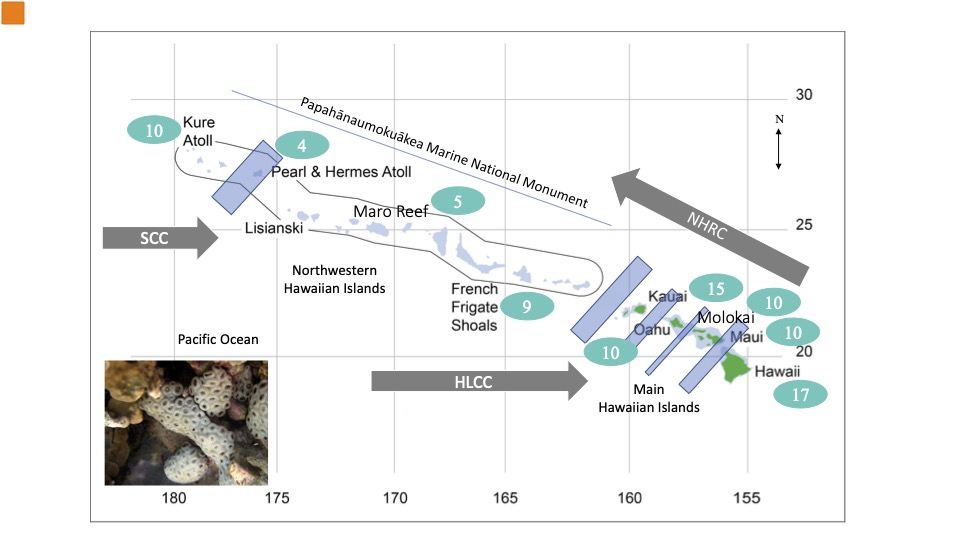

# Migrate Analysis of Metapopulation Structure in *Palythoa tuberculosa*

January 19, 2022

This is an ongoing analysis of gene flow and metapopulation structure in the zoanthid [*Palythoa tuberculosa*](http://www.marinespecies.org/aphia.php?p=taxdetails&id=220520) (Limu-Make-O-Hana or deadly seaweed of Hana). Apparently, Hawaiian warriors used toxins from this beast on the tips of their spears!  ['Ale'alani Dudoit](http://tobolab.org/people/graduate-students/alealani-dudoit/) has kindly shared her hard-won ezRAD sequencing data, sampled from across the Hawaiian archipelago, for this effort. Please feel free to follow along!

[Click here to view the ongoing analysis](Ptuberculosa_migrate.nb.html)

[Click here to see a migrate-n tutorial](migrate_lesson/migrate-n_lesson.nb.html)

Analysis and tutorial by [Eric Crandall](https://science.psu.edu/bio/people/edc5240), Assistant Research Professor, Pennsylvania State University

I followed [this](https://nicolas-van.github.io/easy-markdown-to-github-pages/) handy guide to make this page.