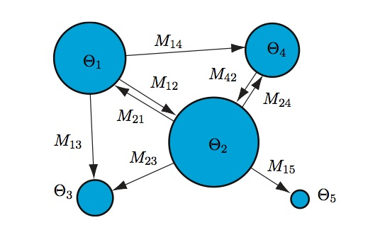
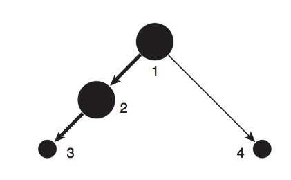
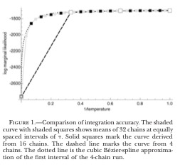
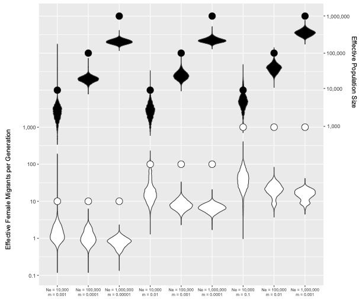
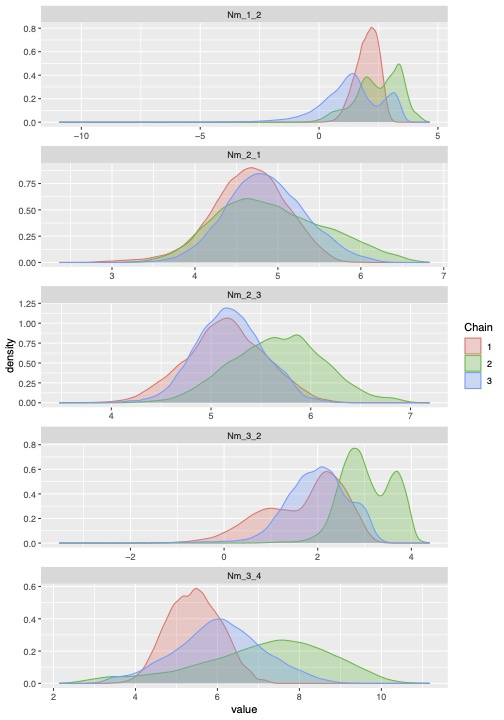
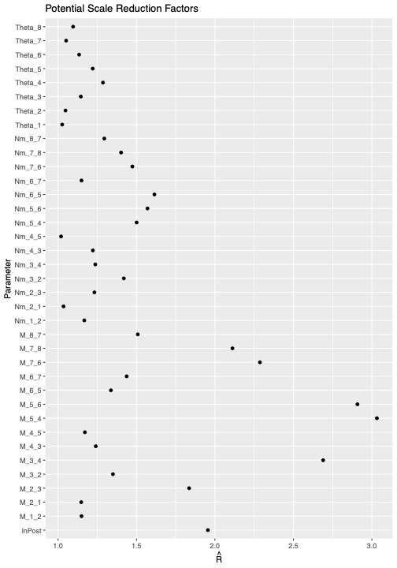

### Setup

You'll need the following packages installed for this tutorial.

```{r, warning=F, message=F}
library(phyclust)
library(phangorn)
library(strataG)
library(knitr)
library(coda)
library(ggplot2)
library(ggmcmc)
library(gridExtra)
library(reshape2)
```

# Migrate-n Tutorial

Welcome to this migrate-n tutorial, by Dr. Eric Crandall of Pennsylvania State University. If you have questions or find errors, please let me know at ecrandall[!@AT^&]psu.edu

[Migrate-n](http://popgen.sc.fsu.edu/Migrate/Info.html) is a program for inferring effective population sizes and gene flow rates and direction within a metapopulation using a Markov Chain Monte Carlo search of parameter space with coalescent simulations. It was written by Dr. Peter Beerli at Florida State University. The program is famously difficult to use, and the [documentation](http://popgen.sc.fsu.edu/migratedoc.pdf) is lengthy and abstruse. The program estimates two parameters for each population that you give it: $\theta = 4N_e\mu$ and $M = \frac{m}{\mu}$. One main assumption of the v3 version of the program is that all populations have been "infinitely" separated. The v4 version handles population divergence, but that will be covered in a future lesson. 


This tutorial will focus on analysis of haploid mitochondrial COI sequence data from *Panulirus pencillatus* provided by Dr. Matt Iacchei's dissertation and Iacchei et al. 2016. Such a beautiful critter.


Photo by: Muséum national d'histoire naturelle




## Setting up Migrate-n

### The Parmfile

Migrate has myriad settings that are recorded by a "parameter file" or `parmfile`. You can use the migrate-n interface to write you a blank parmfile that will have a lot of (sometimes helpful, sometimes confusing) notes and information in it. I have stripped those notes out of the one below, just keeping the actual parameter settings, and adding some quick comments of my own. We will walk through the example below:

```{bash, eval=F}
################################################################################
# Parmfile for Migrate 3.6.4 [do not remove these first TWO lines]
# informal notes added by Eric Crandall
menu=NO
nmlength=10
datatype=SequenceData
# add your transition:transversion ratio here
ttratio= 5.6174
freqs-from-data=NO:0.2345,0.2619,0.2023,0.3013
seqerror-rate=0.0
categories=1
#add your discretized gamma rates here
rates=4:0.331 1.63 4.122 8.423
#assuming that you discretize into 4 rate bins, these probabilities can stay the same.
prob-rates=4:2.044104e-08 2.127821e-04 4.782987e-02 3.951957e+00
autocorrelation=NO
weights=NO
interleaved=NO
fast-likelihood=NO
inheritance-scalars={1}
# this nifty setting lets you lump populations easily to reduce model complexity
population-relabel={1 2 3 4 5 6 7 8}
usertree=RANDOMTREE
infile=../panpen_CI_Iacchei.mig
random-seed=AUTO
title=panpen_CI_Iacchei
progress=YES
logfile=NO
print-data=NO
outfile=outfile.txt
pdf-outfile=outfile.pdf
#whether to use m or Nm in the model. I always use m.
use-M=YES
plot=NO
mathfile=mathfile
profile=ALL:QUICK
print-tree=NONE
write-summary=NO
aic-modeltest=NO
mig-histogram=NO
skyline=NO
#starting values
theta=own:{0.01}
migration=own:{1000}
mutation=CONSTANT
fst-type=THETA
# the metapopulation model. The most important part!
custom-migration={
**000000
***00000
0***0000
00***000
000***00
0000***0
00000***
000000**}
geo=NO
#these settings generally don't need much tweaking
bayes-update=YES
bayes-updatefreq=0.500000
bayes-posteriorbins=500 500
bayes-posteriormaxtype=ALL
bayes-file=YES:bayesfile
bayes-allfile=YES:1:bayesallfile
bayes-proposals= THETA METROPOLIS Sampler
bayes-proposals= MIG SLICE Sampler
# Priors - very important! But I have found these to be pretty good for most marine species.
bayes-priors= THETA WEXPPRIOR: 0.0 0.01 0.1000000 0.01000 
bayes-priors= MIG WEXPPRIOR: 0.000100 100000.000000 1000000.000000 100000.000000 
# Parameters of the MCMCMC chains
long-chains=1
long-inc=100
long-sample=50000
burn-in=20000
# This is the heating scheme Peter recommends for calculating marginal likelihood
# of models via thermodynamic integration. The super-hot chain is essentially exploring
# all corners of parameter space.
heating=YES:1:{1,1.5,3,100000}
heated-swap=YES
moving-steps=NO
long-chain-epsilon=INFINITY
gelman-convergence=No
replicate=YES:3
resistance=0.000100
end
```

At the top are parameters having to do with the model of molecular evolution that we are using. Migrate can use microsatellites, short reads sequenced by any generation of sequencer, SNP data. The inheritance scalar is set to 1, rather than 4 (as in 4Nem) because we are using mitochondrial DNA. mtDNA has 1/4 of as many copies as nuclear DNA because it is 1) haploid and 2) passed only through females (so male copies don't really count).

Towards the end are parameters that have to do with the Metropolis Coupled Markov Chain Monte Carlo (MCMCMC; $MC^3$) search, including the number of samples to take from the posterior to take (`long-sample`)  and the increment at which to take each sample (`long-inc`). If you multiply these two items together, you get the total length of the MCMC "chain" that you will be running. There is the burnin which is the number of samples to discard because they are before the chain reaches an equilibrium and would lead to incorrect parameter estimates (`burn-in`). Also, importantly, there are the priors for $\theta = N_e\mu$ and $M = \frac{m}/{\mu}$.

### The metapopulation model

Of particular interest is the matrix of 0 and \*: this is what lets us specify a model or hypothesis about gene flow in our metapopulation. We can use migrate-n to calculate the likelihood of several alternative hypotheses, thus allowing us to use strong inference to understand migration in our species. **The columns denote the departure population and the rows denote the arrival population**. The diagonals contain the theta parameter for each population.  \* means we are inserting this parameter into the model to be estimated. 0 means no estimated parameter. We could also conceivably use S for symmetric migration, or m for mean migration (all m's have the same mean).

|   |1 |2 |3 |4 |
|---|---|---|---|---|
| 1 | \* | 0 | 0 | 0 |
| 2 | \* | \* | 0 | 0 |
| 3 | 0 | \* | \* | 0 |
| 4 | \* | 0 | 0 | \* |

This matrix denotes the following metapopulation model, where population 1 is a source and 3 and 4 are sinks.



### Set up the migrate-n run

So now we will go about setting up for a migrate run.

1. Stop and think about some hypotheses that you'd like to test with these populations. No, like really think. Go read some papers. Draw your ideas out like the figure above. 

2. Then build matrices like the one above in a spreadsheet. If you have n populations then the matrix will be n x n. Remember if you are using `population-relabel`, to lump populations, then your matrix should be correspondingly smaller. Double check your models. Get a friend to check them. Check them again. If you f this up, you will get spurious results! You can paste your spreadsheet models directly into the parmfiles you'll be making!

3. You'll need to format your data for Migrate. I recommend [PGDSpider](http://www.cmpg.unibe.ch/software/PGDSpider/). If you have RAD data, see my [Palythoa tuberculosa analysis](../Ptuberculosa_migrate.nb.html) for an example how to use Stacks to get haplotypes.

4. For mtDNA data you'll want to use ModelTest to determine the `transition:transversion ratio` and `gamma shape` parameters of an **HKY+G** model. This is the only model of molecular evolution that is implemented in migrate-n, so even if modeltest finds a better one, you should use the HKY+G parameters. For RAD data it is probably less important to fit these parameters for each locus, as the reads are shorter and have fewer mutations. You can use `modeltest` in the phangorn R package.

5. Make a copy of the parmfile that I posted above. Open it in a text editor.


According to modeltest, the `gamma shape` parameter for *P. pencillatus*  is 0.081, and the `transition:transversion ratio` is 5.6174 for an HKY+G model. 

So our gamma distribution looks like this:

```{r}
plot(density(rgamma(1000,shape=0.081)), xlim=c(0,1))
```

Which means that a few sites are changing quickly and most sites are changing slowly. And now to discretize it into 4 rate categories.

```{r}
phangorn:::discrete.gamma(0.081,4)
```

Enter these values in the `rates` line of your parmfile, after the "4:". You can add 5.6174 into the `ttratio` parameter setting of your parmfile (it has already been done for you actually).

6. Change all the output filenames in the parmfile to your liking. Sometimes using generic filenames can be helpful if you will be reading them in via script later. Your folder names can store the important information about models etc. Save the parmfile in a directory that will be devoted to migrate-n analysis.

6. Now you'll want to run several test-runs on this parmfile. You will be tempted to skip this step, but DON'T. Put it in a folder called "Test" with the migrate-formatted data file one directory above it. You can test it locally on your computer or on the server where you will be doing the main analysis. Use one of your more complex models in `custom-migration`. You need to make sure that the parmfile 1) works 2) gets reasonable results. One thing to pay attention to is whether most of the posterior density seems to fall within the prior bounds. If you see, like, half a posterior distribution that is truncated by the prior, you will need to widen your priors. On the other hand if the posterior is nicely formed with lots of space around it, you might want to narrow your priors. Ultimately, your choice of prior should be based on your knowledge of the system.

7. Now make several directories with names (no spaces!) that reflect your hypotheses/models. Place a copy of your finalized parmfile in each one and change `custom-migration` and `population-relabel` to fit each hypothesis. Remember, you can paste your gene flow models directly from the spreadsheet!

8. Place your formatted data file into the directory above these hypotheses, making sure that each parmfile is pointing to the directory above it (`infile=../panpen_CI_Iacchei.txt`).

9. Copy the whole folder (containing all of the model folders and the data file) up to the server, and then login.

```{bash, eval=F}
$ scp -r ./migrate_directory userid@server.address.edu:./migrate_directory
$ ssh userid@server.address.edu
```

10. Set up a virtual terminal window (so that closing the terminal won't kill migrate) and start migrate.

```{bash, eval=F}

$ cd migrate_directory/yourmodel

$ screen -S yourname_yourmodel
$ migrate-n

Reading parmfile "parmfile"....
  =============================================
  MIGRATION RATE AND POPULATION SIZE ESTIMATION
  using Markov Chain Monte Carlo simulation
  =============================================
  PDF output enabled [Letter-size]
  Version 3.6.11   [June-18-15]
  Program started at   Fri Nov  3 09:33:48 2017

.
.
.


$ Type Control-a and then Control-d to detach yourself from this screen
```

11. Repeat this process for all of your models. Keep track of what you named each terminal window (the entry after -S). You can re-attach to any screen by typing `screen -r yourname_yourmodel` to check on progress. If you are unix-inclined, you might want to write a script to do all of this for you. If you are using SLURM or another software queue then you'll pretty much have to write a script to do this.

## Interpreting results

12. When all runs are complete (could be weeks... :-/ ), download the entire folder thusly:

```{bash, eval=F}

$ scp -r userid@server.address.edu:./migrate_directory ./migrate_directory

```

### Harvesting marginal likelihoods

13. Now we will rank the models based on their marginal likelihood scores. This script will rip through all of the output files, and harvest the marginal likelihood scores. Warning, this R code is pre-Tidyverse, yikes!

```{r}

workingDir <- "./PanPen_example/panpen_CI_Iacchei"
marglike <- data.frame(model=character(0),thermodynamic=numeric(0),bezier.corrected=numeric(0),harmonic=numeric(0),stringsAsFactors=F) #initialize a data frame to take the values
    l=1 #initialize l
    for(i in list.files(workingDir)){ #i<-"stepping.stone"
      modelDir<-file.path(workingDir,i)
      print(modelDir)
      
      outfile<-scan(file=file.path(modelDir,"outfile.txt"),what="character",sep="\n") #scan in the outfile, separating at each newline
      
      #now some crazy parsing to get the result from thermodynamic integration
      thermoline <- grep("(1a)",outfile,value=T) #find the line with the thermodynamic likelihood on it
      if(length(thermoline)==0){next}
      thermoline <- strsplit(thermoline, split="=", fixed=T) #split it up
      thermo <- as.numeric(substr(thermoline[[1]][2], start=1, stop=12)) #grab the thermodynamic likelihood
      bezistart <- grep("\\(",strsplit(thermoline[[1]][2], split="")[[1]])+1
      bezier <- as.numeric(substr(thermoline[[1]][2], start=bezistart, stop=bezistart+11)) #and the bezier-corrected value
      #get the harmonic mean
      harmoline <- grep("\\(2\\) H",outfile,value=T) #find the line with harmonic mean likelihood on it
      harmoline <- strsplit(harmoline,split="=",fixed=T) #grab the harmonic mean
      harmo <- as.numeric(substr(harmoline[[1]][2],start=1,stop=12))
      marglike[l,] <- c(i,thermo,bezier,harmo) #add this as a row to the data frame
      l=l+1
    }


kable(marglike, format.args = list(digits = 3))
```

We get 3 likelihood scores for each model. The first is the thermodynamic integration likelihood (which I explained in my lecture). The second is the Bezier corrected thermodynamic integration marginal likelihood (say that 5 times fast). What is a Bezier correction? 



Beerli & Palczewski (2010) showed that, while it would ordinarily take 16 or 32 MCMC chains to explore enough parameter space for thermodynamic integration, one could do the search with just 4 chains (one super-heated) and apply a Bezier spline (the dashed line in the figure), to get comparable results at a fraction of the computation.

### Relative Model Probabilities

14. Now we need to convert these marginal likelihoods into Bayes factors and thence to relative model probabilities. For this I followed Johnson and Omland (2004).

```{r}
# Here is a function for calculating log bayes factors 
bfcalcs<-function(df,ml="bezier.corrected"){
  df$thermodynamic <- as.numeric(df$thermodynamic)
  df$bezier.corrected <- as.numeric(df$bezier.corrected)
  df$harmonic <- as.numeric(df$harmonic)
    mlcol <- df[,ml] 
	bmvalue <- mlcol[which.max(mlcol)]
	lbf <- 2*(mlcol-bmvalue)
	choice <- rank(-mlcol)
	modelprob <- exp(lbf/2)/sum(exp(lbf/2))
	dfall <- cbind(df,lbf,choice,modelprob)
	return(dfall)
}	

# and this function should give us our "answer" as to which model is best supported by the data
bftable<-bfcalcs(marglike)

kable(bftable, format.args = list(digits = 5))
#write.csv(bftable,"model_selection_table.csv")
```

Ta Da! Sit back and reflect on the fact that Matt found 1/24 significant $F_{ST}$ values and 4/24 significant $\Phi_{ST}$ values. Here, we have a result that not only finds metapopulation structure, but actually supports a stepping-stone model of (most) gene flow going between neighboring islands.

Now, the problem is that there is no error estimate for the mode marginal likelihoods, and yes Migrate will arrive at differing marginal likelihoods with each run, due to the nature of MCMCMC. So now you need to re-run these models a minimum of 3 times, and take a low-sample size corrected average. See Crandall et al. 2019 for more information. Yay! 

### Model Parameter Estimates

#### Statistics

15. Supposing that the best model is not "panmixia", you can figure out the highest posterior densities for the parameters in your model. **Warning** For single-locus data, I have found that these values are not at all precise or accurate. Also, all of this code could be upgraded to dplyr.


```{r, warning=F,message=F}
winningModelDir <- file.path(workingDir, "stepping.stone")
#a function for creating Nm vectors out of m and Theta vectors.
migrants.per.gen<-function(x){
  #x<-x[[1]]
  m<-names(x)[which(grepl("M_",names(x)))] #names of m columns
  #theta<-names(x)[which(grepl("Theta_",names(x)))] #names of theta columns
  for(n in m){
    t<-paste("Theta",strsplit(n,split="_")[[1]][3],sep="_")
    x[,paste("Nm",strsplit(n,split="_")[[1]][2],strsplit(n,split="_")[[1]][3],sep="_")]<- x[,which(names(x)==n)]*x[,which(names(x)==t)] 
    #this hairy little statement makes a new column named "Nm_X_Y" and then fills it by multiplying the M_X_Y column by the Theta_Y column	
  }
  return(x)
}

#this may take a minute or two
data <- read.table(file.path(winningModelDir,"bayesallfile"), header=T) 

#calculate migrants per generation
data.nm <- migrants.per.gen(data)  
# Split the whole list into the individual replicates, so that you will
# have a list of data frames
data.list.1 <- split(data.nm,data$Replicate)
    
# Remove burnin if it wasn't removed in the run, where burnin is a proportion of the total.
# e.g. First 40% First 20,000 samples out of 50,000 or 10 million steps out of 25 million
#burnin <- 0.2
#data.list.1<-lapply(data.list.1,subset,subset=Steps>(burnin*max(data.list.1[[1]]$Steps)))

# calculate Nm for each row
data.list.2 <- lapply(data.list.1,migrants.per.gen)
    
#convert each dataframe to an mcmc object and then convert the whole thing to an mcmc list
data.list.mcmc <- mcmc.list(lapply(data.list.2,mcmc))
#collapse all replicates to one for purposes of highest posterior density
data.list.allinone <- mcmc(data=do.call("rbind",data.list.2)) 
    

summ <- summary(data.list.mcmc)
ess <- effectiveSize(data.list.mcmc)
gelman <- gelman.diag(data.list.mcmc,multivariate=F)
HPD <- HPDinterval(data.list.allinone)
    
#concatenate the stats
allstats<-cbind(summ$statistics[,1:2],HPD,ess,gelman$psrf)
#write.csv(allstats,file="codastats.csv")

kable(allstats, format = "html", format.args = list(digits = 3))
  
```


And we see some potentially interesting differences in gene flow. Do they mean anything? Probably not. I have found that single-locus estimates 1) consistently under-estimate gene flow from simulated data and 2) inference of directionality is biased by sample size.





Check out Supplemental Figure 2 from Crandall et al. (2019). The dots are the simulated values of $N_em$ (in white) and Ne (in black). The violin plots are migrate-n's inference for a single mtDNA like simulated locus.


#### Figures

16. Nevertheless, let's create some plots with the ggmcmc package.

```{r, eval=F}
data.list.plot<-lapply(data.list.2,subset,select=c(which(grepl("Theta_",names(data.list.2[[1]])) | grepl("M_",names(data.list.2[[1]])) | grepl("Nm_",names(data.list.2[[1]])) |grepl("lnPost",names(data.list.2[[1]])))))
  #log transform them, since they come from an exponential prior
  data.list.plot<-lapply(data.list.plot,log)
  data.list.plot<-mcmc.list(lapply(data.list.plot,mcmc))

  data.list.gg<-ggs(data.list.plot,burnin=F,description="Panulirus pencillatus Stepping Stone Model")
  #ggmcmc(data.list.gg,plot=c("ggs_traceplot","ggs_density","ggs_Rhat"),simplify_traceplot=0.25,file="PanPen_Stepping.Stone_plots.pdf")
```

Here's what those plots look like:




Yeah, they're not pretty and convergence looks pretty iffy. That's why migrate-n is not good for parameter estimation with a single locus.




Here are the Gelman & Rubin (1992) scale reduction factors for each parameter, where a value > 1.2 indicates poor convergence. So yeah. Not great. But also not horrible, if you remember that we are getting this information from a single 658bp locus. 

# Reading List

Beerli, P. (2009). How to use MIGRATE or why are Markov chain Monte Carlo programs difficult to use? (G. Bertorelle, M. W. Bruford, H. C. Hauffe, A. Rizzoli, & C. Vernesi, Eds.). Cambridge University Press. [Link](./Beerli_2009.pdf)

Beerli, P., & Felsenstein, J. (2001). Maximum likelihood estimation of a migration matrix and effective population sizes in n subpopulations by using a coalescent approach. Proceedings Of The National Academy Of Sciences Of The United States Of America-Biological Sciences, 98(8), 4563–4568.

Beerli, P., & Palczewski, M. (2010). Unified Framework to Evaluate Panmixia and Migration Direction Among Multiple Sampling Locations. Genetics, 185(1), 313–326. doi: 10.1534/genetics.109.112532

Beerli, P., Ashki, H., Mashayekhi, S., & Palczewski, M. (2019). Population divergence time estimation using individual lineage label switching. BioRxiv, 152, 763–28. doi: 10.1101/587832

Crandall, E. D., Toonen, R. J., ToBo Laboratory, & Selkoe, K. A. (2019). A coalescent sampler successfully detects biologically meaningful population structure overlooked by F-statistics. Evolutionary Applications, 12(2), 255–265. doi: 10.1111/eva.12712

Hey, J., & Machado, C. A. (2003). The study of structured populations—New hope for a difficult and divided science. Nature Reviews Genetics, 4(7), 535–543.

Iacchei, M., Gaither, M. R., Bowen, B. W., & Toonen, R. J. (2016). Testing dispersal limits in the sea: Range-wide phylogeography of the pronghorn spiny lobster Panulirus penicillatus. Journal Of Biogeography, 43(5), 1032–1044. doi: 10.1111/jbi.12689

Johnson, J. B., & Omland, K. S. (2004). Model selection in ecology and evolution. Trends in Ecology & Evolution, 19(2), 101–108. doi: 10.1016/j.tree.2003.10.013

Liu, S. Y. V., Green, J., Briggs, D., Hastings, R., Jondelius, Y., Kensinger, S., … Crandall, E. D. (2021). Dongsha Atoll is an important stepping-stone that promotes regional genetic connectivity in the South China Sea. PeerJ, 9, e12063. doi: 10/gmnqhs


